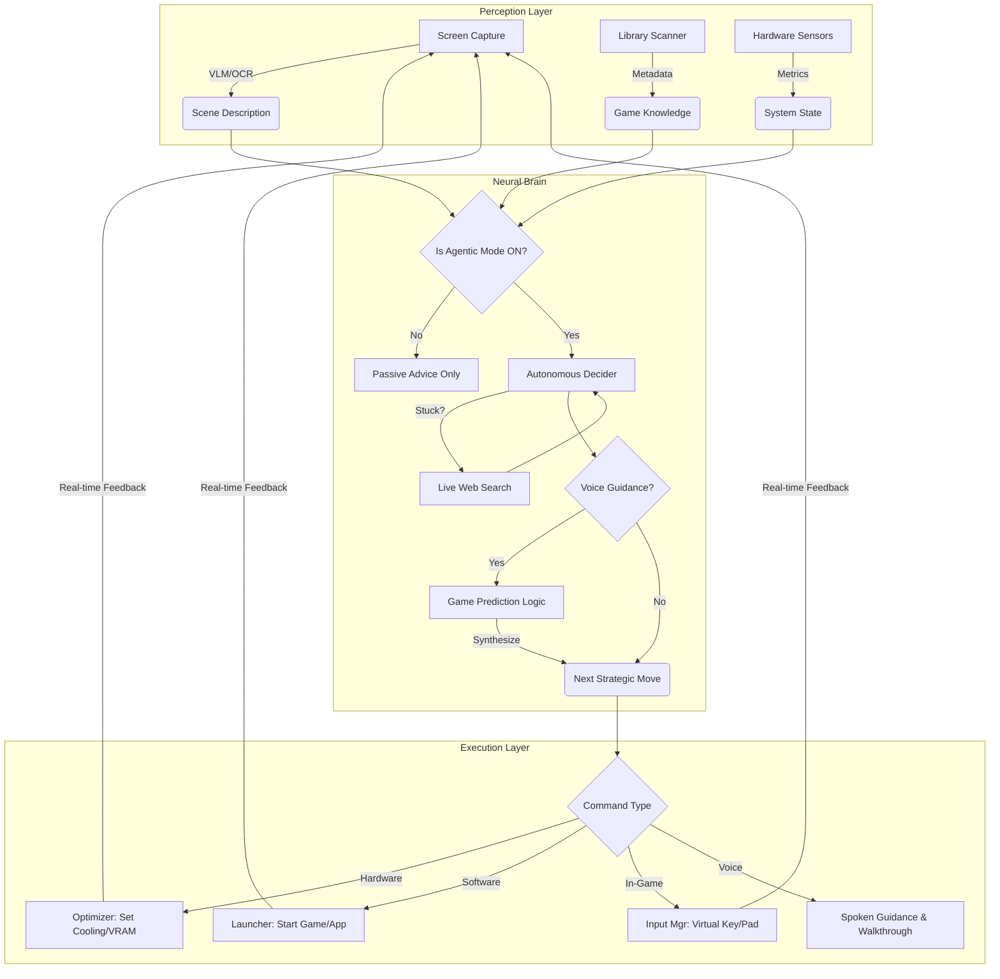

# Agentic AI Logic & Instructions

This document outlines the operational logic for the **Agentic AI Mode**, detailing how the AI translates user intent and visual data into system actions.

## 🤖 Intelligence Architecture

The Agentic AI operates as a multi-stage reasoning engine:

1.  **State Perception**:
    *   **Vision (VLM)**: Captures screen frames to describe HUD, enemies, and environment.
    *   **OCR**: Extracts quest logs, dialogue, and UI text to identify current game missions.
    *   **Telemetry**: Monitors CPU/GPU metrics and active input devices (KBM vs. Controller).

2.  **Contextual Reasoning**:
    *   **Library Context**: Injects scanned games to understand available software.
    *   **Genre Protocols**: Switches logic based on game type (e.g., Tactical, Racing, RPG).
    *   **Web Intelligence**: Fetches live walkthroughs if the user encounters a "stuck" state.

3.  **Command Execution**:
    *   **[SYSTEM_COMMAND]**: Direct calls to hardware (Cooling, VRAM, Navigation).
    *   **[LAUNCH_COMMAND]**: Native OS calls to execute games/apps.
    *   **Input Simulation**: Simulates hardware-level keystrokes or controller inputs.

---

## 🎙️ Agentic Voice Guidance & Prediction

When Agentic Mode is active, a specialized **Voice Co-pilot** protocol is engaged:

1.  **Guidance Trigger**: Upon activation, the agent offers voice guidance. A "yes" response activates the **Proactive Guidance Controller**.
2.  **Game Prediction Logic**:
    *   **Contextual Extrapolation**: The AI analyzes the current `vlm_description` and `quest_texts`.
    *   **Intelligence Synthesis**: It queries web walkthroughs and its own internal game knowledge base.
    *   **Predictive Output**: Instead of just describing the current state, it predicts the **next tactical move** (e.g., "Based on the quest log, you're about to enter the Boss Arena. I predict a high-damage fire phase—I recommend switching to fire-resistant gear now.").
3.  **Autonomous Search**: If a quest objective is detected, the agent proactively searches for the optimal "Logic Path" to completion before the user even asks.

---

## 🔄 Agentic Workflow Diagram

The following diagram illustrates the flow from game detection to autonomous action:

---

## 📝 LLM Instruction Logic

When **Agentic Mode** is active, the system injects the following directive into the AI's prompt:

> `AGENTIC PERMISSION: The user has enabled 'Agentic AI Mode'. You now have direct access to system sensors and controls. You may execute actions using [SYSTEM_COMMAND:...] for hardware or [LAUNCH_COMMAND:...] for app execution.`

This shifts the AI's persona from a "Conversational Assistant" to a "System Operator," enabling it to take initiative on behalf of the player.
