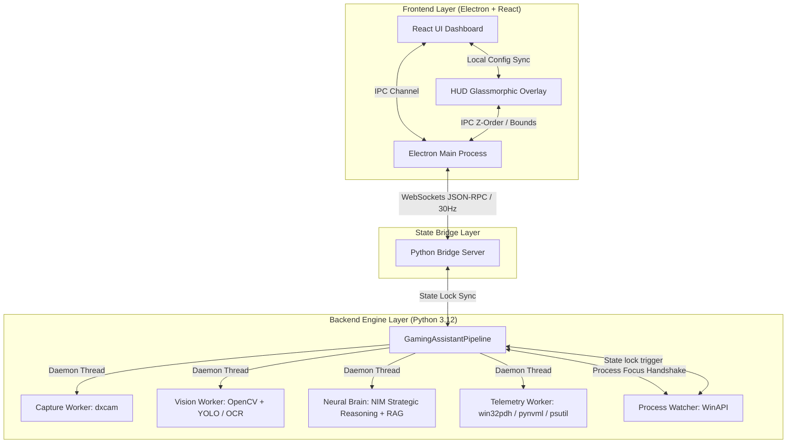

# 🏛️ Mission Control - Comprehensive Architectural Blueprint & Software Engineering paradigms

This document details the production architecture of **Mission Control**, mapping out the event-driven Electron/React frontend, the concurrent multi-threaded Python backend pipeline, the secure WebSocket state bridge, and the advanced software engineering paradigms implemented across the codebase.

---

## 🗺️ System Topology & Flow Diagram

---

## 🖥️ 1. Frontend Layer Logic (Electron & React)

The frontend acts as the user interface shell and system-level overlay manager. It is designed to be visually stunning, GPU-efficient, and highly responsive.

### A. Electron Main Process (`frontend/electron/main.ts`)
- **Native Window Teardown (Active Cleaning Logic):** To guarantee zero VRAM/graphics memory leaks, when the HUD is toggled "off", the window is completely destroyed (`hudWin.close()`). When toggled "on", a clean window is recreated, resetting the coordinate system and High-DPI layout matrices.
- **Event-Driven Snapping & Bounds:** Bounds calculations, snap coordinates, and click-through lockups (`setIgnoreMouseEvents`) are centralized inside the native Electron `'show'` event handler. This prevents race conditions during asynchronous window layout initialization.
- **Single Source of Truth (Visibility):** Tracks intended state with a dedicated `isHUDVisible` flag, eliminating UI synchronization lag caused by OS window-manager transition delays.

### B. React UI Dashboard & HUD (`frontend/src/components/HUD.tsx`)
- **Dynamic Config Auto-Sync:** A reactive `useEffect` synchronization loop listens to config broadcasts from the backend, instantly aligning `localConfig` state with custom dragged coordinates or font scaling shifts to prevent stale form saves from overwriting HUD overlays.
- **Obsidian-Neon Glassmorphic Style:** Uses HSL-tailored dark modes, backdrop-blur filters, dynamic `framer-motion` spring animations, and native system lock indicators (`Ready to Move` vs `HUD Locked`).

---

## ⚙️ 2. Backend Engine Layer Logic (Python 3.12)

The backend is a high-frequency telemetry scanner, visual object detector, and AI reasoning copilot executing on a multi-threaded daemon pipeline.

### A. Core Pipeline Host (`pipeline_host.py`)
- **Threaded Pipeline Workers:** Segregates heavy compute tasks into separate daemon threads:
  1. **Capture Worker (60-120Hz):** Grabs display screen frames using `dxcam` (DirectX-accelerated capture) and pushes them to a synchronized `FrameBuffer`.
  2. **Vision Worker (30Hz):** Pulls frames, runs object detection (YOLO engine / TensorRT), processes character dialogues and quests (RapidOCR), and performs scene classification.
  3. **Brain Worker (10Hz):** Analyzes game telemetry and dispatches strategic prompts to NVIDIA NIM LLMs.
  4. **Telemetry Worker (1-2Hz):** Collects hardware metrics.
- **Adaptive Throttling:** Intelligently throttles processing frequencies if the system is overloaded (GPU load > 92%, CPU temp > 85°C) or if the game window is minimized, protecting game frame parity.

### B. Hardware Telemetry Thread (`runtime_helpers.py` & `gpu_monitor.py`)
- **Pure Telemetry Integration:** Stripped of all simulated, random-jitter, or fallback estimators. All metrics represent actual system states:
  - **GPU & VRAM:** Derived directly from NVIDIA NVML (`pynvml`). Fallback VRAM capacity is fetched via native DXGI adapter mapping.
  - **Disk Utilization:** Queried using persistent Windows Performance Data Helper (PDH) counters (`\PhysicalDisk(_Total)\% Disk Time`), falling back to raw psutil byte delta rates.
  - **FPS Metrics:** Derived strictly from the pipeline's active screen capture rate (measuring actual frames delivered by the game).
  - **Resource Diagnostics:** Uses low-profile native APIs (like `psutil.cpu_freq()`) instead of launching slow, heavy PowerShell subprocesses.

### C. Neural Brain & Search Engine (`decision_maker.py` & `web_search.py`)
- **Asynchronous Optional Search:** To prevent network latency from blocking the snappy 10Hz brain thread, gameplay strategy web searches (DuckDuckGo, RAWG, Wikipedia) are dispatched inside a lightweight background thread (`GameplaySearch`).
- **Dynamic Search Telemetry:** Utilizes a thread-safe `was_search_triggered_this_tick` status flag to seamlessly toggle the HUD intelligence card from `SEARCH: IDLE` to `SEARCH: ACTIVE` during execution.
- **Model Routing:** Task intent classification automatically maps queries to the most cost-effective and highly optimized NIM model (Strategic → Llama 3.1 70B, Tactical → Nemotron, Vision → Phi-3/Nemotron Vision).

### D. Process Watcher (`system/process_watcher.py` & `main.py`)
- **Focus Handshake:** Intercepts WinAPI focus changes. If a scanned library game matches the foreground PID, the process watcher locks state, starts the pipeline capture, Defuses Stealth Boost (defragments VRAM and suspends low-priority processes), and pushes the game metadata directly to the HUD.

---

## 🛠️ 3. Software Engineering Paradigms Followed

The codebase demonstrates strict adherence to professional-grade software engineering patterns:

### 1. Concurrency & Pipeline Pattern (Decoupling)
- **Concept:** Isolates CPU-bound, GPU-bound, and I/O-bound processes.
- **Implementation:** Frame capture, vision analysis, AI reasoning, and hardware scanning run in separate threads communicating via a synchronized queue buffer. This guarantees that deep LLM queries or slow hardware reads never stall screen capture or lower game framerates.

### 2. Event-Driven Architecture (EDA)
- **Concept:** Minimizes busy-loop polling by reacting to state transitions.
- **Implementation:** Reacts to Electron window lifecycles (`'show'`, `'hide'`), focus triggers (`on_focus_lost`, `on_focus_gained`), and process watcher state handshakes (`on_game_detected`).

### 3. Graceful Degradation & Fault Tolerance (Resilience)
- **Concept:** Ensures the app remains functional when auxiliary dependencies fail.
- **Implementation:** 
  - **Circuit Breaker:** If NVIDIA NIM dispatches rate limits (429) or fails three times consecutively, a circuit-breaker disables remote queries for an exponential backoff period and falls back to offline, rules-based "Neural Lite" advice.
  - **Multi-Stage Telemetry Fallbacks:** Thermals degrade gracefully: WMI $\rightarrow$ CIM $\rightarrow$ PerfData $\rightarrow$ Registry. VRAM degrades from NVML $\rightarrow$ DXGI $\rightarrow$ PDH.

### 4. Separation of Concerns (SoC)
- **Concept:** Modules have singular responsibilities with explicit contracts.
- **Implementation:** The UI shell is completely decoupled from the system optimization engine. The layers communicate strictly over a structured JSON WebSocket bridge, allowing the React layer and Python telemetry layer to scale or change independently.

### 5. Security by Design & Anonymized Privacy
- **Concept:** Privacy constraints are enforced at the architectural level.
- **Implementation:** 
  - **Anonymized Reasoning:** Prompts are parsed through regular expressions to strip absolute local system directory paths, OS editions, and local system usernames before dispatching queries to external NIM endpoints.
  - **UUID Signature Binding:** E2EE memory contexts are cryptographically signed and bound to Murmur-mixed motherboard UUID hashes, preventing context spoofing.

### 6. Single Source of Truth (SSOT)
- **Concept:** Eliminates state desynchronization by designating authoritative states.
- **Implementation:** Configuration is owned by `settings.yaml`, IPC visibility is owned by Electron's `isHUDVisible` flag, and system telemetries are bound strictly to active locks, ensuring data coherence between dashboard forms and live overlays.

# Mission Control - Agentic Design System

## Overview
Mission Control is a professional-grade gaming assistant built on a multi-threaded Python/PyQt6 architecture. It leverages high-performance hardware telemetry and AI reasoning to provide real-time optimization and tactical advice.

## Core Pillars
1. **Precision Telemetry**: Replaced legacy WMI with modern PowerShell CIM for sub-millisecond hardware accuracy (DDR5/DDR4, Slot tracking).
2. **Agentic Reasoning**: Multi-turn context continuity powered by NVIDIA NIM (Llama 3.1 70B/405B) for strategic gaming analysis.
3. **Hybrid Connectivity**: Intelligent offline/online switching. Automatically falls back to local rule-based "Neural Lite" reasoning when no internet is detected, ensuring zero-latency tactical support for offline gamers.
4. **Premium Aesthetics**: Obsidian-neon theme using glassmorphism, Segoe UI Variable typography, and Lucide/Remix Icon integration.
5. **Stability Guard**: Global exception hooks and recovery modes to prevent silent application failures.

## Agentic Capabilities
- **Story Skipping**: Detects cutscenes and automates bypass inputs.
- **Fault Detection**: Monitors system logs for driver/hardware interrupts.
- **Performance Tuning**: Dynamic resource reallocation based on game process priority.
- **Library Context**: Accesses the global game library to tailor advice to the specific title being played.

## Technology Stack
- **Framework**: PyQt6 (Multi-threaded UI)
- **Monitoring**: psutil, PowerShell CIM, NVIDIA-SMI
- **AI**: NVIDIA NIM (Full Agentic Integration with Context Memory)
- **Graphics**: QPainter, OpenCV (Vision Feed)
- **Distribution**: Automated patch system (publish.ps1)