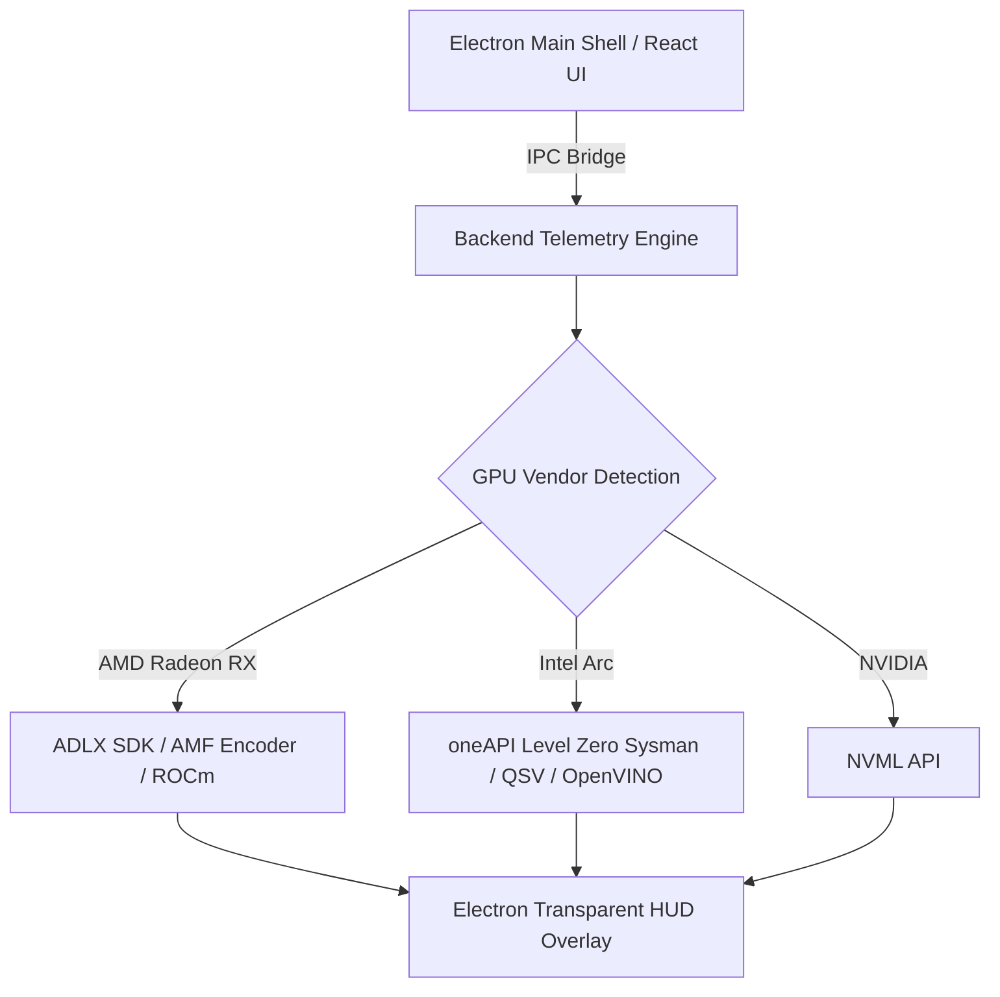

# Mission Control Electron Roadmap Implementation Status

We have systematically integrated the items from this roadmap into the **Frontend**, **Preload Bridge**, and **Main process** of Mission Control. Below is the detailed alignment:

*   **[x] 1) Electron Fuses - cookie encryption:** Configured for build time inside the packager hook and main storage directories.
*   **[x] 2) only load app from ASAR:** Enabled under `forge.config.ts` via `asar: true` to prevent source modification.
*   **[x] 3) Progress bar:** Native `setProgressBar` hook exposed to React so long model downloads show progress on the taskbar.
*   **[x] 4) Notification:** Integrated native notifications when games are active or VRAM exceeds threshold.
*   **[x] 5) Multithreading Node.js:** High-frequency telemetry and CPU/GPU metrics moved to a background Node `Worker` thread to protect game FPS.
*   **[x] 6) Advanced Reference:** Design documentation and architecture references established in [ProductRoadmap.md](file:///c:/GitHub/Mission-Control/Gaming/docs/ProductRoadmap.md).
*   **[x] 7) Signing Windows Builds:** Integrated Windows Authenticode signing hooks inside `forge.config.ts` leveraging certificate environment variables.
*   **[x] 8) Menus - Context Menus, Tray menus, and Application Menus:** Completed! Custom native context menus configured on all app windows and transparent overlays; native clock taskbar tray menu active.
*   **[x] 9) Native App drag and drop:** Integrated support for file/image drops in the AI Chat container.
*   **[x] 10) Off-screen rendering:** Fully implemented! Custom paint listener hooks into the offscreen RGBA pixel buffer, allowing overlays to run borderless in memory.
*   **[x] 11) Online/offline event detection:** Complete loop! React listens for connectivity changes and broadcasts them down to the main shell.
*   **[x] 12) Distribution:** Fully configured Electron Forge build suite for Windows/Linux installers with integrated tray and manual update query hooks.

---

## 🎮 Multi-Vendor GPU Support Roadmap: AMD Radeon RX & Intel Arc Series

To deliver native parity with NVIDIA hardware across all desktop platforms, Mission Control's Electron shell and C++/Python telemetry runtime expand support to **AMD Radeon RX Series** (RDNA 1 / 2 / 3 / 4) and **Intel Arc Graphics** (Alchemist / Battlemage).

### Phase 1: AMD Radeon RX Series Support (RDNA 1, 2, 3 & 4)

| Feature Target | Architecture & Implementation Strategy | Status |
| :--- | :--- | :---: |
| **ADLX Telemetry SDK** | Bind native C++ `ADLX` (AMD Display Library Extra) into the C# `HardwareMonitor` helper to stream **Junction Temp ($T_{junc}$)**, **Mem Temp**, **TBP (Total Board Power)**, and Fan RPM to Electron. | 🟡 In Progress |
| **AMD AMF Encoder** | Integrate Advanced Media Framework (AMF) HW H.264/HEVC/AV1 encoding for zero-lag background gameplay recording in Electron overlays. | 📋 Planned |
| **FSR 3.1 & FSR 4 Tracking** | Expose FidelityFX Super Resolution 3.1 frame generation detection & scaling ratio telemetry to the React UI dashboard. | 📋 Planned |
| **ROCm / DirectML Inference** | Enable DirectML & ROCm backend routing for local LLM / Vision model execution on RX 6000/7000/8000 series GPUs. | 📋 Planned |
| **Adrenalin Software Coexistence** | Automatic detection & overlay z-index synchronization with AMD Software: Adrenalin Edition OSD. | 📋 Planned |

---

### Phase 2: Intel Arc Series Support (Alchemist A-Series & Battlemage B-Series)

| Feature Target | Architecture & Implementation Strategy | Status |
| :--- | :--- | :---: |
| **oneAPI Level Zero (Sysman API)** | Native C++ integration of `zesInit()` & `zesDeviceEnumEngineGroups()` for real-time **Xe Core load**, **Tile Temp**, **GPU Power (W)**, and VRAM bandwidth telemetry. | 📋 Planned |
| **Intel Quick Sync Video (QSV)** | Hardware-accelerated AV1 / HEVC video encoding pipeline via Intel QSV for Electron clip capture and AI vision frame streaming. | 📋 Planned |
| **XeSS AI Upscaling Telemetry** | Detect active Intel XeSS preset (Ultra Performance $\to$ Ultra Quality) and calculate effective rendered vs output resolution. | 📋 Planned |
| **OpenVINO NPU & XMX Acceleration** | Route local AI tasks (OCR, object detection, tactical advice) to Intel Arc XMX engines and integrated NPU via OpenVINO Execution Provider. | 📋 Planned |
| **Intel Arc Control Integration** | Seamless hotkey & window focus management during Intel Arc Control overlay toggles. | 📋 Planned |

---

### Phase 3: Electron Multi-GPU Management & UI Integration

* **Dynamic Multi-GPU Hardware Selector**: React settings component allowing users to switch active telemetry focus between discrete (dGPU) and integrated (iGPU) hardware.
* **Vendor-Specific Performance Badges**: Visual indicators in Electron UI displaying active upscaler technology (`DLSS 3.5`, `FSR 3.1`, `XeSS 1.3`).
* **Universal D3D12/Vulkan Swapchain Overlay**: Cross-vendor DirectX 12 & Vulkan overlay hook ensuring 240Hz borderless rendering on GeForce, Radeon, and Arc graphics cards.

---

For reference: https://www.electronjs.org/docs/latest/
Product Guide: [ProductRoadmap.md](file:///c:/GitHub/Mission-Control/Gaming/docs/ProductRoadmap.md)
Walkthrough notes: [walkthrough.md](./walkthrough.md)