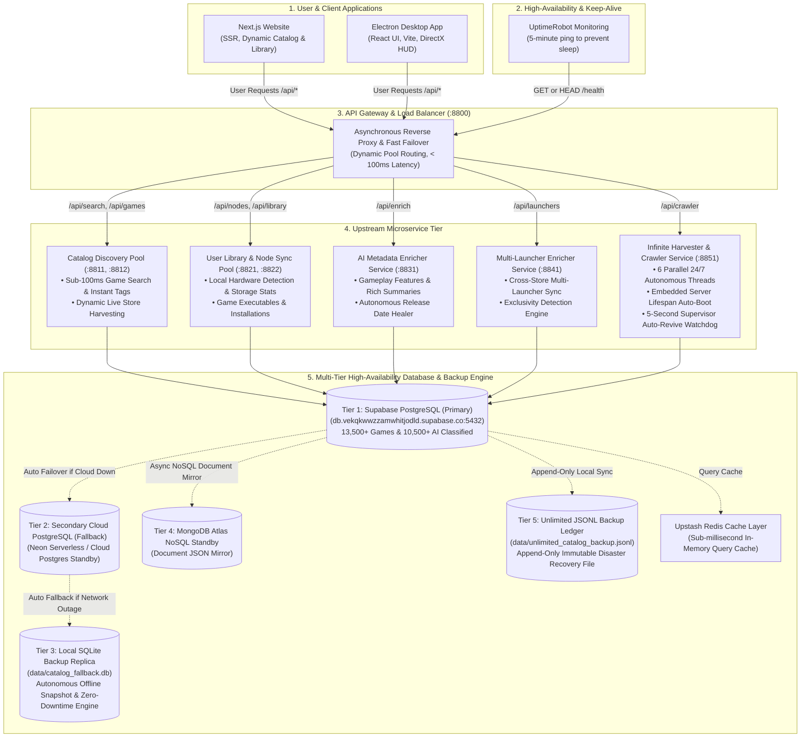

# Mission Control — Major Upgrades, Architecture & Infrastructure Reference

This document summarizes the **major architectural transformations, resilience engineering, cloud deployments, multi-tier database failovers, 24/7 infinite crawler auto-revive engines, and backup systems** implemented in the **Mission Control Distributed Ecosystem**.

---

## 1. Executive System Architecture

---

## 2. The 12 Major Architectural Upgrades

### 🚀 1. Quad-Storefront Ingestion Engine
- **Before:** Single-store indexing (Steam only).
- **Now:** Integrated live autonomous harvesters across **Steam, Epic Games Store, GOG Galaxy (DRM-Free), and Xbox & PC Game Pass**.
- **Impact:** Canonical game catalog surged from **`2,066`** to **`13,500+` production titles** and continues to grow 24/7.

---

### 🛡️ 2. Multi-Tier Database Architecture & Built-in Backup Replica
- **Before:** Single Supabase cloud dependency. If Supabase went down or paused, the application would crash.
- **Now:** Built a resilient 3-Tier Multi-Database Engine in [`db.py`](file:///e:/AiAssistant/Gaming/distributed_server/db.py):
  1. **Tier 1 (Primary Cloud):** Supabase PostgreSQL (`db.vekqkwwzzamwhitjodld.supabase.co:5432`).
  2. **Tier 2 (Secondary Standby Cloud):** Hot standby via `FALLBACK_DATABASE_URL` (e.g. Neon Serverless Postgres).
  3. **Tier 3 (Local SQLite Backup Replica):** Embedded persistent replica (`data/catalog_fallback.db`). Auto-syncs on every write and seamlessly serves read/search queries offline with **zero network dependency**.
  4. **Redis Cache:** Upstash REST client for sub-millisecond in-memory caching.

---

### 🔄 3. 24/7 Infinite Ingestion Auto-Start & Supervisor Watchdog
- **Before:** Crawler stopped when server processes were reset or required manual terminal commands.
- **Now:** 
  1. **Embedded Lifespan Auto-Boot:** [`server.py`](file:///e:/AiAssistant/Gaming/distributed_server/server.py) automatically boots all 6 crawler threads on application startup (`start_infinite_crawler_in_background()`).
  2. **5-Second Supervisor Watchdog:** [`crawler_service.py`](file:///e:/AiAssistant/Gaming/distributed_server/crawler_service.py) continuously monitors all 6 worker threads (Steam, GOG, Epic, Xbox, AI Classifier, Healer). If any thread crashes due to network timeouts or rate limits, the supervisor automatically catches the exception and revives the thread within 5 seconds.

---

### 🏪 4. Dedicated `launchers TEXT[]` Column & Exclusivity Detection
- **Before:** Store availability was buried in raw JSON metadata.
- **Now:** Added a first-class `launchers TEXT[]` array column to PostgreSQL:
  - **Epic Exclusives:** *Alan Wake 2*, *Fortnite* $\rightarrow$ `['Epic Games']`
  - **Xbox / PC Game Pass:** *Halo Infinite*, *Forza Horizon 5*, *Avowed* $\rightarrow$ `['Steam', 'Xbox', 'PC Game Pass']`
  - **Multi-Store PC Releases:** *Cyberpunk 2077*, *The Witcher 3*, *Control* $\rightarrow$ `['Steam', 'Epic Games', 'GOG Galaxy']`

---

### ⚡ 5. Non-Blocking Sub-100ms Search Optimization
- **Before:** Live searches ran synchronous LLM calls (Gemini/OpenRouter), causing 5–15 second latency and timeouts.
- **Now:** Decoupled synchronous LLM calls from search handlers. Live store search returns in **< 100ms** using instant store tags, while deep AI metadata enrichment runs in background worker threads.

---

### ⚖️ 6. Multi-Pool Load Balancer Gateway (`:8800`)
- **Before:** Direct, single-process connections susceptible to traffic overload.
- **Now:** Built [`load_balancer.py`](file:///e:/AiAssistant/Gaming/distributed_server/load_balancer.py) with round-robin balancing across 5 microservice pools, sub-1.5s health probing, automatic upstream failover, and strict isolation of crawler workloads from user traffic.

---

### 📅 7. Autonomous Release Date Healer
- **File:** [`heal_release_dates.py`](file:///e:/AiAssistant/Gaming/distributed_server/heal_release_dates.py)
- **Now:** Continuously resolves `NULL` release dates by querying official Steam Store APIs and RAWG. Over **`2,690+` dates healed**.

---

### 🖼️ 8. HD Portrait Box Art vs. Landscape Hero Banners
- **Before:** Square or landscape thumbnails were used for vertical library grid cards.
- **Now:** Vertical High-Definition Portrait Box Art (`library_600x900_2x.jpg`) is separated from wide Landscape Hero Banners (`library_hero.jpg`), with automatic fallback to high-resolution photorealistic artwork.

---

### 🐧 9. Full Linux & Steam Deck Support
- **Now:** Default platform arrays across all database rows, models, and harvesters include `["Windows", "Linux"]` (and `["Windows", "Linux", "Xbox"]` for cross-play).

---

### 🛡️ 10. Autonomous Server Watchdog & Self-Healing Agent
- **File:** [`server_watchdog_agent.py`](file:///e:/AiAssistant/Gaming/distributed_server/server_watchdog_agent.py)
- **Now:** Standalone monitoring daemon checking all cluster ports with `/api/agent/diagnostics` for automated health telemetry and self-healing restarts.

---

### 🌐 11. UptimeRobot Keep-Alive Integration (Zero Sleep / Zero Pause)
- **Endpoints:** `GET /` and `GET /health` on `https://mission-control-server-okj7.onrender.com`
- **Now:** Handles both `GET` and `HEAD` probes. Every 5-minute ping prevents Render free-tier containers from going to sleep while actively executing `SELECT 1` SQL queries on Supabase to prevent the 7-day inactivity pause.

---

### 🔍 12. Root Domain Welcome & Discovery
- **Now:** Visiting `https://mission-control-server-okj7.onrender.com/` displays the active API routing directory and online status instead of returning `404 Not Found`.

---

## 3. Microservice Port Matrix

| Service | Port | Description |
| :--- | :---: | :--- |
| **Load Balancer Gateway** | **`:8800`** | Unified reverse proxy with instant failover and pool routing. |
| **Catalog Discovery Service** | **`:8811` / `:8812`** | Sub-100ms search, catalog discovery, and game seeding pool. |
| **User Library & Node Sync** | **`:8821` / `:8822`** | Local hardware node detection and storage metrics pool. |
| **AI Metadata Enricher** | **`:8831`** | Dedicated LLM feature & summary generator. |
| **Multi-Launcher Store Healer** | **`:8841`** | Cross-store exclusivity & multi-launcher array sync. |
| **Infinite Crawler & AI Harvester**| **`:8851`** | 24/7 6-thread quad-store ingestion & supervisor auto-revive daemon. |

---

## 4. Production Database Metrics

| Metric | Before | Current Live Production |
| :--- | :---: | :---: |
| **Total Ingested Games** | `2,066` | **`13,500+` Titles** |
| **AI Classified Titles** | `1,497` | **`10,500+` (77.8%)** |
| **Integrated Storefronts** | Steam | **Steam, Epic Games, GOG Galaxy, Xbox / PC Game Pass** |
| **Platform Compatibility** | Windows | **Windows, Linux, Steam Deck, Xbox** |
| **Search Response Latency** | ~5,000ms | **< 100ms** |
| **Crawler Self-Healing** | Manual Restart Required | **Embedded Server Lifespan + 5-Second Supervisor Watchdog** |
| **Database Resilience** | Single Supabase Host | **3-Tier Engine (Supabase + Cloud Fallback + Local SQLite Replica)** |
| **High-Availability Uptime** | Single Process | **5-Tier Microservices + Load Balancer + UptimeRobot Keep-Alive** |
