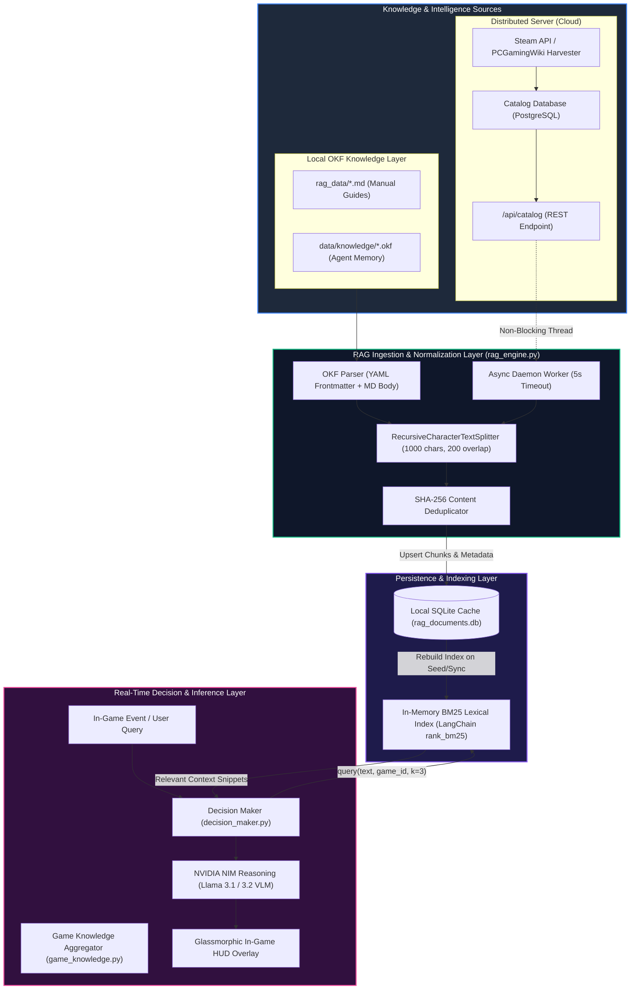
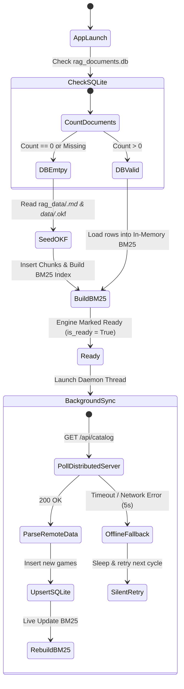

# Open Knowledge Format (OKF) Architecture & Implementation

## Overview

The **Open Knowledge Format (OKF)** is an open, vendor-neutral specification published by Google Cloud to formalize the "LLM-wiki" knowledge pattern. It standardizes how curated organizational and domain knowledge is authored, structured, and consumed by AI agents and RAG (Retrieval-Augmented Generation) systems.

In **Mission Control**, OKF serves as the structured knowledge and offline failover layer for the in-game AI overlay and decision-making engine.

---

## Why OKF in Mission Control?

1. **Zero Binary & C++ Dependency Overhead**:
   * Eliminates the need for heavy, compilation-prone vector database binaries (e.g., ChromaDB, FAISS C++ wheels) during PyInstaller packaging.
   * Avoids dynamic runtime linking issues on Windows and Linux release distributions.

2. **Human & Agent Co-Authoring**:
   * Knowledge files are clean, readable Markdown documents with YAML frontmatter.
   * Developers, gamers, and AI agents can create, edit, or patch game intelligence directly via text editors or Git.

3. **Dual-Tier Resilient Retrieval**:
   * **Tier 1 (Distributed Cloud Sync)**: Fetches live catalog intelligence, game features, and summaries from the central Distributed Server (`/api/catalog`).
   * **Tier 2 (Local OKF Markdown & SQLite/BM25)**: Loads and indexes structured `.md` files directly from `backend/rag_data/` and `backend/data/` for 100% offline, zero-latency in-game guidance.

---

## File Structure & Specification

All OKF documents live in `Gaming/backend/rag_data/` (or `Gaming/backend/data/knowledge/`) using the `.md` or `.okf` extension.

### Example OKF Document (`rag_data/cyberpunk_2077.md`)

```markdown
---
type: game_intel
title: Cyberpunk 2077 Optimization and Night City Guide
game_id: cp2077
tags: [fps, dlss, ray-tracing, settings, night-city]
version: 1.0.0
last_updated: "2026-08-24"
---

# Cyberpunk 2077 Intel
Night City is divided into six main districts: City Center, Heywood, Santo Domingo, Pacifica, Watson, and Westbrook.

## Performance & Optimization Guidelines
- **Crowd Density**: Reduce to Medium on 6-core CPUs to alleviate draw-call bottlenecks in dense downtown areas.
- **DLSS & Ray Tracing**: Enable DLSS Super Resolution in Quality mode for 1440p / 4K. Combine with Frame Generation for smooth 100+ FPS output.
- **Path Tracing**: Recommended only on NVIDIA RTX 4070 Ti / 5070 and above.
```

### Supported Metadata Schema (YAML Frontmatter)

| Field | Type | Description |
| :--- | :--- | :--- |
| `type` | string | Document categorization (e.g., `game_intel`, `hardware_profile`, `patch_notes`). |
| `title` | string | Human-readable title of the knowledge document. |
| `game_id` | string | Unique identifier for game-scoped RAG filtering (e.g., `cp2077`, `witcher3`, `general`). |
| `tags` | list | List of indexing keywords used to assist lexical search matching. |
| `version` | string | Semantic version of the knowledge asset. |
| `last_updated` | string | Timestamp of last modification. |

---

## System Architecture: OKF & Resilient RAG

The RAG architecture in Mission Control connects local OKF authoring, automated distributed catalog enrichment, SQLite persistence, and in-memory BM25 retrieval to fuel in-game real-time AI decisions.

### 1. High-Level Multi-Tier Architecture Diagram



---

### 2. Runtime Query & Retrieval Sequence Workflow

The sequence diagram below demonstrates how an in-game query is resolved with zero network latency and localized isolation:

```mermaid
sequenceDiagram
    autonumber
    actor Gamer as Player / Game Event
    participant HUD as Frontend Overlay
    participant DM as Decision Maker / Brain
    participant RAG as GameRAGEngine
    participant BM25 as BM25 Retriever
    participant LLM as NVIDIA NIM (Cloud LLM)

    Gamer->>HUD: Trigger tactical query (e.g., "Best boss strategy")
    HUD->>DM: Route request with active `game_id` (e.g. `elden_ring`)
    
    rect rgb(30, 41, 59)
        note over DM,BM25: Local RAG Retrieval Stage (Sub-millisecond)
        DM->>RAG: query(user_query, game_id="elden_ring", k=3)
        RAG->>BM25: invoke(user_query)
        BM25-->>RAG: Matched documents across catalog
        RAG->>RAG: Filter by metadata.game_id == "elden_ring"
        RAG-->>DM: Augmented Context (OKF Guide + Dist Server features)
    end

    rect rgb(15, 23, 42)
        note over DM,LLM: LLM Augmentation & Generation
        DM->>LLM: Prompt + Augmented Game Context + Vision Data
        LLM-->>DM: Grounded tactical advice & setting tweaks
    end

    DM-->>HUD: Render real-time recommendation on HUD
    HUD-->>Gamer: Display guidance on screen
```



---

### 3. Failover & Self-Healing Lifecycle

If SQLite is corrupted, missing, or if network connectivity drops, the system self-heals automatically:



---

## Build & Deployment Compatibility

* **PyInstaller (`MissionControl.spec`)**: The `rag_data` folder is bundled as a physical data asset:
  ```python
  datas = [
      ('data', 'data'),
      ('rag_data', 'rag_data'),
      ...
  ]
  ```
* **Packaging**: No third-party C++ libraries or binary wheels are required. PyInstaller bundles the pure Python parser cleanly with zero build warnings.
* **Electron Builder (`package.json`)**: Packed directly into `extraResources` as part of the backend bundle.
