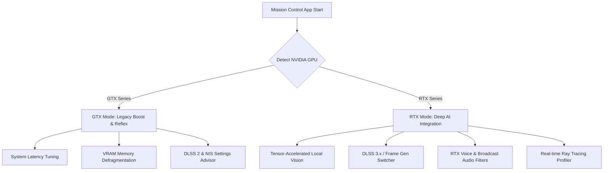
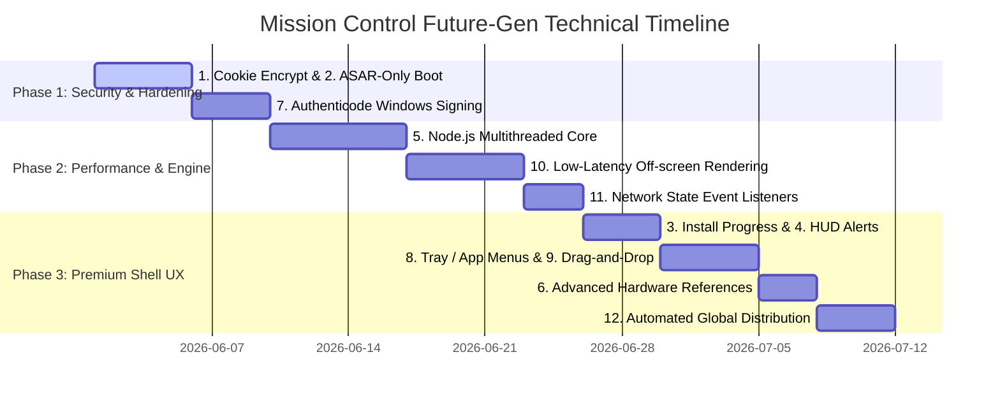

# Mission Control: Premium Product Roadmap & NVIDIA Hardware Optimization Plan

Mission Control is positioned to be the ultimate **AI-Powered Gaming Copilot** for PC gamers. To achieve this vision and provide a premium experience, the application must deeply integrate with the user's specific hardware tier. 

This document outlines strategic feature recommendations, app improvements, and a dedicated roadmap tailored specifically for users of **NVIDIA GeForce RTX** and **GTX** graphics cards.

---

## 🏎️ NVIDIA GPU Tier Optimization Strategy

Not all GPUs are created equal. Mission Control can stand out by dynamically adapting its features, UI badges, and background processes depending on whether the player is running a cutting-edge **RTX (Tensor Core)** card or a reliable **GTX (Pascal/Turing)** card.



### 📊 GPU Feature Matrix

| Feature / Capability | GTX Support (Pascal/Turing/Ampere 16-series) | RTX Support (20, 30, 40, 50-series) | Mission Control Dynamic Optimization Action |
| :--- | :---: | :---: | :--- |
| **Local AI Vision Model** | ⚠️ Partial (CPU/CUDA Fallback) | ✅ Full (Tensor Core Accelerated) | GTX uses lightweight cloud API or visual cropping; RTX runs local lightweight Llama-3.2-Vision. |
| **NVIDIA DLSS 2 (Super Resolution)** | ❌ Unsupported | ✅ Supported | Suggest optimal upscale presets per game context. |
| **NVIDIA DLSS 3 (Frame Generation)** | ❌ Unsupported | ✅ Supported (RTX 40+) | Detect and toggle Frame Gen automatically based on target FPS. |
| **NVIDIA Image Scaling (NIS)** | ✅ Supported | ✅ Supported | Provide GTX users NIS configurations as a performance alternative to DLSS. |
| **NVIDIA Reflex (Low Latency)** | ✅ Supported | ✅ Supported | Monitor system latency and auto-enable Ultra/Boost modes when high input lag is detected. |
| **RTX Voice / Noise Removal** | ❌ Unsupported | ✅ Supported | Clean microphone voice chats in real time using local RTX Tensor Cores. |
| **VRAM Management** | ⚠️ High Alert (Typical 4GB-6GB VRAM) | 🔄 Tiered: ⚠️ High Alert for 6GB RTX | GTX & 6GB RTX modes dynamically halt background Electron subprocesses during heavy gameplay to free up critical VRAM buffers. |

---

## ⚡ GTX Tier: Performance Optimization & Smart Tuning
GTX users are looking to maximize frame rates and minimize input lag on older architectures. Mission Control should serve as a lightweight, intelligent optimizer.

### 1. Smart NIS (NVIDIA Image Scaling) Advisor
*   **The Feature:** For games that lack native DLSS support or for GTX cards that cannot use DLSS, NIS provides spatial scaling and sharpening.
*   **How it works:** Mission Control scans the game configuration and recommends the exact custom resolution and sharpening percentage (e.g., 0.77x scale for 30% FPS boost) via the overlay.
*   **GTX Benefit:** Yields modern upscaling benefits to older GPUs like the GTX 1060/1660 Super.

### 2. VRAM Auto-Defragmenter & Electron Suspender
*   **The Feature:** Electron apps can consume substantial RAM and VRAM.
*   **How it works:** When a game launch is detected, Mission Control enters **"Stealth Boost Mode"**. It suspends heavy UI threads, compresses its VRAM cache, and scales back backend animations, leaving a lightweight performance-tracking hook active.
*   **GTX Benefit:** Prevents VRAM stuttering on 4GB and 6GB GTX graphics cards.

### 3. NVIDIA Reflex Precision Monitor
*   **The Feature:** Real-time optimization of system latency.
*   **How it works:** Reads rendering pipeline statistics. If input latency exceeds 40ms, Mission Control's overlay suggests enabling Reflex in the game settings or forcing "Low Latency Mode = Ultra" in the NVIDIA Control Panel.

---

## 🚀 RTX Tier: Ultimate AI Integration & Next-Gen HUDs
RTX users possess dedicated AI hardware (Tensor Cores and Optical Flow Accelerators). Mission Control should fully leverage this hardware to deliver futuristic features.

### 1. Local Vision HUD (Zero-Latency Game Analyzer)
*   **The Feature:** Real-time screen context analysis using the local RTX Tensor Cores.
*   **How it works:** Rather than sending game screenshots to slow cloud APIs, Mission Control runs a quantized Vision model locally (e.g., using ONNX Runtime with DirectML or TensorRT). It looks at minimaps, inventory states, and health bars to provide instantaneous strategic callouts.
*   **RTX Benefit:** Free, incredibly fast, and completely private screen analysis.

### 2. Deep DLSS & Ray Tracing Tweaker
*   **The Feature:** Automated configuration recommendations based on real-time FPS profiling.
*   **How it works:** Monitors frames-per-second and frametime consistency. If FPS falls below the monitor's refresh rate, Mission Control suggests changing DLSS from *Quality* to *Balanced*, or lowering Ray Reconstruction details.
*   **RTX Benefit:** Striking the perfect balance between cinematic visuals and smooth refresh rates.

### 3. RTX Voice-Driven Command Center
*   **The Feature:** Crystal-clear in-game voice commands utilizing local NVIDIA Broadcast tech.
*   **How it works:** Integrates a local whisper model or fast voice-to-text with RTX background noise cancellation. Gamers can speak naturally ("Hey Aero, check my build", "Is my GPU overheating?") even during loud firefights or mechanical keyboard typing.

### 4. Low-VRAM RTX (6GB) Intelligent Optimization
*   **The Feature:** Adaptive model offloading and texture scaling for 6GB RTX GPUs (e.g., RTX 2060 6GB, RTX 3050 6GB, and laptop RTX 4050/3060 models).
*   **How it works:** These cards support full RTX AI features but are highly VRAM-constrained when running modern AAA titles. Mission Control dynamically runs **quantized INT4 local models** instead of INT8/FP16 models, and shares a unified system memory pool (using NVIDIA's System Memory Fallback driver policies) to ensure the AI overlay never causes game stuttering or out-of-memory crashes.
*   **6GB RTX Benefit:** Grants entry-level RTX users full access to local AI vision features without degrading game texture resolution.

---

## 🎨 Recommended UI/UX Enhancements

To make the app look and feel incredibly premium, the visual layout must explicitly celebrate the user's hardware.

```carousel

<!-- slide -->

```

1.  **Dynamic Ambient Lighting (GPU-Themed):**
    *   **RTX Mode:** Sleek, neon cyberpunk theme with vibrant ray-traced ambient glows (emerald green, electric cyan, and deep purple glassmorphism).
    *   **GTX Mode:** Steel-gray, tactical military-grade layout with warm orange accents representing raw horsepower and mechanical precision.
2.  **Interactive Performance HUD Widget:**
    *   Create a customizable desktop/in-game overlay widget displaying VRAM utilization, GPU Core Clock, and current DLSS status with clean, high-refresh-rate SVG line charts.
3.  **Visual "Protected" States for Key Security Features:**
    *   Continue building on the E2E encryption visual success. When secure mode is enabled, display a high-fidelity glowing shield animation that reflects the local PC's secure hardware enclave.

---

## 🛠️ App Feature Suggestions & Strategic Improvements

Beyond GPU specifics, these overarching enhancements will elevate the utility of the AI Gaming Assistant:

### 1. Neural Game History & Auto-Profiling
*   **Feature:** Automatically log telemetry metrics (average FPS, peak temps, VRAM usage) alongside chat sessions.
*   **Benefit:** When a user reviews their chat session, they can see exactly how a game performed during that timeframe, allowing the AI to give highly tailored tips: *"I noticed your frames dropped during yesterday's session in Cyberpunk. Try adjusting your Volumetric Fog setting to Medium."*

### 2. Intelligent Auto-Launcher & Cloud Sync
*   **Feature:** A unified game library launcher that syncs play states, game paths, and custom launch arguments.
*   **Benefit:** Resolves past issues with cold-starting launchers by pre-authenticating game client protocols (Steam, Epic, EA) through secure Electron secure session states.

---

## 🗺️ Future Generation Engine: Unified Electron Technical Roadmap

To power the next generation of Mission Control, the backend and frontend architecture must evolve. The **12 items** defined in the technical roadmap ([ElectronRoadmap.md](./ElectronRoadmap.md)) represent the ultimate modern core foundation. Here is how they map to enabling our future-gen features:



### 🔒 1. Security & Hardening (Items 1, 2 & 7)
*   **1) Electron Fuses - Cookie & Token Encryption:**
    *   *Product Impact:* Encrypts local chat databases, active gaming sessions, and third-party account credentials. Prevents other processes from sniffing Clerk session tokens or local settings.
*   **2) Strict ASAR-Only Execution:**
    *   *Product Impact:* Blocks runtime code-injection. Prevents cheats, overlays, or malware from tampering with the Electron source, ensuring the app remains white-listed by anti-cheat engines (Easy Anti-Cheat, BattlEye, Vanguard).
*   **7) Signing Windows Builds (Authenticode):**
    *   *Product Impact:* Signs the executable with a trusted certificate, removing Windows SmartScreen warnings at installation and establishing high trust with gamers.

### ⚙️ 2. Performance & Hardware Pipeline (Items 5, 10 & 11)
*   **5) Multithreading Node.js (Worker Threads):**
    *   *Product Impact:* Offloads resource-heavy telemetry tracking, local log parsing, and GPU metric calculations to a background worker thread. Keeps the UI thread running at a smooth 144Hz+.
*   **10) Off-Screen Rendering (OSR):**
    *   *Product Impact:* Renders the tactical overlays directly into game buffers or hardware layers without creating actual window handles. Reduces rendering overhead on GTX cards and guarantees compatibility with fullscreen borderless modes.
*   **11) Online/Offline Event Detection:**
    *   *Product Impact:* Smoothly transitions local AI features into offline fallback modes if internet is lost, preventing the app from freezing during Clerk or Supabase sync operations.

### 🎮 3. Premium Shell Experience (Items 3, 4, 8, 9 & 6)
*   **3) Native Downloader/Installer Progress Bar:**
    *   *Product Impact:* Displays model download progress (e.g., when the user downloads the local VRAM-optimized Vision or Whisper weights) on the Windows taskbar icon.
*   **4) HUD Notification & Native Toast Integration:**
    *   *Product Impact:* Triggers custom hardware notifications, such as: *"⚠️ VRAM running low (92% used) - Stealth Boost applied."*
*   **8) Native Menus (Tray, Context, & Application Menus):**
    *   *Product Impact:* Enables quick-controls from the Windows tray (e.g., right-click to quick-toggle Stealth Boost, select RTX Noise Cancellation, or query GPU temperature).
*   **9) Native App Drag & Drop:**
    *   *Product Impact:* Allows players to drag a game screenshot or log file directly into the AI Chat window for instant screen analysis.
*   **6) Advanced Reference Core:**
    *   *Product Impact:* Establishes a standard design language documentation and architectural model for developer reference, enabling clean community contributions.

### 📦 4. Deployment (Item 12)
*   **12) Distribution Pipeline:**
    *   *Product Impact:* Automated builds for itch.io, Steam, or direct installer downloads, complete with background auto-updates so gamers always have the latest RTX performance presets.
