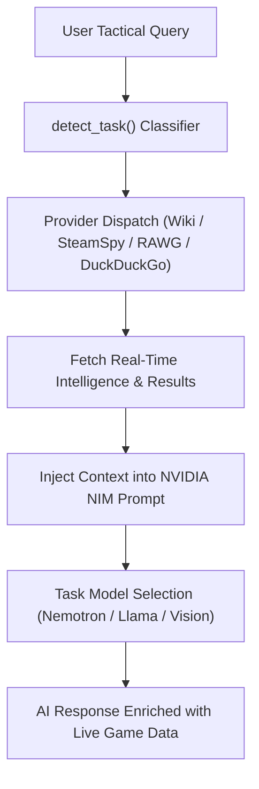

# 📊 Project Summary: Mission Control Gaming Assistant

## 🎯 Core Objective

The **Mission Control Gaming Assistant** is a high-performance, real-time agentic system that enhances gaming through advanced computer vision, NVIDIA-accelerated reasoning, live web-powered game intelligence, and autonomous co-pilot capabilities — with zero VRAM impact on gaming performance.

---

## 📸 Interface & Dashboard Showcase

| 🖥️ **Main Console & Dashboard** | 🤖 **Autonomous AI Co-Pilot** |
| :---: | :---: |
|  |  |
| 📟 **Glassmorphic HUD Overlay** | 📊 **Real-Time Hardware Telemetry** |
|  |  |

---

## 🛠️ Architectural Pillars

### 1. 👁️ Vision Pipeline (The Eyes)
- **Engine:** Pure TensorRT 10.x (YOLOv8). Sub-5ms inference, 0 MB PyTorch VRAM overhead.
- **Capture:** dxcam (DXGI), D3DShot, or MSS fallback at 60–120fps.
- **Capabilities:** Real-time object detection (enemies, items), RapidOCR (dialogue, quests), heuristic + ML scene classification.

### 2. 🧠 Decision Engine (The Brain)
- **Modes:** Competitive, Story, Hybrid, Agent — each with scene-aware routing logic.
- **NVIDIA NIM:** Cloud reasoning via Llama 3.1 8B (strategic/tactical) and Llama 3.2 11B Vision (multi-modal).
- **Auto Model Routing:** Task type (wiki / patch / strategy / real_time) auto-selects the fastest and most appropriate NIM model.
- **Context Awareness:** Tracks game state, process health, and window focus to manage resources adaptively.

### 3. 🌐 Web Search Intelligence (New)
A **gaming-optimized, multi-source search engine** that enriches AI responses with live web data. Completely free in both development and production — no credit card ever required.

| Source | Key | Limit | Purpose |
|---|---|---|---|
| **Wikipedia API** | None | ♾️ Unlimited | Game lore, characters, wiki lookups |
| **SteamSpy API** | None | ♾️ Unlimited | Steam stats, player counts, tags |
| **DuckDuckGo** | None | ♾️ Unlimited | Guides, patch notes, community tips |
| **RAWG.io** | Free key | 20,000/month | Ratings, genres, Metacritic, DLC |
| **Tavily AI** | User key | 1,000/month | Optional enrichment (richer AI answers) |

**Task → Source → Model routing architecture:**

### 4. 🗣️ Voice Engine (The Voice)
- **STT:** Google Cloud (primary), Sphinx (local/offline fallback).
- **TTS:** ElevenLabs (premium), Google Cloud TTS (cloud), SAPI5 / pyttsx3 (always-available local).
- **Profiles:** Named personality profiles (Aero Female / Aero Male / Custom) with distinct rate, pitch, and provider settings per profile.
- **Stability:** Direct COM integration for zero-crash SAPI5 access. Async queue prevents UI blocking.

### 5. 🎮 Agentic Control (The Hands)
- **Autonomous Inputs:** Programmatic keyboard, mouse, and controller via pynput/pyautogui.
- **Safety Workflows:** User-authorized toggles with real-time override detection.
- **Agent Personalities:** Tactical, Friendly, Immersive, Sarcastic, Aggressive.

### 6. 🔧 Hardware Telemetry (The Foundation)
- **GPU:** pynvml (NVML) — real-time thermals, clocks, VRAM, utilization.
- **CPU:** psutil + adaptive priming loop (zero-latency startup, no 0% bug).
- **Thermal:** Multi-stage fallback chain — WMI (MSAcpi) → CIM → PerfData → LibreHardwareMonitor social sync.
- **RAM/Storage:** PowerShell CIM for robust hardware identification on Windows 11.
- **Network:** Real-time WiFi/LAN adapter telemetry.
- **Admin Note:** Full thermal sensor access (CPU temp) requires running as Administrator on modern motherboards.

### 7. ⌨️ Hotkey System
- **Engine:** pynput `GlobalHotKeys` + Win32 `GetAsyncKeyState` fallback.
- **UI:** Click-to-record `HotkeyEdit` widget — no manual `<ctrl>+<alt>+o` typing.
- **Display:** Clean `Ctrl + Alt + O` format (no angle brackets).
- **Configurable:** All 4 hotkeys (HUD toggle, Agentic toggle, Font +/-) editable in Settings.

---

## 🔄 Recent Changes

| Version | Key Feature / Change Description |
| :--- | :--- |
| **v3.5.7 (Latest)** | **007 First Light Artwork Resolution, Hardware Matrix Icons & Post-Update Auth Persistence** — Resolved 007 First Light artwork resolution and added HTTP status verification in Steam store banner scanner to prevent 404 cache poisoning |
| **v3.5.6** | **Google OAuth Hang Resolution & Persistent Library Cache Across Sessions** — Resolved Electron IPC ready-to-show promise resolution hanging Google OAuth popup indefinitely. |
| **v3.5.5** | **Discover Web Dynamic Feeds, 250+ Game Canonical Resolver & Intelligent Recommendation System** — Resolved Electron IPC duplicate handler collision for fetch-steam-trending restoring live storefront feeds |
| **v3.5.4** | **Injected External OAuth Exit Bar, ESC Key Handler & Clerk Redirect Escape Hatches** — Injected top-level Mission Control Exit Bar on external OAuth pages (Google, Discord, Clerk) with drag region and window controls |
| **v3.5.3** | **Clerk Auth Exit & Session Persistence, Vision Model Uninstallation, AI Backbone Models & Build Freshness** — Added Exit/Cancel buttons on Clerk Auth modal and SSO callback redirect |
| **v3.5.2** | **Discover Web Dynamic Trending, Weekly News Engine, Render Shield & Code Modularization** — Added dynamic Steam trending storefront integration via Electron IPC, ISO-week news scheduling, strict Render credit shield, and modularized discovery datasets. |
| **v3.5.1** | **Nemotron 3 Ultra, Gemini 3.8, Settings Cleanup & Library UI Polish** — Added NVIDIA Nemotron 3 Ultra to Neural Backbone, OpenRouter, and NIM failover cascades. |
| **v3.5.0** | **Auto-Updater Seamless Relaunch, Installer Elevation, and Stale Cache Fixes** — Fixed auto-update restart deadlock, elevated silent install with auto-relaunch, and resolved stale directUpdateInfo cache. |
| **v3.4.9** | **Restored Discover from Web, Manage Nodes, and Fixed Library Unresponsiveness** — Restored persistent Discover from Web and Manage Nodes actions on Library header |
| **v3.4.8** | **Fixed launcher icons and cleaned CSS warnings** — Fixed launcher icons and cleaned CSS warnings. |
| **v3.4.7** | **Fixed launcher icons and cleaned CSS warnings** — Fixed launcher icons and cleaned CSS warnings. |
| **v3.4.6** | **Library Features Restoration, Official Launcher Logos & Scanner Resilience** — Restored official vector launcher logos for EA App, Epic Games, Xbox, Battle.net, PlayStation, and Ubisoft Connect |
| **v3.4.5** | **Distributed Fleet Scan Fixes, Real Host Telemetry & Catalog Asset Resilience** — Fixed 0 Games 0 B Storage issue with smart cache fallback to master database for Clerk users |
| **v3.4.4** | **NodeSync Lock Fix, Post-Update Clerk Auth Stability & Image Fallbacks** — Resolved NodeSync background daemon _reg_lock AttributeError in LibraryNodeService |
| **v3.4.3** | **Distributed Fleet Command & Node Management** — Enabled full local host node discovery and real-time disk storage metrics. |
| **v3.4.2** | **Multi-Launcher Support, Omni-Search & Dynamic AI Resolver** — Added EA App, Ubisoft Connect, PlayStation PC, Rockstar Games, and Battle.net launcher support. |
| **v3.4.1** | **Fix OpenCV in-memory loader and enable Gaming Readiness assessment system** — Implement zero-disk in-memory fallback loader for OpenCV to prevent missing config crashes on read-only installations. |
| **v3.4.0** | **Upgrade Discover with Live Steam, Epic, GOG, Xbox Game Pass & Breaking News Intelligence** — Upgrade Discover with Live Steam, Epic, GOG, Xbox Game Pass & Breaking News Intelligence. |
| **v3.3.9** | **Fix telemetry scanner bridge state and enable native 1-click node registration** — Fix telemetry scanner bridge state and enable native 1-click node registration. |
| **v3.3.8** | **Fixes some issue and bug of server update .Also fix the setup app** — Fixes some issue and bug of server update .Also fix the setup app. |
| **v3.3.7** | **Fixes some issue and bug of server** — Fixes some issue and bug of server. |
| **v3.3.6** | **Fix Supabase password URL decode for pooler connection** — Fix Supabase password URL decode for pooler connection. |
| **v3.3.5** | **Fix update installer: kill running processes before file extraction to prevent app freeze and OpenCV errors** — Fix update installer: kill running processes before file extraction to prevent app freeze and OpenCV errors. |
| **v3.3.4** | **Fix Supabase password URL decode for pooler connection** — Fix Supabase password URL decode for pooler connection. |
| **v3.3.3** | **Fixes some issue and bug of server** — Fixes some issue and bug of server. |
| **v3.3.2** | **Unified Supabase Architecture, Redis Caching Cascade & Weekly Intelligence Pipeline** — Removed Neon dependency and established Supabase PostgreSQL as single source of truth. |
| **v3.3.1** | **Multi-Cloud High Availability & Instant Zero-Lag Startup Architecture** — Added multi-tier cloud failover topology supporting Supabase (Tier 1), Neon Serverless PostgreSQL (Tier 2), and Local SQLite NVMe replica (Tier 3) |
| **v3.3.0** | **Ecosystem Optimization, Multi-Node Architecture & Dynamic Deduplication** — Added Win32 working set RAM compaction (EmptyWorkingSet) dropping idle background memory to ~40-60 MB during gameplay |
| **v3.2.9** | **Telemetry & Rollback Subsystem Reliability Hardening** — The Telemetry & Rollback Subsystem Reliability Hardening update enhances system stability and accuracy by addressing various reliability and performance issues. |
| **v3.2.8** | **OpenCV Resilience & Pipeline Stability Hardening** — Hardened all backend vision modules against OpenCV load failures with try/except guards and NumPy/PIL fallbacks |
| **v3.2.7** | **Distributed Server Agent and Vision Connection Integration** — Connected Agent and Vision UI pages to the central distributed library server with live node telemetry updates |
| **v3.2.6** | **OpenCV Loader & Supabase Metadata Enrichment Fixes** — This release addresses critical issues with OpenCV loader and Supabase metadata enrichment, while enhancing AI classifier reliability. |
| **v3.2.5** | **Distributed Cluster Architecture & Multi-Tenant User Isolation** — Implemented high-performance distributed cluster architecture with Load Balancer and multi-instance microservices |
| **v3.2.4** | **OpenCV Config Loader & PyInstaller Backend Fixes** — Resolved OpenCV cv2 config loader missing module errors in PyInstaller backend packaging |
| **v3.3.0** | **Distributed Game Library Server & Web Discovery Engine** — Implemented a multi-machine stateless server architecture with active heartbeats, Steam/Epic/GOG launcher crawlers, and Gemini Flash tag classifications. |
| **v3.2.4** | **OpenCV Config Loader & PyInstaller Backend Fixes** — This release resolves OpenCV configuration loader issues and improves PyInstaller backend packaging for Mission Control. |
| **v3.2.3** | **Fix First-Launch Setup Loading & Backend Process Startup Loop** — This release resolves critical issues with the first-launch setup and backend process startup loop, ensuring a stable and efficient user experience. |
| **v3.2.3** | **Fix OpenCV config loader missing configuration in PyInstaller backend packaging** — Improved PyInstaller backend packaging for OpenCV and RapidOCR components. |
| **v3.2.2** | **AI Support Assistant, Community Benchmarks & Live Telemetry Reporting** — Implemented comprehensive multi-tier AI support chatbot system with conversational assistance and model failovers |
| **v3.2.1** | **Library Scanner Sanitation & Steam Container Optimization** — Enhance the library scanner's accuracy and efficiency with improved steam container handling and automated game discovery. |
| **v3.2.1** | **Library Scanner Sanitation & Steam Container Optimization** — Resolved Steam library container false-positives by filtering out steamapps directory entries |
| **v3.2.0** | **Dynamic Game Root Resolution & Subfolder Optimization** — v3.2.0 enhances game management with dynamic root resolution, subfolder optimization, and improved executable analysis. |
| **v3.1.9** | **Universal Game Scanner & Dynamic Binary Title Resolution** — Enhance game title extraction and management for improved user experience. |
| **v3.1.8** | **Direct GitHub Releases In-App Updater Fallback & Elevated Offline Rollback** — Added direct GitHub Releases API fallback to Electron autoUpdater for seamless in-app downloads, and refactored automated offline rollback with robocopy retry loops and automatic UAC elevation escalation. |
| **v3.1.7** | **Multi-Vendor GPU Support & Unified GPU Tuning** — Added AMD & Intel GPU detection, Groq GPT OSS 120B/Qwen 3.6 models, and unified GPU power optimizer. |
| **v3.1.6** | **Alienware CPU Thermal Fix** — Fixed AWCC WMI sensor mapping & eliminated delayed telemetry readings. |
| **v3.1.5** | **Multi-Platform Linux Release** — Universal `.AppImage`, `.deb`, `.rpm`, `.tar.gz` packages + OS-dependent download router. |
| **v3.1.4** | **Mission Control UI Overhaul** — Premium glassmorphism, neural glow backgrounds, and Lucide icons. |
| **v3.1.3** | **Hybrid Connectivity** — Intelligent offline/online switching with Neural Lite local reasoning fallback. |
| **v3.1.2** | **Gaming Web Search Engine** — Free multi-source integration (Wikipedia, RAWG.io, SteamSpy, DuckDuckGo). |
| **v3.1.1** | **Auto Model Router** — Task-based NIM model selection (tactical, strategic, vision multi-modal). |
| **v3.1.0** | **Click-to-Record Hotkey Manager** — Live visual key combination recorder without manual config edits. |
| **v3.0.9** | **CPU Thermal Fallback Chain** — Multi-stage WMI → CIM → LibreHardwareMonitor sensor polling. |
| **v3.0.8** | **Voice Profile System** — Dynamic male/female profiles powered by ElevenLabs + Google TTS + SAPI5. |
| **v3.0.7** | **Zero-Waste TensorRT Vision Engine** — Sub-5ms YOLOv8 screen inference with 0 MB PyTorch VRAM overhead. |

---

## 📈 Roadmap Status

| Phase | Description | Status |
|---|---|---|
| 1–10 | Vision, capture, pipeline, multi-mode brain, memory, input, NVIDIA, TensorRT, Blackwell | ✅ Done |
| 11 | System & Hardware Dashboard + Full Settings | ✅ Done |
| 12 | In-App Auto-Update System | ✅ Done |
| 13 | Agentic AI Assistant (G-Assist interface) | ✅ Done |
| 14 | NVIDIA NIM full reasoning integration | ✅ Done |
| 15 | Autonomous co-pilot (input control) | ✅ Done |
| 16 | Multi-model pipeline optimization | ✅ Done |
| 17 | Multi-modal vision (VLM) | ✅ Done |
| 18 | Adaptive Agent Personalities | ✅ Done |
| 19 | High-Reliability Voice Engine | ✅ Done |
| 20 | Autonomous Gameplay + Safety Lab | ✅ Done |
| 21 | Gaming Web Search Intelligence | ✅ Done |
| 22 | Hotkey Recorder + Auto Model Routing | ✅ Done |
| 23 | Multi-Platform Packaging & Linux Downloads | ✅ Done |
| **24** | **Distributed Game Library & Web Discovery** | ✅ **Done** |
| **25** | **Open Knowledge Format (OKF) & Resilient RAG Engine** ([`OKF.md`](./OKF.md)) | ✅ **Done** |

---

*Last Updated: 05/09/2026*

