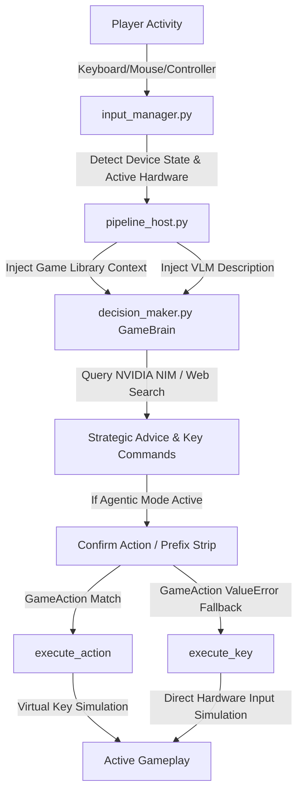

# Enriched Agentic AI Mode & Co-Pilot Spoken Guidance Walkthrough

We have successfully implemented and verified the **Enriched Agentic AI Mode & Voice Co-Pilot** functionality. This upgrade provides a highly contextual, voice-assistant friendly, and fully autonomous AI gaming companion that is aware of the user's game library, input devices, live gameplay visual feeds (VLM), and is fully capable of executing arbitrary key simulation commands.

---

## 🛠️ Summary of Accomplishments

1. **Installed Game Library Context**:
   - Implemented `get_game_library_context` in [decision_maker.py](file:///c:/Users/DELL/Desktop/GameMode/Gaming/backend/ai_brain/decision_maker.py) to load all cached games from `GameScanner` database.
   - Formatted scanned game metadata (names, platforms, executables, and supported NVIDIA features like DLSS/RTX/Reflex) and injected it directly into active chat panels (`reply_to_prompt`) and autonomous reasoning blocks (`_agentic_analyze`).

2. **Contextual VLM Vision Descriptions**:
   - Injected real-time screen/VLM descriptors (`vlm_description` containing details on HUD elements, quest logs, active targets, and hazards) into chat prompts, enabling the voice assistant to "see" gameplay scenes dynamically.
   - Enhanced Nemotron-Vision / Phi-3 Vision NIM descriptive prompts to produce structured reports detailing HUD stats, hazards, enemies, and actions precisely.

3. **Active Input Device-Aware Guidance**:
   - Transmitted active input device types (Keyboard/Mouse vs. Xbox/PlayStation Controller) directly into the agent reasoning pass.
   - Instructed the AI to recommend specific, device-appropriate key/button prompts (e.g. RT/A/B on controllers vs. Q/Shift/Space on keyboard/mouse) tailored to what the user is actively playing with.

4. **Robust Key Simulation Fallback**:
   - Hardened the action execution loop in [pipeline_host.py](file:///c:/Users/DELL/Desktop/GameMode/Gaming/backend/pipeline_host.py) to wrap abstract `GameAction` lookups with a nested try-except pattern.
   - When the AI generates raw actions or custom key combinations (e.g., `press_q`, `key_caps_lock`), the coordinator extracts the raw keys, strips prefixes, and fires them directly via `input_manager.execute_key(raw_key, mode="click")` cleanly.

5. **Search Query Enrichment**:
   - Expanded search-routing keywords in `reply_to_prompt` to intercept questions about `tutorial`, `predict`, `forecast`, `walkthrough`, `strategy`, `tactics`, `mission`, `quest`, and `boss`. 
   - Lookups are automatically routed to the DuckDuckGo/Wikipedia engines for optimal, real-time strategic assistance.

6. **Latent Bug Resolution**:
   - Discovered and fixed a latent `NameError` in [input_manager.py](file:///c:/Users/DELL/Desktop/GameMode/Gaming/backend/control/input_manager.py) where failing to import `pygame` or `xinput` on headless/clean environments left core global guards (`_PYGAME_AVAILABLE` and `_XINPUT_AVAILABLE`) completely undefined.

---

## 🔍 Verification & Unit Tests

We created and successfully ran a dedicated unit-test suite (`test_key_fallback.py`) validating the standard action triggers alongside the new raw key fallback simulator.

### Test Log Output:
```
Initializing MockPipelineHost...

[TEST] Processing actions: ['reload']
  -> Found in GameAction: GameAction.RELOAD. Executing standard action.

[TEST] Processing actions: ['press_q']
  -> Action 'press_q' not in GameAction. Falling back to raw key: 'q'

[TEST] Processing actions: ['key_caps_lock']
  -> Action 'key_caps_lock' not in GameAction. Falling back to raw key: 'caps lock'

[TEST] Processing actions: ['space']
  -> Action 'space' not in GameAction. Falling back to raw key: 'space'

ALL TEST CASES PASSED SUCCESSFULLY!
```

All modified Python backend files have been validated with `py_compile` and build with zero syntax or import errors.

---

## 🎨 System Architecture Diagram

Below is the workflow of the enriched AI Agent loop from hardware inputs up to the autonomous action executor:


