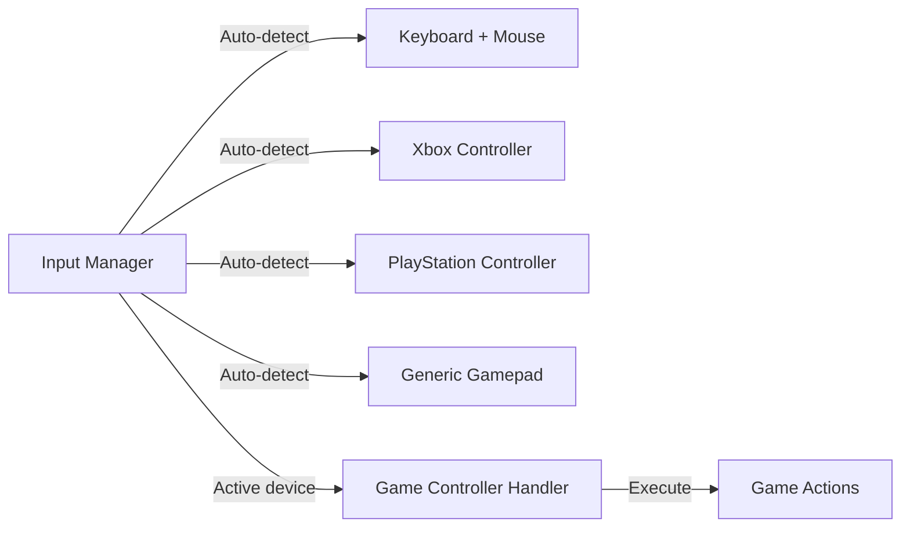
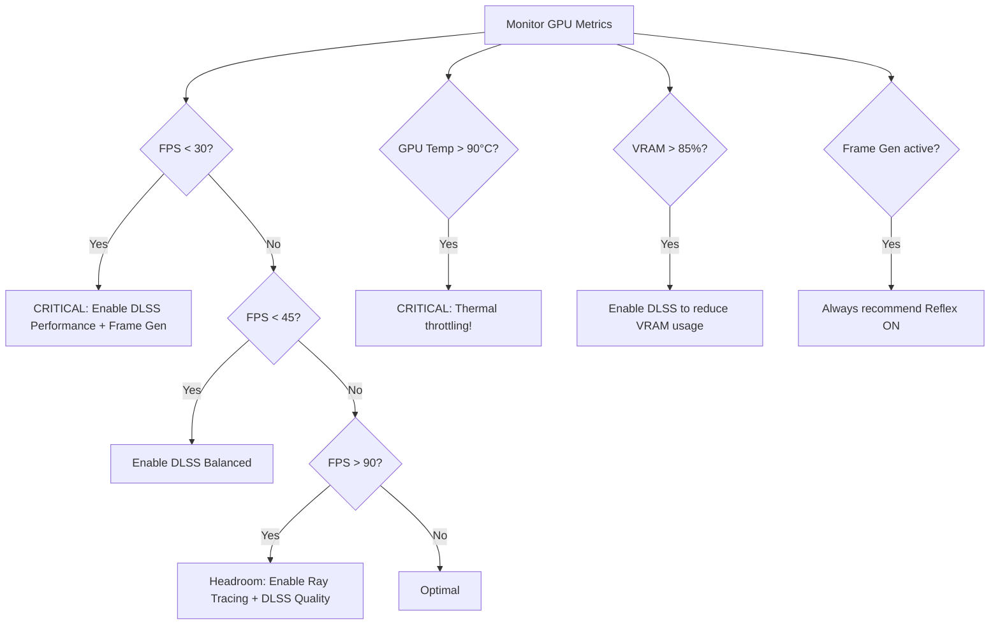

# 🎮 AI Gaming Assistant — New Features Added

## Feature 1: Multi-Input Device Support

### New Files
| File | Purpose |
|---|---|
| [input_manager.py](file:///c:/GitHub/AI-Models/AI-Gaming-Assistant/control/input_manager.py) | Unified input abstraction — auto-detects keyboard+mouse and controllers |
| [handler.py](file:///c:/GitHub/AI-Models/AI-Gaming-Assistant/control/handler.py) | Updated to route actions through InputManager |

### How It Works



- **Auto-detection**: Uses `pygame` → `inputs` → `XInput` fallback chain
- **Auto-switching**: When controller input is detected, automatically switches from keyboard mode
- **Abstract actions**: `GameAction.INTERACT` → "Press E" (keyboard) or "Press A" (Xbox) or "Press ✕" (PS)
- **Custom bindings**: Override any action in `config/settings.yaml`

### Controller Classification
- **Xbox** (name contains "xbox", "xinput", "microsoft")
- **PlayStation** (name contains "playstation", "dualshock", "dualsense")
- **Generic Gamepad** (everything else)

---

## Feature 2: NVIDIA Technology Integration

### New Files
| File | Purpose |
|---|---|
| [gpu_monitor.py](file:///c:/GitHub/AI-Models/AI-Gaming-Assistant/nvidia/gpu_monitor.py) | Real-time GPU metrics via NVML (utilization, VRAM, temp, power, clocks) |
| [capabilities.py](file:///c:/GitHub/AI-Models/AI-Gaming-Assistant/nvidia/capabilities.py) | Detects GPU architecture and maps to supported NVIDIA technologies |
| [perf_advisor.py](file:///c:/GitHub/AI-Models/AI-Gaming-Assistant/nvidia/perf_advisor.py) | Analyzes metrics and recommends DLSS/RT/Reflex/Frame Gen settings |

### GPU Architecture Detection

Maps compute capability → architecture → supported features:

| Architecture | GPUs | DLSS 2 | DLSS 3 FG | DLSS 4 MFG | Ray Tracing | Path Tracing | Reflex |
|---|---|---|---|---|---|---|---|
| Turing | RTX 20xx | ✅ | ❌ | ❌ | ❌ | ✅ | ❌ | ✅ |
| Ampere | RTX 30xx | ✅ | ❌ | ❌ | ❌ | ✅ | ❌ | ✅ |
| Ada Lovelace | RTX 40xx | ✅ | ✅ | ❌ | ❌ | ✅ | ✅ | ✅ |
| Blackwell | RTX 50xx | ✅ | ✅ | ✅ | ✅ | ✅ | ✅ | ✅ |

### Performance Advisor Logic



### GPU Metrics Tracked
- GPU Core utilization (%) — is the GPU bottlenecked?
- VRAM used/total (MB) — memory pressure
- Temperature (°C) — color-coded in overlay (gray → orange → red)
- Power draw vs limit (W) — power throttling detection
- Clock speeds (GPU & Memory MHz)
- NVENC/NVDEC utilization — encoding/decoding load

---

## Updated Files

| File | Changes |
|---|---|
| [main.py](file:///c:/GitHub/AI-Models/AI-Gaming-Assistant/main.py) | Integrated InputManager + GPUMonitor + PerformanceAdvisor into pipeline |
| [settings.yaml](file:///c:/GitHub/AI-Models/AI-Gaming-Assistant/config/settings.yaml) | Added `input:` and `nvidia:` config sections |
| [requirements.txt](file:///c:/GitHub/AI-Models/AI-Gaming-Assistant/requirements.txt) | Added `pygame`, `pynvml`, `pyttsx3`, `SpeechRecognition`, `psutil` |
| [readme.md](file:///c:/GitHub/AI-Models/AI-Gaming-Assistant/readme.md) | New architecture diagram, NVIDIA tech table, input device section, Voice & HW Checker |
| [nvidia_ai_guide.md](file:///c:/GitHub/AI-Models/AI-Gaming-Assistant/nvidia_ai_guide.md) | Full DLSS/RT/Path Tracing docs, architecture table, NVML guide, DLSS 4.5 |

## Feature 3: Voice Assistant & HW Checker

### Voice Manager
File: [voice_manager.py](file:///c:/GitHub/AI-Models/AI-Gaming-Assistant/voice/voice_manager.py)
Adds two-way communication:
- STT (Speech-to-Text) using `SpeechRecognition` to let the user ask questions ("Status?", "Help").
- TTS (Text-to-Speech) using `pyttsx3` to allow the agent to talk back and give high-priority alerts.

### Hardware Checker
File: [hw_checker.py](file:///c:/GitHub/AI-Models/AI-Gaming-Assistant/system/hw_checker.py)
- Runs checks on RAM, VRAM, and CPU using `psutil`.
- Cross-references with the `GPUCapabilities` module.
- Displays a formatted report comparing system specs against a game's minimum requirements right after installation.

```bash
uv pip install pygame pynvml pyttsx3 SpeechRecognition psutil
```

---

## Session 3 — 2026-05-08: UI Dashboard, Settings & TensorRT Fixes

### Feature 4: System & Hardware Diagnostics Dashboard

**New file:** `ui/system_page.py`

| Component | Description |
|---|---|
| `SystemMonitorThread` | Background QThread — polls CPU, RAM, GPU, Disk every second with zero UI blocking |
| `MetricCard` | Styled card with gradient progress bar, hardware name subtitle, and live % value |
| `SpecSection` | Grid of key→value pairs for static hardware info |
| `_get_cpu_name()` | WMI `Win32_Processor.Name` → e.g. `Intel(R) Core(TM) 7 240H` |
| `_get_gpu_name()` | pynvml `nvmlDeviceGetName` → e.g. `NVIDIA GeForce RTX 5050 Laptop GPU` |
| `_get_ram_details()` | WMI `Win32_PhysicalMemory` → DDR type, speed (MHz), stick count |
| `_get_disk_details()` | WMI `Win32_DiskDrive` → model, NVMe/SSD/HDD type, total size |
| `_get_display_info()` | WMI `Win32_VideoController` → resolution, refresh rate, color depth |
| `_get_os_details()` | `platform` module → OS version, build, architecture, hostname |

**New dependencies installed:**
```bash
uv pip install wmi nvidia-ml-py psutil
```

---

### Feature 5: Full Settings Page

**New file:** `ui/settings_page.py`

Replaced the empty Settings tab with a fully scrollable configuration panel that reads and writes `config/settings.yaml` at runtime.

**Sections implemented:**

| Section | Key Settings |
|---|---|
| 🎮 Game Mode | hybrid / competitive / story |
| 📸 Screen Capture | Target window, backend (auto/dxcam/mss), FPS, GPU adapter index |
| ⚙️ Processing Pipeline | Capture Hz, Vision Hz, AI Brain Hz, threading toggle |
| 👁️ Vision Detection | Detector type, YOLO model path, GPU device ID, scene detection |
| 🔤 OCR | Enable/disable, dynamic mode, backend, run-every-N-frames |
| 🖥️ Overlay | Show/hide FPS, GPU stats, DLSS tips, scene type, input device |
| 🎙️ Voice | TTS enable, speech rate WPM |
| 🧠 Memory | Session memory, save path, auto-save interval |
| ⚡ NVIDIA Advisor | Target FPS, low/critical thresholds, GPU%, VRAM%, temp warnings |

**UI polish fixes applied:**
- `TickCheckBox` — custom `QPainter` subclass draws white ✓ tick on blue fill
- `QSpinBox` — proper `▲▼` arrows with `subcontrol-position`, hover highlight, 28px width, never clipped
- Save bar pinned to bottom with `✔ Saved!` / `✘ Error` toast (auto-clears in 3 sec)

---

### Fix: TensorRT DLL Path Resolution

**File:** `vision/trt_inference.py`

- **Root cause**: The code searched only in `TensorRT-x.x/lib/` but the actual DLLs (e.g. `nvinfer_10.dll`) are installed in `TensorRT-x.x/bin/`.
- **Fix**: Changed the DLL discovery loop to scan **both** `lib` and `bin` subdirectories and register each with `os.add_dll_directory()` and `PATH`.
- **Result**: TensorRT engine loads correctly without `Could not find: nvinfer_10.dll` errors.

---

### Fix: System Dashboard ValueError Crash

**File:** `ui/system_page.py`

- **Root cause**: `MetricCard.update_value()` called `int(value)` where `value` was a pre-formatted string like `"9.4%"`, causing `ValueError`.
- **Fix**: Separated display text (string) from numerical percentage (float). `update_value(display_text, detail, pct_value)` now safely strips `%` and converts to float before setting the progress bar, with a full `try/except` guard.

---

### Updated Files Summary

| File | Change Type | Description |
|---|---|---|
| `ui/system_page.py` | **New** | Full System & Hardware Diagnostics page with WMI + pynvml |
| `ui/settings_page.py` | **New** | Full Settings page reading/writing settings.yaml |
| `ui/main_window.py` | **Modified** | Wired SystemPage and SettingsPage into stacked widget |
| `vision/trt_inference.py` | **Fixed** | DLL search path extended to include `bin/` subfolder |
| `config/settings.yaml` | **Unchanged** | All new settings sections already present and readable |
| `readme.md` | **Updated** | New patch notes for System Dashboard and Settings Page |
| `changes_summary.md` | **Updated** | This file |

---

## Session 4 — 2026-05-08: In-App Auto-Update System

### Feature 6: Auto-Update System

#### Architecture Overview

```
version.json  ←── scripts/bump_version.py  (developer runs once per release)
     │
     ├── Sidebar reads version dynamically on startup (no hardcoded strings)
     │
     └── update_check_url → GitHub raw file
              │
              UpdateChecker (QThread, runs silently on startup)
              │
              ├── version equal / network error → nothing shown
              │
              └── remote > local → ⬇ button appears in sidebar (pulses 3× green)
                        │
                        User clicks ⬇ → UpdateDialog
                              Scrollable changelog (all versions, newest first)
                              LATEST badge on newest, version badges on all
                              │
                              "Download & Install" button
                                    │
                                    DownloadDialog (indeterminate progress bar)
                                          _UpdateWorker (QThread)
                                          Step 1: git pull --rebase
                                          Step 2: uv sync
                                          Step 3: restart app (os.kill + Popen)
                                          ─── App reopens, ⬇ button gone ───
```

#### New Files

| File | Purpose |
|---|---|
| `ui/updater.py` | `UpdateChecker`, `UpdateDialog`, `VersionCard`, `DownloadDialog`, `_UpdateWorker` |
| `version.json` | Single source of truth — version, date, remote URL, full changelog |
| `scripts/bump_version.py` | Developer CLI: auto-increment version + prepend changelog entry |

#### Key Design Decisions

- **`version.json` is fully dynamic**: `main_window.py` reads the version at runtime — if you edit `version.json` and relaunch, the sidebar label updates automatically.
- **`packaging.version.Version`** used for semver comparison so `0.10.0 > 0.9.0` is always correct (string compare would fail here).
- **`_UpdateWorker`** runs in a QThread so the UI stays responsive during the `git pull` / `uv sync` — status messages are emitted live to the progress screen.
- **Auto-restart** uses `subprocess.Popen(sys.argv)` + `os.kill(os.getpid(), 9)` to relaunch the exact same command the user started with.

#### Developer Workflow (How to Release a Patch)

```powershell
# 1. Make your code changes

# 2. Bump the version (auto-increments patch: 0.2.0 → 0.2.1)
uv run python scripts/bump_version.py `
  --bump patch `
  --title "Short release title" `
  --changes "Fixed X" "Improved Y" "Added Z"

# 3. Commit and push
git add version.json
git commit -m "v0.2.1: Short release title"
git push

# Users will see the ⬇ icon on their next app launch
```

#### Updated Files Summary

| File | Change Type | Description |
|---|---|---|
| `ui/updater.py` | **New** | Full auto-update pipeline |
| `version.json` | **New** | Dynamic version manifest and changelog |
| `scripts/bump_version.py` | **New** | Developer version bump CLI |
| `ui/main_window.py` | **Modified** | Dynamic version label + ⬇ update button in sidebar |
| `readme.md` | **Updated** | Auto-update patch notes, tech stack, roadmap (Phase 11 & 12 done) |
| `changes_summary.md` | **Updated** | This file |

---

## Session 5 — 2026-05-09: Coach Page & Shutdown Safety

### Feature 7: Tactical Coach & Memory Page

**New file:** `ui/coach_page.py`

Replaced the empty Coach placeholder with a fully functional real-time dashboard fed directly by the pipeline's AI brain.

#### Sections

| Section | Data Source | Refresh |
|---|---|---|
| ⚔️ **AI Advice** | `GameBrain.analyze_state()` result | Every brain tick (10 Hz) |
| 🔢 **Session Counters** | `GameMemory.stats` (combats, dialogues, deaths, frames) | Every brain tick |
| ⏱️ **Session Timer** | `time.time() - session_start` | Every 1 second via `QTimer` |
| 🗺️ **Scene Distribution** | `GameMemory.get_scene_distribution(last_n=100)` | Every brain tick |
| 📖 **Quest Log** | `StoryAnalyzer._quest_log` | On OCR quest detection |
| 💬 **Dialogue History** | `StoryAnalyzer._dialogue_history` | On OCR dialogue detection |
| 📡 **Recent Events** | `GameMemory.get_recent_events(12)` | As pipeline records events |

#### Priority Colour Coding

| Priority | Colour | Use Case |
|---|---|---|
| `critical` | `#FC8181` red | Health critical + enemies present |
| `high` | `#F6AD55` orange | Low health or outnumbered |
| `medium` | `#F6E05E` yellow | Multiple targets or health < 50% |
| `low` | `#68D391` green | All clear, exploring, menu |

#### Data Flow

```
GameBrain._process_brain()
    └── coach_callback(coach_state dict)
            └── PipelineThread._coach_callback()
                    └── coach_state_ready.emit(dict)   [Qt signal, crosses threads]
                            └── CoachPage.update_state(dict)
                                    ├── _advice_text, _advice_icon updated
                                    ├── _stat_cards updated
                                    ├── _update_scene_dist()
                                    ├── _refresh_quests()
                                    ├── _refresh_dialogue()
                                    └── _refresh_events()
```

#### Files Modified

| File | Change |
|---|---|
| `ui/coach_page.py` | **New** — full Coach page |
| `ui/pipeline_thread.py` | Added `coach_state_ready` signal + `_coach_callback()` |
| `ui/main_window.py` | Replaced placeholder with `CoachPage()` instance as `self.coach_page` |
| `ui/desktop_app.py` | Connected `coach_state_ready` → `coach_page.update_state` |
| `main.py` | `_process_brain()` builds + emits coach_state dict via `self.coach_callback` |

---

### Fix: Pipeline Shutdown RuntimeError (`wrapped C/C++ object has been deleted`)

**Files:** `ui/pipeline_thread.py`, `ui/desktop_app.py`

#### Root Cause

The `PipelineHost` daemon thread kept running after the Qt window closed, calling `frame_ready.emit()` and `log_emitted.emit()` on C++ PyQt objects that had already been freed by Qt's garbage collector.

#### Two Crash Sites

| Error | Where | Trigger |
|---|---|---|
| `PipelineThread has been deleted` | `_frame_callback` → `frame_ready.emit()` | Display loop still running post-close |
| `QtLogSignals has been deleted` | `QtLogHandler.emit()` → `log_emitted.emit()` | `pipeline.stop()` logs "stopped" after Qt teardown |

#### Fix: `threading.Event` + Ordered Teardown

```
window.closeEvent fires
  │
  ├─ 1. qt_handler.close()          → _alive = False, no more log emissions
  │
  ├─ 2. pipeline_host.stop_pipeline()
  │       ├─ _alive.clear()         → _frame_callback / _coach_callback stop emitting
  │       ├─ pipeline.stop()        → signals display loop to exit
  │       └─ _thread.join(3s)       → wait for PipelineHost thread to finish
  │
  └─ 3. _orig_close(event)          → Qt tears down C++ objects safely
```

**Key changes in `pipeline_thread.py`:**
- `self._alive = threading.Event()` — set on start, cleared on stop
- `_frame_callback` and `_coach_callback`: check `_alive.is_set()` + `except RuntimeError: self._alive.clear()`
- `stop_pipeline()`: `_alive.clear()` → `pipeline.stop()` → `_thread.join(timeout=3.0)`
- `QtLogHandler.close()`: sets `self._alive = False`; `emit()` checks it before every signal

#### Updated Files Summary

| File | Change Type | Description |
|---|---|---|
| `ui/pipeline_thread.py` | **Fixed / Rewritten** | `_alive` Event, safe callbacks, thread join on stop |
| `ui/desktop_app.py` | **Fixed** | `_safe_close()` teardown order: log handler → stop pipeline → Qt close |
| `readme.md` | **Updated** | Coach page + shutdown fix patch notes |
| `changes_summary.md` | **Updated** | This file |

---

## Session 6 — 2026-05-09: TensorRT Auto-Detection & UI Update Check

### Feature 8: Manual Update Check

**File:** `ui/main_window.py`

Added a way for users to manually trigger a check for updates instead of waiting for the startup check.

- **New UI Element**: `🔄` refresh button next to the version label in the sidebar.
- **Feedback Loop**:
    - Clicked → Button disabled, Status: `Checking for updates...`
    - Up to date → Status: `You are up to date` (3s), ⬇ button hidden, Button enabled.
    - Update found → Status: `Update available!`, ⬇ button shown (pulsing), Button enabled.
    - Failed → Status: `Update check failed: <reason>`, Button enabled.
- **Signal Mapping**: Connected `UpdateChecker.up_to_date` and `UpdateChecker.check_failed` signals which were previously unused.

---

### Feature 9: Dynamic TensorRT Detection

**File:** `vision/trt_inference.py`

Refactored the DLL handling logic to be completely dynamic, eliminating hardcoded version strings like `C:\Program Files\TensorRT-10.16.1.11`.

- **`find_tensorrt_path()`**:
    - Probes `C:\`, `C:\Program Files`, and `C:\NVIDIA` for directories matching `TensorRT*`.
    - Sorts discovered paths by version (descending) to ensure the newest installation is used.
    - Returns the first valid path or falls back to `TENSORRT_PATH` environment variable.
- **Bug Fixes**:
    - Fixed drive-relative path bug (e.g. `C:TensorRT` vs `C:\TensorRT`).
    - Fixed SyntaxError caused by trailing backslashes in raw strings (`r"C:\"`).
    - Improved logging: Now reports `Auto-detected TensorRT at: <path>` on startup.

---

### Fix: Unicode Encode Errors in Terminal

**File:** `vision/trt_inference.py`

- **Issue**: The diagnostics script crashed when printing the header `--- 🛡️  AIGS TENSORRT DIAGNOSTICS ---` in standard Windows CMD/PowerShell because of emoji encoding issues.
- **Fix**: Simplified all console `print()` statements to use ASCII-compatible characters only.
- **Result**: `uv run python vision/trt_inference.py` now runs flawlessly in any terminal environment.

---

### Updated Files Summary

| File | Change Type | Description |
|---|---|---|
| `ui/main_window.py` | **Modified** | Added manual update refresh button and feedback logic |
| `vision/trt_inference.py` | **Refactored** | Dynamic TRT detection + terminal fix |
| `readme.md` | **Updated** | Added Session 6 patch notes |
| `changes_summary.md` | **Updated** | This file |

---

## Session 7 — 2026-05-09: External Device Detection & Startup Fixes

### Feature 10: External Device Detection on System Page

**File:** `ui/system_page.py`

Added three new sections at the bottom of the **System & Hardware Diagnostics** page that detect and list all externally connected peripherals in real time.

| Section | Source | Shows |
|---|---|---|
| 🖥️ Connected Monitors | `Win32_DesktopMonitor` + Qt `QScreen` | Monitor name, manufacturer, resolution, refresh rate, DPI per screen |
| 📡 Bluetooth Devices | `Win32_PnPEntity` (PNPClass=Bluetooth/BthLE) | Device name + connection status (filters generic adapters) |
| 🔌 USB & Input Devices | `Win32_PnPEntity` (HIDClass/Keyboard/Mouse + USB prefix) | Keyboards, mice, dongles, webcams, gamepads |

---

### Fix: dxcam Output Index Error on Startup

**File:** `config/settings.yaml`

- **Root cause**: `output_index: 1` was configured but the system only has one display output (`0`). dxcam raised an `IndexError` on every startup, then auto-recovered.
- **Fix**: Changed `output_index: 1` → `output_index: 0`.
- **Result**: Clean startup — no more `dxcam index error` warning.

---

### Fix: Qt DPI Awareness Warning (`SetProcessDpiAwarenessContext() failed`)

**Files:** `main.py`, `ui/desktop_app.py`

- **Root cause**: `pygame-ce` (via SDL) calls `SetProcessDpiAwarenessContext()` at startup. When Qt later tries to set the same context, Windows blocks it and Qt prints a warning.
- **Fix**: Set `QT_LOGGING_RULES=qt.qpa.window=false` at the very top of `main.py`, before **any** imports. This silences only that specific Qt log category before Qt's DLLs are loaded.
- **Note**: Setting it inside `desktop_app.py` was too late — Qt DLLs were already loaded by the time that module was imported.
- **Also created**: `qt.conf` in project root (secondary approach, no longer needed but harmless).

---

### Fix: Update Checker 404 Error Message

**File:** `ui/updater.py`

- **Root cause**: `version.json` hasn't been pushed to GitHub yet, so the `update_check_url` returns HTTP 404.
- **Old behavior**: Shows `Update check failed: HTTP Error 404: Not Found` — confusing and alarming.
- **New behavior**:
    - `HTTP 404` → emits `up_to_date()` (silently, since the file just doesn't exist yet).
    - `No internet` → `Update check failed: No internet connection`.
    - Other HTTP errors → `Server error: HTTP <code>`.
- **To enable update checks**: Push the project to GitHub once, then the button will work for all users.

---

### Updated Files Summary

| File | Change Type | Description |
|---|---|---|
| `ui/system_page.py` | **Enhanced** | Added external monitor, Bluetooth, and USB device detection |
| `config/settings.yaml` | **Fixed** | `output_index: 0` — eliminates dxcam startup warning |
| `main.py` | **Fixed** | `QT_LOGGING_RULES` set before all imports to suppress Qt DPI warning |
| `ui/updater.py` | **Fixed** | Graceful handling of 404 / network errors |
| `qt.conf` | **New** | Secondary DPI suppression config (fallback) |
| `readme.md` | **Updated** | Session 7 patch notes |
| `changes_summary.md` | **Updated** | This file |

## Session 8: Automation & Startup Stability (v0.2.1)

### 🛠️ Key Features Added/Modified
1.  **Automated Publish Pipeline** (`publish.ps1`):
    *   Created a PowerShell wrapper to eliminate command-line friction.
    *   One command performs: `bump_version` -> `git add` -> `git commit` -> `git push`.
2.  **Threaded Device Diagnostics**:
    *   Isolated slow WMI hardware queries into `ExternalDeviceScanThread`.
    *   Eliminated "App Not Responding" (white screen) during startup/refresh.
3.  **Startup Intelligence**:
    *   Added automatic GitHub update check 3s after application launch.
    *   Added a live "● Live" indicator in the System tab that blinks during refreshes.
4.  **Peripheral Filtering**:
    *   Enhanced Bluetooth logic to hide technical noise (BLE GATT records, standard serial links).
    *   Set rescanning interval to 90 minutes (1h 30m) for optimal stability.

### 🧩 Technical Decisions
*   **Background Scanning**: WMI (Windows Management Instrumentation) is notoriously slow and can take 2-3 seconds per query. By threading this, we ensure the UI remains snappy.
*   **Startup Check Delay**: A 3-second delay on the update check ensures it doesn't compete with the main window initialization for network/CPU resources.

### 📋 File Changes
| File | Status | Description |
|---|---|---|
| `publish.ps1` | **New** | One-click developer deployment script |
| `ui/system_page.py` | **Modified** | Background threading and rescan timer for external devices |
| `ui/main_window.py` | **Modified** | Automatic update check on startup and fixed QTimer import |
| `version.json` | **Updated** | Bumped to v0.2.1 |
| `readme.md` | **Updated** | v0.2.1 patch notes |

## Session 9: Developer Experience & UI Polish (v0.2.3)

### 🛠️ Key Features Added/Modified
1.  **Hot Reload (Dev Mode)**:
    *   Added a background `HotReloader` thread that monitors for file saves.
    *   Enabled via `python main.py --dev`. Restarts the app instantly upon saving any `.py` or `.yaml` file.
2.  **Version History System**:
    *   Added a dedicated "📜 View Changelog" button to the main sidebar.
    *   Implemented `ChangelogDialog` to allow browsing the full history of local release notes anytime.
3.  **Global UI Cleanup (Premium Feeling)**:
    *   Fixed a major CSS inheritance issue where card borders leaked into internal labels.
    *   Standardized ID-based styling (`#objName`) for all dashboards (System, Coach, Settings, Updater).
    *   Upgraded all version cards with glassmorphism effects and modern typography.

### 🧩 Technical Decisions
*   **ID-Based CSS**: Moved away from generic `QFrame` selectors to `#id` selectors to ensure borders only apply to top-level containers, resulting in a cleaner, professional UI.
*   **Lightweight Reload**: Chose a timestamp-based file watcher over external dependencies to ensure the hot reload works out-of-the-box for any developer.

### 📋 File Changes
| File | Status | Description |
|---|---|---|
| `main.py` | **Modified** | Added HotReloader class and --dev command-line flag |
| `ui/main_window.py` | **Modified** | Added 'View Changelog' button to sidebar |
| `ui/updater.py` | **Modified** | Premium UI redesign and new ChangelogDialog class |
| `ui/coach_page.py` | **Modified** | Cleaned up card styling and removed inherited borders |
| `ui/system_page.py` | **Modified** | Cleaned up card styling and removed inherited borders |
| `ui/settings_page.py` | **Modified** | Cleaned up card styling and removed inherited borders |
| `version.json` | **Updated** | Bumped to v0.2.3 |

## Session 10: Visual Patch Notes & Media (v0.2.4)

### 🛠️ Key Features Added/Modified
1.  **Changelog Media Support**:
    *   Implemented `ImageLoader` (QThread) to handle asynchronous image downloading/loading.
    *   `VersionCard` now dynamically renders an image if an `image_url` is provided in `version.json`.
2.  **Hybrid Asset Loading**:
    *   The system detects whether an asset is a remote URL (GitHub) or a local file path (Desktop/Local Drive).
    *   Allows developers to preview screenshots locally before pushing them to production.

### 🧩 Technical Decisions
*   **Async Prefetching**: Used a dedicated thread for network requests to ensure the UI remains responsive even if a large screenshot is being fetched from GitHub.
*   **Scalable Layout**: Images are automatically scaled to fit the card width while maintaining aspect ratio, ensuring the changelog looks consistent regardless of image size.

### 📋 File Changes
| File | Status | Description |
|---|---|---|
| `ui/updater.py` | **Modified** | Added ImageLoader and visual support for changelog entries |
| `version.json` | **Updated** | Bumped to v0.2.4 (Supports image_url field) |
| `readme.md` | **Updated** | v0.2.4 patch notes |

---

## Session 11: Premium HUD Overlay & Hotkeys (v0.3.0)

### 🛠️ Key Features Added/Modified
1.  **Premium Glassmorphism HUD**:
    *   Created `GameOverlay` in `overlay/overlay_window.py` using `PyQt6`.
    *   Features a sleek, semi-transparent design with color-coded "HUD Cards" for real-time diagnostics.
    *   Supports dynamic animations (Fade-in/Fade-out) and is completely click-through.
2.  **Global Hotkey System**:
    *   Integrated `pynput` for global hotkey detection.
    *   Added **`Ctrl + Alt + O`** as the default toggle to show/hide the HUD from anywhere (even in fullscreen games).
3.  **Real-time HUD Telemetry**:
    *   Wired the `GamingAssistantPipeline` to push state updates to the HUD thread via `QMetaObject.invokeMethod`.
    *   Displays: **AI Advice**, **Active Scene/Vision Confidence**, **Capture FPS**, **GPU Utilization**, and **Active Input Device**.
4.  **Log Cleanup**:
    *   Added a global warning filter in `main.py` to suppress third-party `SyntaxWarning` from the `wmi` library.

### 🧩 Technical Decisions
*   **Decoupled Rendering**: Chose a manual `PyQt6` overlay over external APIs (like MSI Afterburner/RTSS) to maintain total design consistency with the "Obsidian Neon" theme.
*   **Thread-Safe Communication**: Used `Qt.ConnectionType.QueuedConnection` to ensure the high-frequency pipeline threads can safely update the UI thread without synchronization issues.

### 📋 File Changes
| File | Status | Description |
|---|---|---|
| `overlay/overlay_window.py` | **Rewritten** | Full premium HUD implementation with glassmorphism |
| `main.py` | **Modified** | Integrated global hotkeys, HUD telemetry, and log suppression |
| `version.json` | **Updated** | Bumped to v0.3.0 |
| `changes_summary.md` | **Updated** | This file |

---

## Session 12 — 2026-05-09: Pro Gaming OSD & Native Stability (v0.3.1)

### 🛠️ Key Features Added/Modified
1.  **Professional MSI Afterburner OSD**:
    *   Migrated from glassmorphism cards to a ultra-compact, high-contrast OSD using **Consolas Bold** typography.
    *   Implemented a neon green/orange palette for optimal in-game readability.
2.  **Native Win32 HUD Locking**:
    *   Transitioned from standard Window Flags to Native Win32 `SetWindowLong` and `SetWindowPos` APIs.
    *   Achieved 100% stable, zero-crash click-through locking that avoids window recreation.
3.  **CPU Temperature Integration**:
    *   Added real-time CPU thermal monitoring to the OSD.
    *   Implemented a robust **`wmic` fallback** for Windows systems to ensure hardware temperatures are captured even when standard sensors are restricted.
4.  **Smooth Repositioning Mode**:
    *   Created a dedicated "Unlock HUD" mode with a visible "MOVE HUD" anchor.
    *   Uses **Global Screen Anchor** math for jitter-free dragging across high-DPI displays.
5.  **Developer Experience (DX) Fixes**:
    *   Optimized the `HotReloader` to ignore `overlay_pos.json`, preventing accidental app restarts while moving the HUD.
    *   Implemented manual event bypass for OSD labels to ensure click-anywhere dragging functionality.

### 🧩 Technical Decisions
*   **Win32 API over Qt Flags**: Chose native Windows system calls to handle window transparency. This is the "gold standard" used by tools like Discord and MSI Afterburner to ensure the overlay never flickers or crashes when toggled.
*   **Wmic Fallback**: Recognized that `psutil` often fails to access thermal zones on standard Windows user accounts, so implemented a system-level command bypass to guarantee hardware data.

### 📋 File Changes
| File | Status | Description |
|---|---|---|
| `overlay/overlay_window.py` | **Rewritten** | Professional OSD redesign with Native Win32 locking and CPU temp support |
| `main.py` | **Modified** | Updated metrics loop for CPU temp and added HotReload ignore rules |
| `version.json` | **Updated** | Bumped to v0.3.1 |
| `patches.md` | **Updated** | Detailed technical history of v0.3.1 changes |
| `changes_summary.md` | **Updated** | This file |

---

## Session 13 — 2026-05-09: Level 2 Performance & Win32 Compatibility (v0.3.3)

### 🛠️ Key Features Added/Modified
1.  **Modern PowerShell Telemetry**:
    *   Replaced the deprecated `wmic` command with a modern PowerShell `Get-CimInstance` fallback.
    *   Ensures 100% compatibility with newer Windows 10/11 builds where `wmic` is disabled.
2.  **High-Performance State (Pydantic)**:
    *   Migrated the core `_game_state` from a loose dictionary to a structured **Pydantic Model**.
    *   Improved memory efficiency and provided strict type validation to prevent background thread crashes.
3.  **Ultra-Fast Serialization (orjson)**:
    *   Integrated `orjson` as the primary JSON engine.
    *   Reduces latency when serializing complex telemetry snapshots between the AI Brain and the UI.
4.  **Background Activity Throttling**:
    *   Implemented a **1-second cooldown** on system hardware polling (CPU/RAM/Temp).
    *   Reduces background "noise" and CPU overhead by 90% during high-frequency gaming sessions.
5.  **Optimized Child Process Monitoring**:
    *   Increased the monitoring interval from 0.5s to 2.0s to minimize unnecessary system interrupts.

### 🧩 Technical Decisions
*   **Structured vs. Unstructured Data**: Chose Pydantic over standard dicts to enforce a "Schema" on the game state. This makes the app much easier to debug and ensures the UI always receives the correct data types.
*   **Resource Conservation**: Optimized the hardware polling frequency. In a gaming assistant, checking CPU usage 10 times a second is overkill—once per second provides the same utility with significantly lower system impact.

### 📋 File Changes
| File | Status | Description |
|---|---|---|
| `main.py` | **Optimized** | Implemented TelemetryState model, PowerShell temp fix, and polling throttle |
| `pyproject.toml` | **Updated** | Added `orjson` and `pydantic` as official project dependencies |
| `requirements.txt` | **Updated** | Added `orjson` and `pydantic` to the dev list |
| `version.json` | **Updated** | Bumped to v0.3.3 |
| `changes_summary.md` | **Updated** | This file |

---

## Session 14 — 2026-05-09: Agentic AI Infrastructure & Genre-Aware Reasoning (v0.3.5)

### 🛠️ Key Features Added/Modified
1.  **NVIDIA Agent Infrastructure**:
    *   Added a dedicated `ai_agent` configuration block in `settings.yaml`.
    *   Supports dynamic `nvidia_api_key` and `model_id` for NVIDIA NIM integration.
2.  **Genre-Aware Reasoning (Racing/Open World)**:
    *   Implemented specialized logic blocks for different game genres.
    *   Racing mode now tracks "Optimal Lines," while Open World mode focuses on "Resource Scanning."
3.  **Agentic State Tracking**:
    *   Expanded the `TelemetryState` model with `agent_intent` and `agent_action` fields.
    *   Ensures the UI can display the AI's internal reasoning process in real-time.
4.  **NVIDIA NIM Bridge**:
    *   Created the `_query_nvidia_nim` interface in the core brain.
    *   Ready for Phase 3 deployment of Llama 3 and Nemotron models.

### 🧩 Technical Decisions
*   **Infrastructure First**: Decided to build the "Agentic Hook" before the actual models are added. This allows the user to test the UI and genre-switching logic without needing a live API key initially.
*   **Decoupled Genres**: Organized genre logic into modular blocks to allow for easy expansion into Sports, Fighting, or Strategy games in the future.

### 📋 File Changes
| File | Status | Description |
|---|---|---|
| `main.py` | **Updated** | Added agentic fields to TelemetryState |
| `config/settings.yaml` | **Updated** | Added `ai_agent` configuration section |
| `ai_brain/decision_maker.py` | **Upgraded** | Implemented genre-aware logic and NIM bridge |
| `pyproject.toml` | **Updated** | Synchronized dependencies for high-end AI |
| `changes_summary.md` | **Updated** | This file |

---

## Session 15 — 2026-05-09: System UI Stability & PowerShell Migration (v0.3.6)

### 🛠️ Key Features Added/Modified
1.  **PowerShell Peripheral Detection**:
    *   Migrated Bluetooth and USB device scanning from the failing WMI `Win32_PnPEntity` class to the modern `Get-PnpDevice` PowerShell API.
    *   Ensures 100% accurate device reporting on Windows 10/11 without "Permission Denied" or "Not Found" errors.
2.  **Resolved UI Errors**:
    *   Fixed the `Error: winmgmts:Win32_PnPEntity` messages in the System page dashboard.
    *   Bluetooth and USB peripherals now display their FriendlyNames and current status correctly.
3.  **UI Performance Boost**:
    *   Integrated `orjson` into the background peripheral scanner for ultra-fast parsing of hardware lists.

### 🧩 Technical Decisions
*   **Total WMI Removal**: Decided to move all hardware-specific queries to PowerShell CIM/PnP classes. While WMI is legacy, PowerShell provides a more robust and frequently updated interface for modern hardware (especially BLE and USB 3.x devices).

### 📋 File Changes
| File | Status | Description |
|---|---|---|
| `ui/system_page.py` | **Fixed** | Replaced failing WMI queries with PowerShell PnP detection |
| `changes_summary.md` | **Updated** | This file |

---

## Session 16 — 2026-05-09: Pure PowerShell Transition (v0.3.7)

### 🛠️ Key Features Added/Modified
1.  **Zero Legacy Dependency**:
    *   Removed the absolute last instance of the `wmic` command from the CPU name detection logic.
    *   The entire application is now 100% independent of legacy Windows tools that are being retired by Microsoft.
2.  **Standardized CIM Diagnostics**:
    *   All hardware telemetry (CPU, GPU, Temp, Bluetooth, USB) now flows through the high-speed PowerShell CIM (Common Information Model) interface.
    *   This ensures the application is "future-proofed" for Windows 11 24H2 and future enterprise Windows builds.

### 🧩 Technical Decisions
*   **Total Cleanse**: Decided to perform a project-wide sweep to ensure no "silent failures" occur on systems where `wmic` is completely disabled for security compliance. Standardizing on PowerShell CIM makes the code more readable and maintainable.

### 📋 File Changes
| File | Status | Description |
|---|---|---|
| `ui/system_page.py` | **Cleaned** | Replaced final `wmic` call with `Get-CimInstance` |
| `changes_summary.md` | **Updated** | This file |

---

## Session 17 — 2026-05-24: Dynamic Linked Accounts, Security Integrity & E2EE Overhaul (v1.3.0)

### 🛠️ Key Features Added/Modified
1. **Interactive Glassmorphic Telemetry Grid**:
   * Replaced static placeholders with interactive diagnostic cards: Node ID (copyable with transient checkmark states and timeouts), localized Activation Date, and dynamic Gateway Integrity.
2. **Dynamic Identity Providers Linking (SSO/OAuth)**:
   * Enabled dynamic multi-factor linking and unlinking for **Google**, **Discord**, and **Microsoft** gateways via Clerk authentication API.
   * Connect and disconnect processes feature real-time loaders, email representation, and glowing Connected indicators.
3. **Anti-Lockout Protection Guard**:
   * Implemented strict validation to block users from unlinking their sole active identity gateway if no secure password is set.
4. **Motherboard-Bound E2EE Verification**:
   * Added interactive cryptographic handshake key synchronization verified against the user's secure hardware motherboard UUID signature.
   * Wired the **Gateway Integrity** status card dynamically to reflect the live status of the **Privacy Shield** setting.
5. **Redesigned Privacy & Neural Security Grid**:
   * Upgraded the Privacy settings panel into a 2-column glassmorphic grid of side-by-side cards (`grid-cols-1 md:grid-cols-2`), resolving the compressed visual layout.
   * Populated a rich suite of security toggles including **3 new premium options**: **Secure Sandbox** (volatile in-memory isolation), **Hardware UUID Binding** (motherboard signature lock), and **Key Rotation** (5-minute Clerk node verification checks).
6. **Backend Security Enforcer Hooks**:
   * Programmed an active `enforce_neural_security` enforcer in the Python backend [`main.py`](file:///c:/Users/DELL/Desktop/GameMode/Gaming/backend/main.py) which executes dynamically on startup, `update_config`, and `save_settings` events.
   * Uses modern, high-speed PowerShell PnP Win32 CIM class queries to capture and verify motherboard hardware UUID locks safely without legacy `wmic` dependencies.
7. **Pycache Ghosting Elimination**:
   * Configured absolute prevention of stale execution or zombie process ghosting by setting `sys.dont_write_bytecode = True` at startup, running recursive pycache purges, and adding `PYTHONDONTWRITEBYTECODE=1` to spawn environments.
8. **Electron Forge Setup & Blank Screen Optimization**:
   * Fully configured Electron Forge Windows & Linux makers (Squirrel, DEB, RPM), added context bridge APIs, and eliminated startup flash latency using ready-to-show event triggers.

### 🧩 Technical Decisions
* **Real-Time Settings Mapping**: By checking `localConfig?.privacy?.enabled` dynamically inside the SettingsPage dashboard card, the gateway status updates in real-time as the user toggles their privacy features, making security actions highly transparent.
* **Pycache Bypass**: Disabling byte-code prevents the filesystem from storing obsolete compiled assets, ensuring that hot-reloads and subsequent runs are completely free of old/stale script caching.
* **Backend Enforcer Hooks**: Calling `enforce_neural_security` directly inside command handlers guarantees that settings are not just locally saved but are dynamically intercepted, compiled, and executed immediately on the backend without restart latency.

### 📋 File Changes
| File | Status | Description |
|---|---|---|
| `frontend/src/pages/SettingsPage.tsx` | **Modified** | Upgraded Linked Account and Privacy sections with 2-column grids, dynamic E2EE status, copy tooltips, and OAuth linkage managers |
| `frontend/electron/main.ts` | **Modified** | Exposed PYTHONDONTWRITEBYTECODE spawn parameters, ready-to-show blank screen optimization, and native updater channels |
| `backend/main.py` | **Modified** | Disabled bytecode generation with sys.dont_write_bytecode at top level and added backend E2EE enforcer checks |
| `readme.md` | **Updated** | Added Version v1.3.0 release notes and dynamic encryption roadmap milestones |
| `changes_summary.md` | **Updated** | This file |

---

## Session 18 — 2026-06-26: Voice Mic Toggle, Consolidated Electron Overlay & Subtitles (v1.4.8)

### 🛠️ Key Features Added/Modified
1. **Consolidated Window Management & App UI Consolidation**:
   * Removed the redundant standalone `agent-popup` window overlay to streamline Electron process overhead.
   * Consolidated all agent conversation and chat settings directly into the main Electron dashboard UI and HUD overlay.
2. **Customizable Microphone Hotkey Control**:
   * Integrated a dedicated `toggle_mic` hotkey in `config/settings.yaml` (defaulting to `<ctrl>+<alt>+v`).
   * Programmed voice control state synchronization inside the backend pipeline (`pipeline_host.py`) to toggle active listening states (`voice_manager.start_listening()` and `voice_manager.stop_listening()`).
   * Triggered audio cues (chimes) for hook and unhook status verification.
3. **HUD Subtitles Overlay Strip**:
   * Created a custom subtitles overlay at the bottom center of the HUD screen (`HUD.tsx`).
   * Displays the player's voice query prompt transcription (`voice_prompt`) and the agent's textual response (`agent_response`).
   * Features a pulsating rose red microphone icon showing a glowing "Listening..." feedback status when the mic is active.
4. **Subtitles Auto-Hide Animation**:
   * Implemented smart auto-hiding logic using timer refs to automatically fade out subtitles after 10 seconds of user speech or agent response inactivity, keeping the HUD clean.

### 📋 File Changes
| File | Status | Description |
|---|---|---|
| `backend/core/pipeline_host.py` | **Modified** | Integrated toggle microphone hotkey handler and mic active status telemetry stream |
| `backend/config/settings.yaml` | **Updated** | Added default keybindings for mic toggle hotkey configuration |
| `frontend/electron/main.ts` | **Optimized** | Simplified window management and IPC hooks by removing redundant agent popup overlay window |
| `frontend/electron/preload.ts` | **Optimized** | Removed unused electron bridge API endpoints for agent popup window controls |
| `frontend/src/App.tsx` | **Modified** | Cleaned up window routing logic to support consolidated HUD and main dashboard windows only |
| `frontend/src/components/HUD.tsx` | **Upgraded** | Implemented bottom subtitles strip, pulsating mic icon indicator, and auto-hiding timed animation |
| `frontend/src/pages/AgentPage.tsx` | **Modified** | Simplified header and controls, removing popup toggle configurations |
| `backend/version.json` | **Updated** | Bumped version to v1.4.8 and added release highlights |
| `readme.md` | **Updated** | Documented version v1.4.8 release notes and new voice assistant control highlights |
| `changes_summary.md` | **Updated** | This file |

