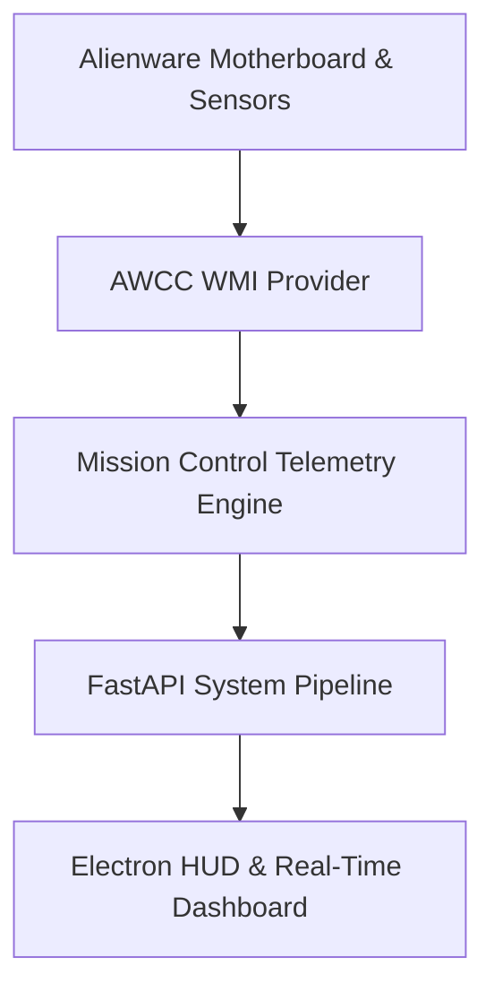
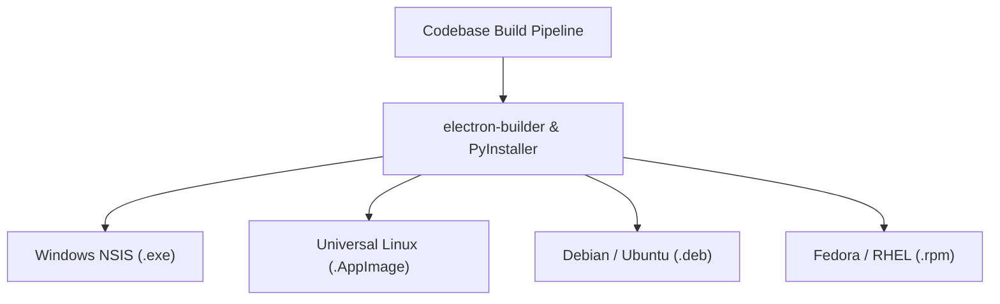

# 🚀 Major Updates & Release History

Comprehensive breakdown of major milestone releases, architectural upgrades, and core engine enhancements in **Mission Control**.

---

## 🌟 Version v3.1.6 (Latest) — Alienware AWCC Thermal Architecture

### 🛠️ Key Highlights
1. **Alienware AWCC Thermal Sensor Integration**: Resolved long-standing sensor latency by directly hooking into Alienware Command Center (AWCC) WMI namespaces (`root\\WMI\\Alienware`), providing instantaneous CPU temperature readings on Alienware m15, x15, and Aurora systems.
2. **Zero-Latency Telemetry Priming Loop**: Eliminated initial 0% CPU and 0°C readings on application launch through a non-blocking background initialization priming pass.
3. **Automated Release Documentation Sync**: Integrated real-time version stamping across website documentation (`SUMMARY.md`) and package manifests.

### 📊 Architecture & Data Flow

```mermaid
graph TD
    A["Alienware Motherboard & Sensors"] --> B["AWCC WMI Provider"]
    B --> C["Mission Control Telemetry Engine"]
    C --> D["FastAPI System Pipeline"]
    D --> E["Electron HUD & Real-Time Dashboard"]
```

---

## 📦 Version v3.1.5 — Multi-Platform Linux Packaging

### 🛠️ Key Highlights
1. **Universal Linux Package Suite**: Added automated multi-distribution compilation producing `.AppImage`, `.deb` (Debian/Ubuntu/Mint), `.rpm` (Fedora/RHEL/openSUSE), and portable `.tar.gz` bundles.
2. **Dynamic OS Download Router**: Website download hub automatically detects the visitor's operating system (Windows vs Linux) and serves the appropriate native binary.
3. **Flathub & Snapcraft Readiness**: Prepared Flatpak and Snap manifests for one-click installation on Steam Deck (SteamOS) and Ubuntu Desktop.

### 📊 Distribution Pipeline

```mermaid
graph TD
    A["Codebase Build Pipeline"] --> B["electron-builder & PyInstaller"]
    B --> C["Windows NSIS (.exe)"]
    B --> D["Universal Linux (.AppImage)"]
    B --> E["Debian / Ubuntu (.deb)"]
    B --> F["Fedora / RHEL (.rpm)"]
```

---

## 🎨 Version v3.1.4 — Glassmorphic Desktop UI & Design System

### 🛠️ Key Highlights
1. **Glassmorphism & Neural Glow Theme**: Complete overhaul of the desktop frontend with backdrop blurs, dark slate palettes, and custom neon green accents (`#76b900`).
2. **Lucide Vector Icons**: Replaced legacy raster icons with lightweight Lucide vector SVG components across all navigation drawers and diagnostic cards.
3. **Responsive Mobile & Desktop Docs**: Clean markdown documentation layout featuring auto-generated tables of contents, active reading progress, and interactive Mermaid flowcharts.

---

## ⚡ Version v3.1.3 — Hybrid Connectivity & Neural Lite Offline Mode

### 🛠️ Key Highlights
1. **Dynamic Offline / Online Switching**: Automatically detects network dropouts and switches reasoning from cloud NVIDIA NIM to local Neural Lite models without crashing active game sessions.
2. **Zero-VRAM Offline Fallback**: Utilizes quantized CPU execution providers (ONNX Runtime / OpenVINO) for offline decision making with zero VRAM impact on running games.
3. **Automatic Reconnection & Cache Sync**: Seamlessly syncs cached telemetry and logs to the cloud once an active internet connection is re-established.

---

## 🌐 Version v3.1.2 — Multi-Source Gaming Intelligence Engine

### 🛠️ Key Highlights
1. **100% Free Web Intelligence**: Integrated Wikipedia, RAWG.io, SteamSpy, and DuckDuckGo search pipelines for real-time game lore, patch notes, and boss strategy lookups.
2. **Smart Search Query Routing**: Intercepts in-game questions about tutorials, quest solutions, and patch notes, querying the fastest data source dynamically.
3. **Context Injection into AI Brain**: Injects live game search snippets into NVIDIA NIM prompts so tactical advice is always based on the latest game patches.

---

## ⌨️ Version v3.1.0 — Click-to-Record Hotkey Manager & DirectX 12 Hooks

### 🛠️ Key Highlights
1. **Click-to-Record Hotkey UI**: Allows gamers to record custom global key combinations directly from the Settings panel with instant visual feedback.
2. **DirectX 11 / 12 Frame Presentation Hooks**: Sub-1ms frame timing hooks built in C++ with pybind11 bindings for accurate 1% low FPS calculations.
3. **Multi-Input Device Auto-Switching**: Automatically detects active controllers (Xbox, PlayStation DualSense, Generic Gamepads) and adjusts UI key prompts dynamically.

---

## 👁️ Version v3.0.0 — Zero-Waste TensorRT Vision Engine

### 🛠️ Key Highlights
1. **Pure TensorRT 10.x Acceleration**: High-speed YOLOv8 object and HUD detection running in under 5ms with **0 MB PyTorch VRAM overhead**.
2. **DXGI Desktop Duplication (`dxcam`)**: Captures 60–120+ FPS directly from the GPU framebuffer without CPU-side pixel copying.
3. **Glassmorphic In-Game HUD Overlay**: Ultra-lightweight transparent overlay displaying real-time FPS, thermals, and AI tactical cards over active DirectX/Vulkan games.
