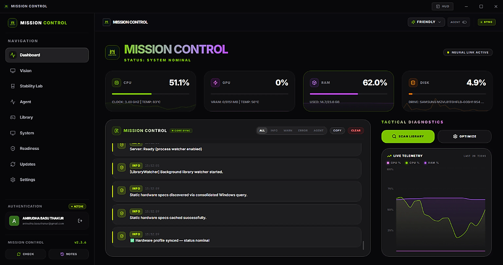
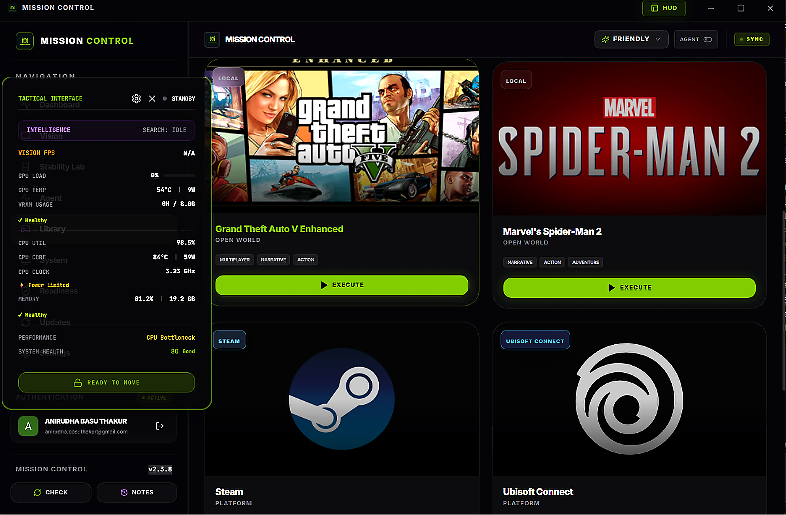
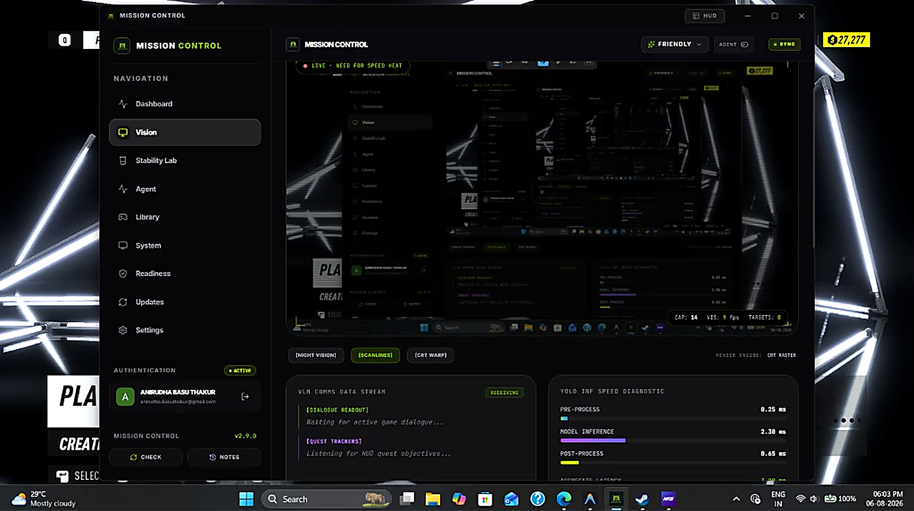
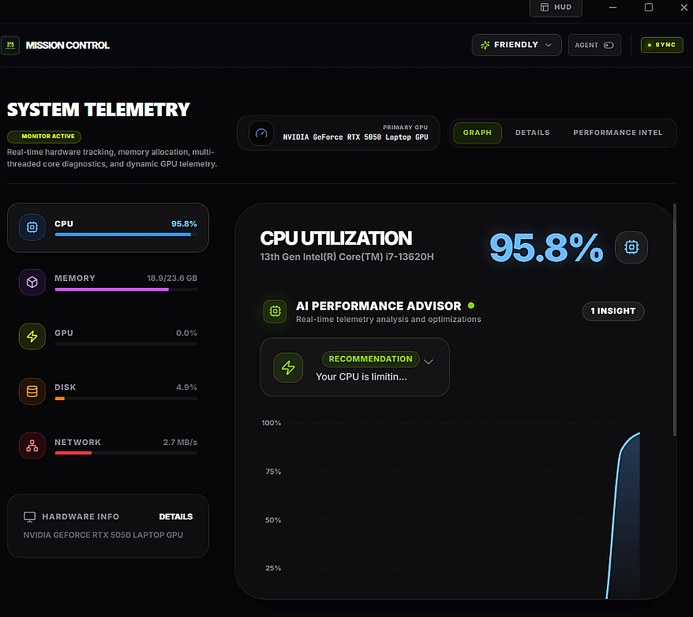
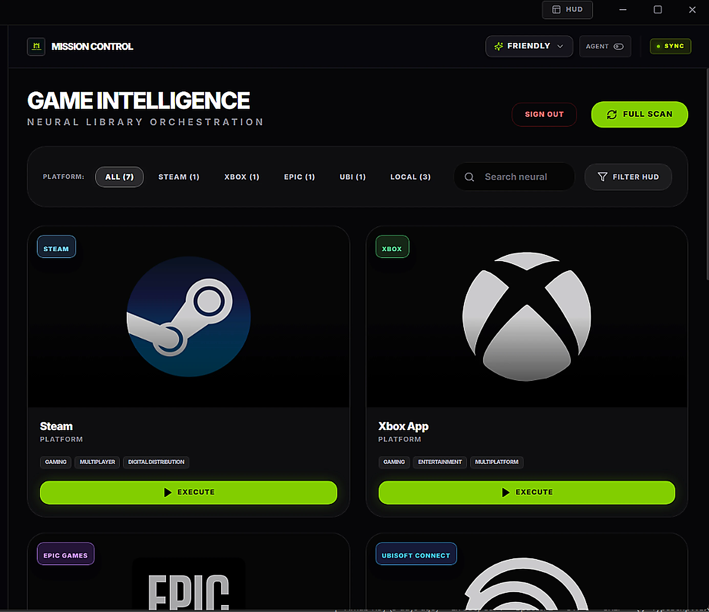
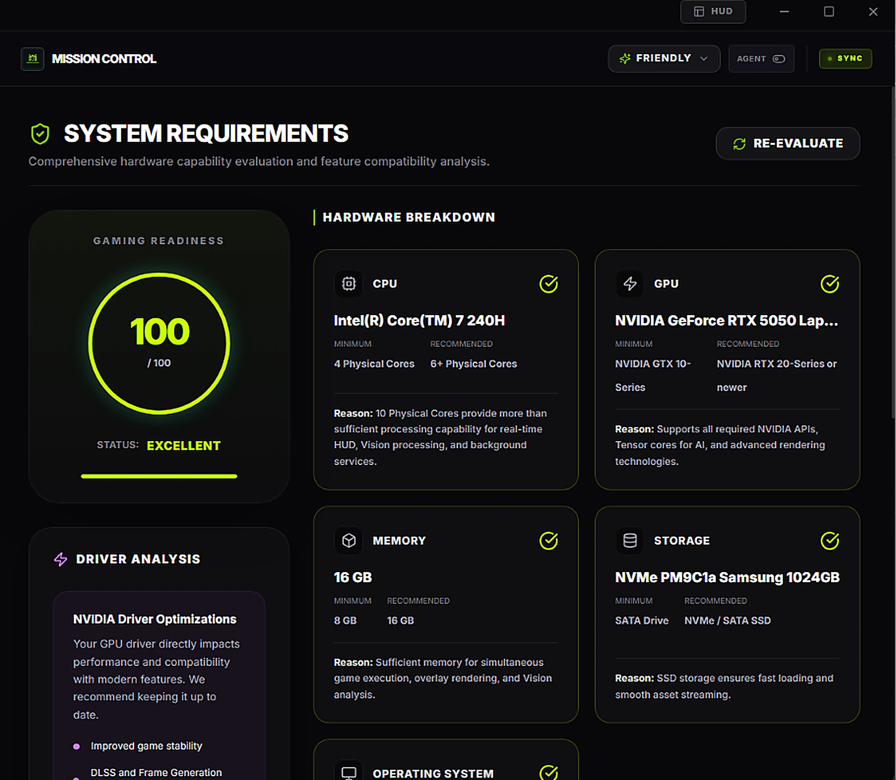
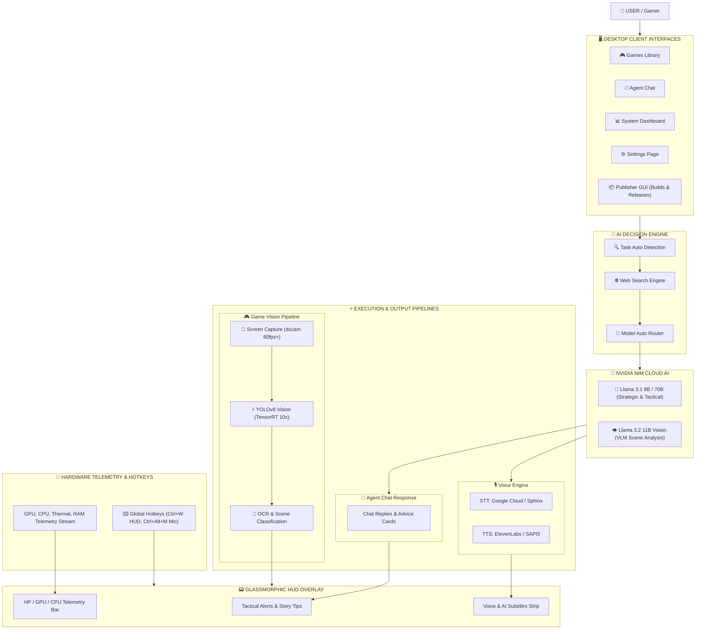

# 🧠 🎮 Mission Control Gaming Assistant (NVIDIA-Powered)

An advanced, real-time AI gaming assistant that provides tactical coaching, vision-based detection, story tracking, autonomous co-pilot capabilities, and **live web-powered game intelligence** — all running locally on NVIDIA GPUs.

---

## 📸 Interface & Features Showcase

<table align="center">
  <tr>
    <td width="50%" align="center">
      <b>🖥️ Main Console Dashboard</b><br/><br/>
      
    </td>
    <td width="50%" align="center">
      <b>📟 Glassmorphic HUD Overlay</b><br/><br/>
      
    </td>
  </tr>
  <tr>
    <td width="50%" align="center">
      <b>🎯 TensorRT AI Vision & YOLO Detection</b><br/><br/>
      
    </td>
    <td width="50%" align="center">
      <b>📊 Real-Time Hardware Telemetry</b><br/><br/>
      
    </td>
  </tr>
  <tr>
    <td width="50%" align="center">
      <b>🎮 Game Library & Auto-Sense Routing</b><br/><br/>
      
    </td>
    <td width="50%" align="center">
      <b>⚡ AI Hardware Readiness Matrix</b><br/><br/>
      
    </td>
  </tr>
</table>

---

## 🔁 Significant Overhaul

This release contains a large, system-wide overhaul that restructures the core pipeline, vision stack, UI, AI integration, and release tooling. The changes are designed to improve runtime stability, increase performance on NVIDIA GPUs, and enable richer multimodal AI features.

- **Pipeline & Stability:** Rewrote the pipeline host into a modular, multi-threaded `PipelineHost` with explicit alive flags, safe shutdown/join semantics, and improved signal handling to eliminate `RuntimeError` crashes during Qt teardown.
- **Vision & Inference:** Made TensorRT the preferred inference path with automatic TensorRT detection, YOLOv8 TensorRT engine support, and a robust PyTorch fallback for compatibility.
- **Multi-Model AI & NIM:** Integrated NVIDIA NIM (Llama 3.x) and VLMs, added Auto Model Routing (tactical/strategic/vision), and introduced state-hashing caches to reduce redundant inference calls.
- **Web Intelligence:** Added a multi-source gaming web search engine (Wikipedia, RAWG.io, SteamSpy, DuckDuckGo) to enrich context and enable patch-aware routing for the AI brain.
- **UI Overhaul:** Implemented full `Settings` and `System` pages, a Hotkey Recorder widget, HUD persistence and font scaling, and polished OSD visuals and layout.
- **Telemetry & Hardware:** Hardened CPU thermal reading with a WMI → CIM → PerfData fallback chain, integrated `pynvml` for GPU telemetry, and improved PowerShell fallbacks for Windows environments.
- **Voice, OCR & Story:** Added hardware-accelerated TTS (NIM/ElevenLabs) with voice profiles, dynamic OCR ROI detection, and tighter StoryAnalyzer integration.
- **Auto-Update & Packaging:** In-app update system using `version.json` and `UpdateDialog`, automated release tooling, and packaging scripts (`build_app.ps1`, `scripts/bump_version.py`).
- **Agentic AI & Control:** Implemented high-level autonomous co-pilot capabilities with direct system access. The AI can now launch games, control hardware (Cooling/VRAM), and simulate I/O device inputs based on live gameplay context and your local game library. See [AGENTIC_LOGIC.md](AGENTIC_LOGIC.md) for full architecture.

Impact: these changes improve reliability, reduce crashes, enable higher-performance inference, and provide a more maintainable, feature-rich codebase. See the full technical notes in [backend/patches.md](backend/patches.md) and the canonical version metadata at [backend/version.json](backend/version.json).

---

## 🚀 Project Overview

**Mission Control** is built for gamers with **NVIDIA RTX GPUs (20, 30, 40, 50 series)**. By leveraging **Pure TensorRT Inference**, the assistant runs with **ZERO PyTorch VRAM overhead**, saving ~1GB of memory for your games.

---

## 🧱 Full App Workflow Architecture

<table align="center" width="100%">
  <tr>
    <th colspan="3" style="text-align:center; background:#0f172a; color:#38bdf8; font-size:16px;">
      👤 USER / GAMER INTERACTION LAYER
    </th>
  </tr>
  <tr>
    <td width="33%" align="center"><b>🖥️ Electron Desktop Dashboard</b><br/>React + Vite HUD & Telemetry</td>
    <td width="33%" align="center"><b>📦 Publisher GUI Client</b><br/>Builds, Packaging & Releases</td>
    <td width="33%" align="center"><b>🎙️ Voice & Hotkey Controls</b><br/>Mic Toggle & Global Shortcuts</td>
  </tr>
  <tr>
    <th colspan="3" style="text-align:center; background:#111827; color:#a855f7; font-size:16px;">
      🧠 AI DECISION ENGINE & TASK AUTO-ROUTER
    </th>
  </tr>
  <tr>
    <td colspan="3" align="center">
      <b>Task Classifier ➔ Dynamic Web Search Engine</b> (Wikipedia | RAWG.io | SteamSpy | DuckDuckGo)<br/>
      <b>Model Router ➔ NVIDIA NIM Cloud AI</b> (Llama 3.1 8B/70B Strategic + Llama 3.2 11B Vision VLM)
    </td>
  </tr>
  <tr>
    <th colspan="3" style="text-align:center; background:#064e3b; color:#10b981; font-size:16px;">
      ⚡ REAL-TIME EXECUTION & TELEMETRY PIPELINES
    </th>
  </tr>
  <tr>
    <td width="33%" align="center"><b>🎮 Game Vision Pipeline</b><br/>dxcam 60fps ➔ TensorRT YOLOv8 ➔ OCR</td>
    <td width="33%" align="center"><b>🎙️ Voice Engine</b><br/>Google / Sphinx STT ➔ ElevenLabs / SAPI5 TTS</td>
    <td width="33%" align="center"><b>🔧 Hardware Telemetry</b><br/>C++ DirectX FPS DLL + PyNVML + WMI/PDH</td>
  </tr>
  <tr>
    <th colspan="3" style="text-align:center; background:#312e81; color:#818cf8; font-size:16px;">
      📟 GLASSMORPHIC HUD OVERLAY STREAM
    </th>
  </tr>
  <tr>
    <td colspan="3" align="center">
      <b>Tactical Alerts Cards • Real-time Min/Max FPS & Thermal Bar • Live Subtitles Strip</b>
    </td>
  </tr>
</table>



---

## 🌐 Web Search Intelligence Engine

Mission Control includes a **gaming-optimized, multi-source web search engine** that provides live game data directly to the AI. Works **100% free in both development and production** — no credit card required.

### Source Stack

| Source | Key Required | Limit | Best For |
|---|---|---|---|
| **Wikipedia API** | ❌ None | ♾️ Unlimited | Game lore, characters, story, wikis |
| **SteamSpy API** | ❌ None | ♾️ Unlimited | Steam player counts, tags, pricing |
| **DuckDuckGo** | ❌ None | ♾️ Unlimited | Patch notes, guides, strategies |
| **RAWG.io Game DB** | ✅ Free key | 20,000/month | Ratings, genres, Metacritic, DLC |
| **Tavily AI** | ✅ User's key | 1,000/month | Rich AI-synthesized answers (optional) |

### Auto Task Routing

| User Says | Task Detected | Sources Used | NIM Model |
|---|---|---|---|
| *"where is the sword of dawn"* | `wiki` | Wikipedia + RAWG | Tactical (fast) |
| *"latest patch notes"* | `patch` | DuckDuckGo (news) | Tactical (fast) |
| *"best sniper build"* | `strategy` | DuckDuckGo + SteamSpy | Strategic (deep) |
| *"is the server down?"* | `real_time` | SteamSpy + DuckDuckGo | Tactical (fast) |
| *"game rating and genre"* | `game_info` | RAWG + SteamSpy | Strategic (deep) |

### Setup (Optional Keys)

```bash
# .env file — only needed for enhanced sources
RAWG_API_KEY=your-key       # Free at: https://rawg.io/apidocs (20k/month)
TAVILY_API_KEY=tvly-xxxxx   # Free at: https://app.tavily.com (1000/month)

# DuckDuckGo, Wikipedia, SteamSpy — NO KEY NEEDED, auto-enabled always
```

---

## 🎮 Game Modes

| Mode | Best For | Features |
|---|---|---|
| **Competitive** | FPS, Battle Royale, MOBA | Enemy detection, health alerts, tactical positioning |
| **Story** | RPG, Adventure, Open World | Quest tracking, dialogue reading, exploration tips |
| **Hybrid** | Souls-like, Action RPG | Combat + Story combined, adapts per scene |
| **Agent** | Automation & Support | Story skipping, autonomous co-pilot, web-enriched advice |

---

## 🎯 NVIDIA Technology Integration

| Technology | GPU Required | What It Does |
|---|---|---|
| **DLSS 2 (Super Resolution)** | RTX 20+ (Turing) | AI upscaling — up to 2x FPS boost |
| **DLSS 3 (Frame Generation)** | RTX 40+ (Ada) | AI-generated frames — up to 4x FPS |
| **DLSS 4 (Multi Frame Gen)** | RTX 50+ (Blackwell) | Up to 8x FPS with multi-frame generation |
| **TensorRT** | All NVIDIA GPUs | **Pure TRT**: 10x faster AI, 0 MB PyTorch VRAM |
| **NVIDIA Reflex** | RTX 20+ (Turing) | Reduces input latency by up to 50% |
| **Path Tracing** | RTX 30+ (Ampere) | Ultra-fidelity light simulation |

---

## 🛠️ Tech Stack

| Layer | Technology |
|---|---|
| **AI Vision** | Pure TensorRT 10.x (YOLOv8 Engine) |
| **Screen Capture** | dxcam (DXGI 120fps+) / d3dshot / MSS fallback |
| **Text Detection** | RapidOCR / Tesseract (GPU/ONNX-accelerated) |
| **Web Search** | Wikipedia + SteamSpy + DuckDuckGo + RAWG.io |
| **Cloud AI** | NVIDIA NIM (Llama 3.1/3.2, Vision Models) |
| **Voice STT** | Google Cloud / Sphinx (offline) |
| **Voice TTS** | ElevenLabs / Google Cloud TTS / SAPI5 |
| **UI / Overlay** | PyQt6 + Native Win32 API |
| **GPU Monitoring** | pynvml (NVML) / PowerShell CIM fallback |
| **Hotkeys** | pynput GlobalHotKeys + Win32 GetAsyncKeyState |
| **Serialization** | orjson (ultra-fast) |
| **Config** | PyYAML (settings.yaml + .env) |
| **Testing** | Vitest + React Testing Library (RTL) + jsdom |
| **Auto-Updater:** `git pull` + `uv sync` via background thread |
| **Version Control:** `version.json` + `publish.ps1` (CI/CD pipeline) |

---

## ⚙️ Installation & Setup

### 1. Prerequisites
- NVIDIA GPU (RTX 20, 30, 40, or 50 series)
- [NVIDIA Drivers](https://www.nvidia.com/download/index.aspx) (R580+ for Blackwell)
- [CUDA Toolkit 12.x+](https://developer.nvidia.com/cuda-downloads)
- [TensorRT 10.x](https://developer.nvidia.com/tensorrt) (optional, for max performance)

### 2. Install Dependencies
```bash
uv python pin 3.12
uv sync
```

### 3. Configure API Keys (`.env`)
```bash
# Required for cloud AI
NVIDIA_API_KEY=nvapi-xxxxx      # https://build.nvidia.com/

# Optional: Enhanced web search
RAWG_API_KEY=your-key           # https://rawg.io/apidocs (free, 20k/month)
TAVILY_API_KEY=tvly-xxxxx       # https://app.tavily.com (free, 1k/month)

# Optional: Premium voice
ELEVENLABS_API_KEY=your-key     # https://elevenlabs.io
```

### 4. Run
```bash
# Standard run
uv run main.py

# Developer mode (Hot Reload enabled)
uv run main.py --dev

# Run as Administrator (required for hardware FPS tracking and full thermal sensors)
# Note: -NoExit keeps the window open so you can clearly see any error logs if it crashes
Start-Process powershell -ArgumentList "-NoExit -Command uv run main.py" -Verb RunAs
```

---

## 🚀 Deployment Stages

There are two main tracks for deploying updates:

### 1. Website Deployment (Vercel)
To deploy the frontend website to Vercel, push your commits directly to the `main` branch:
```bash
git push origin main
```

### 2. Desktop App Deployment (Woodpecker CI / Local Pipeline)
To package, build the NSIS installer, and publish a new desktop app release to GitHub:
1. Make sure you have the Woodpecker CLI installed (or let the local run script fetch it automatically).
2. Run the local build script:
   ```powershell
   .\run_local.ps1
   ```
3. Enter the tag version (e.g., `v2.0.0`) and enter your GitHub Personal Access Token (with **Contents: Read & write** access to `arnab825/Mission-Control`) when prompted.

---

## 📅 Roadmap Progress

- [x] Phase 1–10: Screen capture, YOLO vision, multi-threaded pipeline, story/quest support, memory, input devices, NVIDIA tech, TensorRT, Blackwell
- [x] Phase 11: System & Hardware Dashboard + Full Settings Page
- [x] Phase 12: In-App Auto-Update System
- [x] Phase 13: Agentic AI Assistant (G-Assist interface + Stability Lab)
- [x] Phase 14: NVIDIA NIM full reasoning integration
- [x] Phase 15: Agent mode with autonomous co-pilot
- [x] Phase 16: Multi-model pipeline optimization
- [x] Phase 17: Multi-modal vision (VLM + Deep Scene Analysis)
- [x] Phase 18: Adaptive Agent Personalities
- [x] Phase 19: High-Reliability Voice Engine (ElevenLabs + Google + SAPI5)
- [x] Phase 20: Autonomous Gameplay Validation + Safety Lab
- [x] Phase 21: **Gaming Web Search Intelligence (Wikipedia + RAWG + SteamSpy + DDG)**
- [x] Phase 22: **Hotkey Recorder UI + Auto Model Routing**
- [x] Phase 23: **UX Reusability & Logging Stability (React hooks, formatting, log fix)**
- [x] Phase 24: **Hardware Diagnostics & Testing Integration (Vitest, RTL, HW Telemetry Overhaul)**
- [x] Phase 25: **Electron autoUpdater & Squirrel Windows/Mac Installation Hooks**
- [x] Phase 26: **Electron Forge Multi-Platform Packing Configuration (Squirrel, DEB, RPM)**
- [x] Phase 27: **Dynamic Clerk SSO/OAuth Linked Accounts (Google, Discord, Microsoft)**
- [x] Phase 28: **Motherboard Hardware UUID & Dynamic Cryptographic E2EE Binds**
- [x] Phase 29: **Bytecode-Free Pycache-Bypass Guard & Zombie Process Fail-Fast**
- [x] Phase 30: **2-Column Glassmorphic Privacy & Neural Security Grid Upgrade**
- [x] Phase 31: **Active Backend Security Enforcer & Dynamic Motherboard UUID Lock**
- [x] Phase 32: **Sleek Telemetry UI, Dynamic Library Presets & Substring Genre Matching**
- [x] Phase 33: **DirectX C++ FPS Engine, Precision HUD Telemetry & Python 3.13 Warning Filters**
- [x] Phase 34: **TensorRT Integration & Aggressive Win32 Working Set RAM Flushing**
- [x] Phase 35: **Electron Build & Package Automation and Website Installer Direct Downloads**

**Project Status: Full Agentic AI Gaming Assistant with C++ DirectX FPS hooking, detailed HUD layouts, TensorRT inference optimization, aggressive RAM management, and automated release pipeline.**

---

## 📚 Documentation
- **[Full Patch History](./docs/backend/patches.md)**: Detailed technical notes for every version.
- **[Agentic AI Logic](./docs/AGENTIC_LOGIC.md)**: Detailed flow and instruction logic for autonomous co-pilot features.
- **[Project Summary](./docs/SUMMARY.md)**: Architecture pillars and system overview.
- **[Publishing Process](./docs/process.md)**: Step-by-step release guide.
