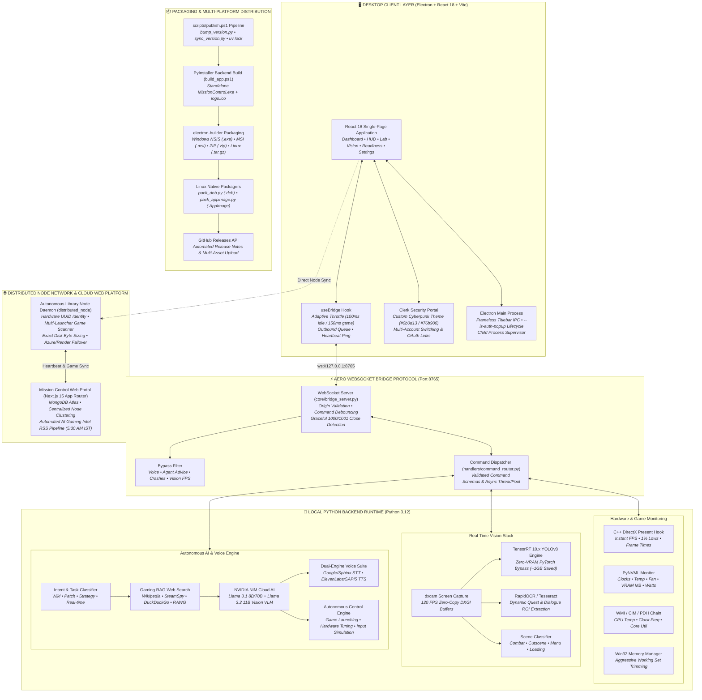

# 🧠 🎮 Mission Control Gaming Assistant (NVIDIA-Powered)

An advanced, real-time AI gaming assistant that provides tactical coaching, vision-based detection, story tracking, autonomous co-pilot capabilities, and **live web-powered game intelligence** — all running locally on NVIDIA GPUs.

---

## 📸 Interface & Features Showcase

<table align="center">
  <tr>
    <td width="50%" align="center">
      <b>🖥️ Main Console Dashboard</b><br/><br/>
      
    </td>
    <td width="50%" align="center">
      <b>🤖 Autonomous AI Co-Pilot & Tactical Agent</b><br/><br/>
      
    </td>
  </tr>
  <tr>
    <td width="50%" align="center">
      <b>📟 Glassmorphic HUD Overlay</b><br/><br/>
      
    </td>
    <td width="50%" align="center">
      <b>🎯 TensorRT AI Vision & YOLO Detection</b><br/><br/>
      
    </td>
  </tr>
  <tr>
    <td width="50%" align="center">
      <b>📊 Real-Time Hardware Telemetry</b><br/><br/>
      
    </td>
    <td width="50%" align="center">
      <b>🔬 Performance Tuning Lab & Power Controls</b><br/><br/>
      
    </td>
  </tr>
  <tr>
    <td width="50%" align="center">
      <b>🎮 Game Library & Auto-Sense Routing</b><br/><br/>
      
    </td>
    <td width="50%" align="center">
      <b>⚡ AI Hardware Readiness Matrix</b><br/><br/>
      
    </td>
  </tr>
  <tr>
    <td width="50%" align="center">
      <b>⚙️ System Settings & AI Neural Configuration</b><br/><br/>
      
    </td>
    <td width="50%" align="center">
      <b>🔍 Deep Scanner & Library Auto-Discovery</b><br/><br/>
      
    </td>
  </tr>
</table>

---

## 🔁 Significant Overhaul

This release contains a large, system-wide overhaul that restructures the core pipeline, vision stack, UI, AI integration, and release tooling. The changes are designed to improve runtime stability, increase performance on NVIDIA GPUs, and enable richer multimodal AI features.

- **Pipeline & Stability:** Rewrote the pipeline host into a modular, multi-threaded `PipelineHost` with explicit alive flags, safe shutdown/join semantics, and improved signal handling to eliminate `RuntimeError` crashes during Qt teardown.
- **Vision & Inference:** Made TensorRT the preferred inference path with automatic TensorRT detection, YOLOv8 TensorRT engine support, and a robust PyTorch fallback for compatibility.
- **Multi-Model AI & NIM:** Integrated NVIDIA NIM (Llama 3.x) and VLMs, added Auto Model Routing (tactical/strategic/vision), and introduced state-hashing caches to reduce redundant inference calls.
- **Web Intelligence:** Added a multi-source gaming web search engine (Wikipedia, RAWG.io, SteamSpy, DuckDuckGo) to enrich context and enable patch-aware routing for the AI brain.
- **UI Overhaul:** Implemented full `Settings` and `System` pages, a Hotkey Recorder widget, HUD persistence and font scaling, and polished OSD visuals and layout.
- **Telemetry & Hardware:** Hardened CPU thermal reading with a WMI → CIM → PerfData fallback chain, integrated `pynvml` for GPU telemetry, and improved PowerShell fallbacks for Windows environments.
- **Voice, OCR & Story:** Added hardware-accelerated TTS (NIM/ElevenLabs) with voice profiles, dynamic OCR ROI detection, and tighter StoryAnalyzer integration.
- **Auto-Update & Packaging:** In-app update system using `version.json` and `UpdateDialog`, automated release tooling, and packaging scripts (`build_app.ps1`, `scripts/bump_version.py`).
- **Agentic AI & Control:** Implemented high-level autonomous co-pilot capabilities with direct system access. The AI can now launch games, control hardware (Cooling/VRAM), and simulate I/O device inputs based on live gameplay context and your local game library. See [AGENTIC_LOGIC.md](AGENTIC_LOGIC.md) for full architecture.

Impact: these changes improve reliability, reduce crashes, enable higher-performance inference, and provide a more maintainable, feature-rich codebase. See the full technical notes in [backend/patches.md](backend/patches.md) and the canonical version metadata at [backend/version.json](backend/version.json).

---

## 🚀 Project Overview

**Mission Control** is built for gamers with **NVIDIA RTX GPUs (20, 30, 40, 50 series)**. By leveraging **Pure TensorRT Inference**, the assistant runs with **ZERO PyTorch VRAM overhead**, saving ~1GB of memory for your games.

---

## 🧱 Full System Architecture & Process Workflow


```mermaid
graph TB
    subgraph CLIENT ["🖥️ DESKTOP CLIENT LAYER (Electron + React 18 + Vite)"]
        direction TB
        UI["React 18 Single-Page Application<br/><i>Dashboard • HUD • Lab • Vision • Readiness • Settings</i>"]
        Hook["useBridge Hook<br/><i>Adaptive Throttle (100ms idle / 150ms game)<br/>Outbound Queue • Heartbeat Ping</i>"]
        Clerk["Clerk Security Portal<br/><i>Custom Cyberpunk Theme (#0b0d13 / #76b900)<br/>Multi-Account Switching & OAuth Links</i>"]
        IPC["Electron Main Process<br/><i>Frameless Titlebar IPC • --is-auth-popup Lifecycle<br/>Child Process Supervisor</i>"]
        
        UI <--> Hook
        UI <--> Clerk
        UI <--> IPC
    end

    subgraph BRIDGE ["⚡ AERO WEBSOCKET BRIDGE PROTOCOL (Port 8765)"]
        direction TB
        WS["WebSocket Server (core/bridge_server.py)<br/><i>Origin Validation • Command Debouncing<br/>Graceful 1000/1001 Close Detection</i>"]
        Bypass["Bypass Filter<br/><i>Voice • Agent Advice • Crashes • Vision FPS</i>"]
        Router["Command Dispatcher (handlers/command_router.py)<br/><i>Validated Command Schemas & Async ThreadPool</i>"]
        
        WS --> Bypass
        WS <--> Router
    end

    subgraph ENGINE ["🐍 LOCAL PYTHON BACKEND RUNTIME (Python 3.12)"]
        direction TB
        subgraph TELEMETRY ["Hardware & Game Monitoring"]
            ETW["C++ DirectX Present Hook<br/><i>Instant FPS • 1% Lows • Frame Times</i>"]
            NVML["PyNVML Monitor<br/><i>Clocks • Temp • Fan • VRAM MB • Watts</i>"]
            CPU["WMI / CIM / PDH Chain<br/><i>CPU Temp • Clock Freq • Core Util</i>"]
            RAM["Win32 Memory Manager<br/><i>Aggressive Working Set Trimming</i>"]
        end

        subgraph VISION ["Real-Time Vision Stack"]
            Cap["dxcam Screen Capture<br/><i>120 FPS Zero-Copy DXGI Buffers</i>"]
            TRT["TensorRT 10.x YOLOv8 Engine<br/><i>Zero-VRAM PyTorch Bypass (~1GB Saved)</i>"]
            OCR["RapidOCR / Tesseract<br/><i>Dynamic Quest & Dialogue ROI Extraction</i>"]
            Scene["Scene Classifier<br/><i>Combat • Cutscene • Menu • Loading</i>"]
            
            Cap --> TRT
            Cap --> OCR
            Cap --> Scene
        end

        subgraph AGENTIC ["Autonomous AI & Voice Engine"]
            Intent["Intent & Task Classifier<br/><i>Wiki • Patch • Strategy • Real-time</i>"]
            RAG["Gaming RAG Web Search<br/><i>Wikipedia • SteamSpy • DuckDuckGo • RAWG</i>"]
            NIM["NVIDIA NIM Cloud AI<br/><i>Llama 3.1 8B/70B + Llama 3.2 11B Vision VLM</i>"]
            Voice["Dual-Engine Voice Suite<br/><i>Google/Sphinx STT • ElevenLabs/SAPI5 TTS</i>"]
            Exec["Autonomous Control Engine<br/><i>Game Launching • Hardware Tuning • Input Simulation</i>"]
            
            Intent --> RAG --> NIM --> Voice
            NIM --> Exec
        end
    end

    subgraph CLUSTER ["🌐 DISTRIBUTED NODE NETWORK & CLOUD WEB PLATFORM"]
        direction TB
        Node["Autonomous Library Node Daemon (distributed_node)<br/><i>Hardware UUID Identity • Multi-Launcher Game Scanner<br/>Exact Disk Byte Sizing • Azure/Render Failover</i>"]
        Web["Mission Control Web Portal (Next.js 15 App Router)<br/><i>MongoDB Atlas • Centralized Node Clustering<br/>Automated AI Gaming Intel RSS Pipeline (5:30 AM IST)</i>"]
        
        Node <-->|Heartbeat & Game Sync| Web
    end

    subgraph RELEASE ["📦 PACKAGING & MULTI-PLATFORM DISTRIBUTION"]
        direction TB
        Pub["scripts/publish.ps1 Pipeline<br/><i>bump_version.py • sync_version.py • uv lock</i>"]
        PyInst["PyInstaller Backend Build (build_app.ps1)<br/><i>Standalone MissionControl.exe + logo.ico</i>"]
        ElPack["electron-builder Packaging<br/><i>Windows NSIS (.exe) • MSI (.msi) • ZIP (.zip) • Linux (.tar.gz)</i>"]
        LinPack["Linux Native Packagers<br/><i>pack_deb.py (.deb) • pack_appimage.py (.AppImage)</i>"]
        GH["GitHub Releases API<br/><i>Automated Release Notes & Multi-Asset Upload</i>"]

        Pub --> PyInst --> ElPack --> LinPack --> GH
    end

    Hook <-->|ws://127.0.0.1:8765| WS
    Router <--> TELEMETRY
    Router <--> VISION
    Router <--> AGENTIC
    UI -.->|Direct Node Sync| Node
```

---

## 🔄 Core Operational Processes: How the System Works

Mission Control operates as an interconnected ecosystem of background threads, asynchronous pipelines, and real-time streaming sockets. Below is the precise operational lifecycle of every subsystem:

### 1. Boot & Security Enforcement Process
- **Process Guard & Instance Lock:** On startup ([`main.py`](backend/main.py)), the backend acquires an exclusive file lock (`ai_gaming_assistant.lock`) via `core/process_guard.py` in `%LOCALAPPDATA%\MissionControl\` to guarantee single-instance execution.
- **Orphan Watchdog:** An orphan monitor thread periodically verifies the parent Electron process ID; if the frontend crashes or exits unexpectedly, the backend terminates automatically within 3 seconds to prevent zombie processes.
- **Process Priority Adjustment:** The backend calls Windows `SetPriorityClass` to lower its own process priority to `BELOW_NORMAL_PRIORITY_CLASS`, ensuring background telemetry and AI threads never steal frame rendering cycles from active games.
- **Motherboard Hardware UUID Lock:** If neural security is enabled, `core/security.py` queries system SMBIOS hardware UUIDs to enforce hardware-bound cryptographic execution.

### 2. Aero WebSocket Bridge & IPC Protocol (`bridge_server.py` & `useBridge.ts`)
- **Bidirectional Streaming:** Operates on `ws://127.0.0.1:8765` using Python's `websockets` engine. The server validates origin headers (`localhost`, `127.0.0.1`, `file`, `vscode-webview`) and rejects unauthorized connections.
- **Adaptive Telemetry Throttling:** When idle, React state updates are batched every 100ms. When an active game is focused, telemetry drops to 150ms batches, minimizing CPU context switching.
- **Critical Key Bypass:** High-priority events (e.g., `voice_prompt`, `agent_response`, `chat_history`, `game_crash_alert`, `vision_fps`) bypass the throttling window and are broadcast immediately across the bridge.
- **Graceful Disconnect Resilience:** Standard RFC 6455 disconnect codes `1000` (`NORMAL_CLOSURE`) and `1001` (`CLOSE_GOING_AWAY`) — emitted during Vite Hot Module Reloading or page navigation — are handled as clean departures (`logger.debug`), preventing false-positive server warnings.
- **Outbound Command Buffering:** If the frontend issues a command while the socket is temporarily reconnecting, `useBridge.ts` buffers commands in `pendingQueue` and automatically drains them the moment the socket re-opens.

### 3. Ultra-Low Latency Telemetry & DirectX C++ Hooking
- **DirectX Presentation Hooking:** Uses `fps_counter_dx.py` and ETW (Event Tracing for Windows) DLL hooks to measure real-time presentation events directly from the graphics pipeline, delivering accurate instant FPS, 1% low metrics, and frame time variance.
- **Native GPU Telemetry:** The `GPUMonitor` subsystem taps directly into NVIDIA's `pynvml` (NVML C-API) to sample GPU core/memory clock speeds, VRAM allocation (MB), core temperature, fan speed percentage, and power consumption (Watts).
- **CPU Thermal & Frequency Fallback Chain:** System telemetry queries Windows Management Instrumentation (WMI) → Common Information Model (CIM) → Performance Data Helper (PDH) to guarantee CPU package thermal metrics even on locked OEM motherboards.
- **Aggressive RAM Management:** Win32 API `SetProcessWorkingSetSize(-1, -1)` is invoked periodically to flush unused memory pages back to the operating system, keeping the backend's footprint under ~120 MB.

### 4. Vision AI & On-Demand TensorRT Engine
- **Zero-Copy Screen Capture:** `capture/screen.py` leverages `dxcam` (DirectX Desktop Duplication API) to capture gameplay frames at up to 120 FPS directly into system memory with sub-millisecond capture overhead. Fallbacks to `d3dshot` and `mss` ensure compatibility across multi-monitor setups.
- **Pure TensorRT 10.x Inference:** `vision/yolo_detector.py` executes object detection using a compiled TensorRT engine (`yolov8n.engine`). This completely bypasses PyTorch's runtime memory manager, saving approximately 1 GB of VRAM for the game.
- **Dynamic OCR & Dialogue Parsing:** RapidOCR and Tesseract target dynamic Regions of Interest (ROI) such as quest logs, minimaps, and subtitles, translating in-game text into structured context for the decision engine.
- **Scene Classifier:** Automatically classifies the current screen state into `combat`, `cutscene`, `menu`, `loading`, or `exploration`, automatically modulating agent verbosity so the user is never distracted during high-intensity combat.

### 5. Autonomous AI Agent & Multimodal Web Intelligence
- **Task-Aware Query Classification:** The AI engine inspects player inputs and gameplay state, dynamically classifying queries into categories (`wiki`, `patch`, `strategy`, `real_time`, or `game_info`).
- **Live RAG Web Search Engine:** A built-in multi-source search engine retrieves real-time game wikis, Steam player counts, and patch notes across Wikipedia, SteamSpy, DuckDuckGo, and RAWG.io without requiring paid API keys.
- **NVIDIA NIM Cloud Reasoning:** Dispatches queries to optimized NIM cloud endpoints — routing tactical queries to low-latency models (`Llama 3.1 8B Instruct`) and deep analytical queries to high-parameter models (`Llama 3.1 70B/405B`). Screenshots can be fed directly to `Llama 3.2 11B Vision VLM` for visual troubleshooting.
- **Dual-Engine Voice Suite:** Voice commands are processed via Google Speech-to-Text (with an offline CMU Sphinx fallback). Spoken responses are rendered through ElevenLabs, Google Cloud TTS, or Windows SAPI5 voice profiles.
- **Autonomous Co-Pilot Controls:** With user authorization, the agent can launch game executables, apply hardware power presets, and simulate input keystrokes.

### 6. Desktop Frontend & Clerk Cyberpunk Security Portal
- **React 18 + Vite + Tailwind CSS v4:** Modern, hardware-accelerated user interface featuring glassmorphic HUD overlays, live frame time sparklines, and telemetry Bento grids.
- **Custom Cyberpunk Clerk Theme ([`clerkTheme.ts`](frontend/src/styles/clerkTheme.ts)):** Overrides Clerk's default light theme with Mission Control's signature aesthetic: deep tactical canvas (`#0b0d13`), neon green accents (`#76b900`), `rounded-3xl` glassmorphic cards, and high-contrast typography.
- **Development Mode & Branding Suppression:** Suppresses development mode watermark banners, diagonal striped badges, and branding footers via `unsafe_disableDevelopmentModeWarnings: true` and CSS overrides.
- **Multi-Account Switching & OAuth Lifecycle:** Seamlessly handles Google, Discord, and Microsoft SSO account linking in Electron via `--is-auth-popup` flags, auto-redirecting and closing popup windows upon handshake completion.

### 7. Autonomous Distributed Library Node Cluster
- **Hardware-Derived Identity:** Each node daemon ([`distributed_node/node_service.py`](distributed_node/node_service.py)) generates a deterministic hardware ID (`NODE-XXXXXX`) based on system MAC address and hostname.
- **Multi-Launcher Auto-Discovery:** The scanner traverses local storage for installations across Steam, Epic Games Store, GOG Galaxy, Xbox App, Battle.net, Riot Games, and Ubisoft Connect.
- **Byte-Exact Storage Calculation:** Uses [`storage_calculator.py`](backend/storage_calculator.py) to calculate exact disk usage per game title.
- **Multi-Tier Cloud Failover:** Periodically transmits node heartbeats and library manifests to centralized endpoints (Azure App Service with automatic failover to Render) with 30s/35s timeout resilience.

### 8. Single-Command Multi-Platform Publishing Pipeline ([`publish.ps1`](scripts/publish.ps1))
- **Semver Management:** `scripts/bump_version.py` updates the canonical version in `backend/version.json` and prepends formatted release notes.
- **Cross-Project Manifest Synchronization:** `scripts/sync_version.py` automatically updates `frontend/package.json`, `website/package.json`, `backend/pyproject.toml`, `website/version.json`, `docs/SUMMARY.md`, and `website/docs/`.
- **Automatic `uv.lock` Synchronization:** Explicitly runs `uv lock` in `backend/` immediately after version bump, preventing lockfile drift.
- **PyInstaller Backend Compilation:** `scripts/build_app.ps1` compiles the Python backend into a standalone, branded Windows executable (`dist/MissionControl.exe`).
- **Multi-Format Packaging:** `electron-builder` packages Windows NSIS (`.exe`), MSI (`.msi`), and portable ZIP (`.zip`), alongside Linux archives (`.tar.gz`).
- **Linux Native Packaging:** `scripts/pack_deb.py` packages Debian `.deb`, while `scripts/pack_appimage.py` packages universal Linux `.AppImage`.
- **Atomic Git Release & Tagging:** Stages all manifests, lockfiles, and documentation directories (`docs/`, `website/docs/`). Amends the release commit post-build, realigns the Git tag (`vX.Y.Z`), and uploads all artifacts directly to GitHub Releases via `GH_TOKEN`.

### 9. Next.js Website & Automated AI Gaming Intel Pipeline
- **Next.js 15 App Router:** High-performance web portal built with Next.js 15, TypeScript, and MongoDB Atlas.
- **Automated AI Blog Generation (`/api/blogs/generate`):** Runs daily at 5:30 AM IST via Vercel cron jobs. Ingests RSS feeds from IGN, Kotaku, Eurogamer, Tom's Hardware, and AnandTech.
- **3-Tier Failover LLM Pipeline:** Text generation cascades across Google Gemini Flash (`gemini-2.5-flash`), Hugging Face Inference (`Llama-3.1-8B-Instruct`), and NVIDIA NIM (`nemotron-3-super-120b`).
- **4-Tier Image Generation & Blob CDN:** Featured blog artwork generates through Gemini Imagen 3, Hugging Face FLUX.1, Pollinations AI, or procedural 3D fallbacks, stored permanently on Vercel Blob CDN (`BLOB_READ_WRITE_TOKEN`).

---

## 🌐 Web Search Intelligence Engine

Mission Control includes a **gaming-optimized, multi-source web search engine** that provides live game data directly to the AI. Works **100% free in both development and production** — no credit card required.

### Source Stack

| Source | Key Required | Limit | Best For |
|---|---|---|---|
| **Wikipedia API** | ❌ None | ♾️ Unlimited | Game lore, characters, story, wikis |
| **SteamSpy API** | ❌ None | ♾️ Unlimited | Steam player counts, tags, pricing |
| **DuckDuckGo** | ❌ None | ♾️ Unlimited | Patch notes, guides, strategies |
| **RAWG.io Game DB** | ✅ Free key | 20,000/month | Ratings, genres, Metacritic, DLC |
| **Tavily AI** | ✅ User's key | 1,000/month | Rich AI-synthesized answers (optional) |

### Auto Task Routing

| User Says | Task Detected | Sources Used | NIM Model |
|---|---|---|---|
| *"where is the sword of dawn"* | `wiki` | Wikipedia + RAWG | Tactical (fast) |
| *"latest patch notes"* | `patch` | DuckDuckGo (news) | Tactical (fast) |
| *"best sniper build"* | `strategy` | DuckDuckGo + SteamSpy | Strategic (deep) |
| *"is the server down?"* | `real_time` | SteamSpy + DuckDuckGo | Tactical (fast) |
| *"game rating and genre"* | `game_info` | RAWG + SteamSpy | Strategic (deep) |

---

## 🎮 Game Modes

| Mode | Best For | Features |
|---|---|---|
| **Competitive** | FPS, Battle Royale, MOBA | Enemy detection, health alerts, tactical positioning |
| **Story** | RPG, Adventure, Open World | Quest tracking, dialogue reading, exploration tips |
| **Hybrid** | Souls-like, Action RPG | Combat + Story combined, adapts per scene |
| **Agent** | Automation & Support | Story skipping, autonomous co-pilot, web-enriched advice |

---

## 🎯 NVIDIA Technology Integration

| Technology | GPU Required | What It Does |
|---|---|---|
| **DLSS 2 (Super Resolution)** | RTX 20+ (Turing) | AI upscaling — up to 2x FPS boost |
| **DLSS 3 (Frame Generation)** | RTX 40+ (Ada) | AI-generated frames — up to 4x FPS |
| **DLSS 4 (Multi Frame Gen)** | RTX 50+ (Blackwell) | Up to 8x FPS with multi-frame generation |
| **TensorRT** | All NVIDIA GPUs | **Pure TRT**: 10x faster AI, 0 MB PyTorch VRAM |
| **NVIDIA Reflex** | RTX 20+ (Turing) | Reduces input latency by up to 50% |
| **Path Tracing** | RTX 30+ (Ampere) | Ultra-fidelity light simulation |

---

## 🛠️ Complete Monorepo Tech Stack

| Subsystem | Layer | Technology |
|---|---|---|
| **Frontend UI** | Desktop Shell | Electron 43 + React 18 + Vite 8 + TypeScript 5.8 |
| **Frontend UI** | Styling & Icons | Tailwind CSS v4 + Lucide React + Glassmorphism |
| **Frontend UI** | Authentication | Clerk React 5.61 + Custom Cyberpunk Dark HUD Theme |
| **Backend Core** | Runtime & Server | Python 3.12 + FastAPI + Uvicorn + uv Package Manager |
| **Backend Core** | IPC Bridge | WebSocket Server (`core/bridge_server.py`) on port 8765 |
| **AI Vision** | Inference Engine | Pure TensorRT 10.x Engine (YOLOv8) + ONNX Runtime fallback |
| **AI Vision** | Screen Capture | dxcam (DirectX DXGI 120 FPS) + d3dshot + mss |
| **AI Vision** | OCR & Detection | RapidOCR (ONNX-accelerated) + Tesseract OCR |
| **Telemetry** | Frame Performance | C++ DirectX ETW DLL + Frame Time Variance Math |
| **Telemetry** | Hardware Sensors | PyNVML (NVIDIA NVML) + WMI / CIM / PDH fallback |
| **Agentic AI** | Cloud Reasoning | NVIDIA NIM (Llama 3.1 8B/70B + Llama 3.2 11B Vision VLM) |
| **Agentic AI** | Voice Engine | Google Cloud Speech + CMU Sphinx STT \| ElevenLabs + SAPI5 TTS |
| **Agentic AI** | Web Intelligence | Wikipedia API + SteamSpy API + DuckDuckGo + RAWG.io |
| **Distributed Node** | Client Daemon | Python autonomous daemon + MAC UUID identification |
| **Web Platform** | Portal & Docs | Next.js 15 (App Router) + Tailwind CSS + MongoDB Atlas |
| **Web Platform** | AI News Generator | Vercel Cron (5:30 AM IST) + Gemini Flash + HuggingFace + Vercel Blob |
| **Packaging & CI/CD** | Installers | PyInstaller + electron-builder (NSIS .exe, .msi, .zip, .deb, .AppImage) |
| **Packaging & CI/CD** | Pipeline Script | PowerShell (`scripts/publish.ps1`) with atomic sync & GitHub Release |

---

## ⚙️ Installation & Running Locally

### 1. Prerequisites
- **Hardware:** NVIDIA GeForce RTX GPU (20, 30, 40, or 50 series)
- **OS:** Windows 10/11 (64-bit) or Linux (Ubuntu 22.04+, Debian 12+)
- **NVIDIA Drivers:** R580+ (Game Ready / Studio)
- **Tools:** Python 3.12 (via `uv`), Node.js 20+, and Git

### 2. Environment Setup
```bash
# Clone the repository
git clone https://github.com/arnab825/Mission-Control.git
cd Mission-Control

# Configure environment secrets
cp .env.example .env
```

### 3. Launching the Desktop Application
```powershell
# Terminal 1: Launch Backend (from Gaming/backend)
cd Gaming/backend
uv sync
uv run main.py --dev

# Terminal 2: Launch Electron Frontend (from Gaming/frontend)
cd Gaming/frontend
npm install
npm run dev
```

### 4. Running the Distributed Library Node
```powershell
cd Gaming/distributed_node
uv run python node_service.py
```

### 5. Launching the Web Portal
```bash
cd Gaming/website
npm install
npm run dev
```

---

## 🚀 Publishing & Releasing (`publish.ps1`)

Mission Control includes a fully automated release pipeline in [`Gaming/scripts/publish.ps1`](scripts/publish.ps1). A single command handles everything:

```powershell
.\Gaming\scripts\publish.ps1 -Type "patch" -Title "Your Release Title" -Changes "Feature description 1; Feature description 2"
```

**What the publish script executes automatically:**
1. **Version Bumping:** Increments semver in `backend/version.json` via `bump_version.py`.
2. **Manifest Synchronization:** Updates `package.json`, `pyproject.toml`, `version.json`, and all docs via `sync_version.py`.
3. **Lockfile Alignment:** Runs `uv lock` in `backend/` to guarantee lockfile consistency.
4. **PyInstaller Backend Compilation:** Packages the Python core into a standalone executable (`build_app.ps1`).
5. **Electron Frontend Packaging:** Builds the production React app and packages Windows (`.exe`, `.msi`, `.zip`) and Linux (`.tar.gz`) binaries.
6. **Native Linux Packaging:** Builds `.deb` and `.AppImage` packages.
7. **Git Staging & Tagging:** Stages all manifests, lockfiles, and documentation directories, amends the release commit, aligns the Git tag (`vX.Y.Z`), and uploads all binaries to GitHub Releases.

---

## 📅 Roadmap Progress

- [x] Phase 1–10: Screen capture, YOLO vision, multi-threaded pipeline, story/quest support, memory, input devices, NVIDIA tech, TensorRT, Blackwell
- [x] Phase 11: System & Hardware Dashboard + Full Settings Page
- [x] Phase 12: In-App Auto-Update System
- [x] Phase 13: Agentic AI Assistant (G-Assist interface + Stability Lab)
- [x] Phase 14: NVIDIA NIM full reasoning integration
- [x] Phase 15: Agent mode with autonomous co-pilot
- [x] Phase 16: Multi-model pipeline optimization
- [x] Phase 17: Multi-modal vision (VLM + Deep Scene Analysis)
- [x] Phase 18: Adaptive Agent Personalities
- [x] Phase 19: High-Reliability Voice Engine (ElevenLabs + Google + SAPI5)
- [x] Phase 20: Autonomous Gameplay Validation + Safety Lab
- [x] Phase 21: **Gaming Web Search Intelligence (Wikipedia + RAWG + SteamSpy + DDG)**
- [x] Phase 22: **Hotkey Recorder UI + Auto Model Routing**
- [x] Phase 23: **UX Reusability & Logging Stability (React hooks, formatting, log fix)**
- [x] Phase 24: **Hardware Diagnostics & Testing Integration (Vitest, RTL, HW Telemetry Overhaul)**
- [x] Phase 25: **Electron autoUpdater & Squirrel Windows/Mac Installation Hooks**
- [x] Phase 26: **Electron Forge Multi-Platform Packing Configuration (Squirrel, DEB, RPM)**
- [x] Phase 27: **Dynamic Clerk SSO/OAuth Linked Accounts (Google, Discord, Microsoft)**
- [x] Phase 28: **Motherboard Hardware UUID & Dynamic Cryptographic E2EE Binds**
- [x] Phase 29: **Bytecode-Free Pycache-Bypass Guard & Zombie Process Fail-Fast**
- [x] Phase 30: **2-Column Glassmorphic Privacy & Neural Security Grid Upgrade**
- [x] Phase 31: **Active Backend Security Enforcer & Dynamic Motherboard UUID Lock**
- [x] Phase 32: **Sleek Telemetry UI, Dynamic Library Presets & Substring Genre Matching**
- [x] Phase 33: **DirectX C++ FPS Engine, Precision HUD Telemetry & Python 3.13 Warning Filters**
- [x] Phase 34: **TensorRT Integration & Aggressive Win32 Working Set RAM Flushing**
- [x] Phase 35: **Electron Build & Package Automation and Website Installer Direct Downloads**

**Project Status: Full Agentic AI Gaming Assistant with C++ DirectX FPS hooking, detailed HUD layouts, TensorRT inference optimization, aggressive RAM management, and automated release pipeline.**

---

## 📚 Documentation
- **[Full Patch History](./docs/backend/patches.md)**: Detailed technical notes for every version.
- **[Agentic AI Logic](./docs/AGENTIC_LOGIC.md)**: Detailed flow and instruction logic for autonomous co-pilot features.
- **[Project Summary](./docs/SUMMARY.md)**: Architecture pillars and system overview.
- **[Publishing Process](./docs/process.md)**: Step-by-step release guide.
