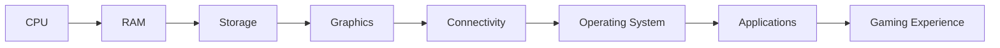

# The State of Mini PCs in Gaming Hardware

In recent years, mini PCs have gained popularity among gamers and content creators due to their compact form factor, ease of use, and affordability. The latest offering from BOSGAME, the AMD Ryzen 5 mini PC, has taken the market by storm with its impressive specifications and competitive pricing. In this article, we will delve into the world of mini PCs, explore the BOSGAME Ryzen 5's capabilities, and examine the current state of gaming hardware.

## BOSGAME Ryzen 5 Mini PC: A Budget-Friendly Beast

The BOSGAME Ryzen 5 mini PC boasts an impressive set of specifications, including a 16GB RAM, 512GB SSD, and a powerful AMD Ryzen 5 processor. Priced at $260, this mini PC is an attractive option for those seeking a budget-friendly gaming PC. According to IGN, the BOSGAME Ryzen 5 mini PC has dropped to an even more affordable price point of $260, making it an even more compelling choice for gamers on a budget.

### Technical Specifications

| Component | Specification |
| --- | --- |
| CPU | AMD Ryzen 5 |
| RAM | 16GB DDR4 |
| Storage | 512GB SSD |
| Graphics | Integrated Vega 8 Graphics |
| Connectivity | Wi-Fi 6, Bluetooth 5.0, HDMI 2.0, USB 3.2 Gen 2 |

## Razer Blade 16 (2026) Review: A Benchmark for Gaming Performance

In a recent review by Tom's Hardware, the Razer Blade 16 (2026) was put through its paces to evaluate its gaming performance and endurance. The review highlights the laptop's competitive gaming performance and class-leading endurance, making it a top contender in the gaming laptop market.

### Key Findings

* The Razer Blade 16 (2026) boasts a powerful NVIDIA GeForce RTX 3080 Ti GPU, delivering exceptional gaming performance.
* The laptop's 16-inch QHD display provides a crisp and vibrant visual experience, making it ideal for gaming and content creation.
* The Razer Blade 16 (2026) features a robust cooling system, ensuring optimal performance and longevity.

## The Future of Mini PCs in Gaming Hardware

The BOSGAME Ryzen 5 mini PC and the Razer Blade 16 (2026) demonstrate the evolving landscape of gaming hardware. As mini PCs continue to gain popularity, manufacturers are pushing the boundaries of what is possible in a compact form factor. With the rise of cloud gaming and streaming services, the need for powerful and portable gaming devices has never been greater.

### Mermaid Diagram: Mini PC Architecture

## Conclusion

The BOSGAME Ryzen 5 mini PC and the Razer Blade 16 (2026) represent the cutting edge of gaming hardware. As the industry continues to evolve, we can expect to see even more innovative solutions that blend power, portability, and affordability. Whether you're a casual gamer or a hardcore enthusiast, there has never been a better time to explore the world of mini PCs and gaming hardware.
