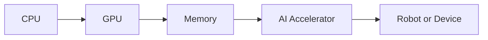

## A New Era in Physical AI and Data Center Competition

The latest developments in the world of artificial intelligence and data center computing have just gotten a significant boost from AMD. The company has announced its new X100 chip lineup, which brings embedded Ryzen AI 'Strix Halo' chips to the table, and the Instinct MI455X AI accelerator, designed to take on Intel's Panther Lake in the data center.

### AMD's X100 Chip Lineup: Embedded AI for Robots and Beyond

The X100 chip lineup is a major step forward in the world of embedded AI, bringing the power of AMD's Zen 5 CPU and RDNA 3.5 GPU cores to the table. This combination of processing power and graphics capabilities makes the X100 chip lineup an ideal solution for a wide range of applications, from robotics and IoT devices to autonomous vehicles and more.

The X100 chip lineup is designed to be highly flexible and scalable, making it easy to integrate into a variety of systems and devices. With its advanced AI capabilities and high-performance processing, the X100 chip lineup is poised to revolutionize the world of embedded AI and beyond.

### Instinct MI455X AI Accelerator: Taking on Intel in the Data Center

The Instinct MI455X AI accelerator is a powerful new addition to AMD's data center lineup, designed to take on Intel's Panther Lake in the battle for data center supremacy. With its CDNA 5 architecture and Helios rack-scale architecture, the Instinct MI455X AI accelerator is a highly efficient and scalable solution for a wide range of data center workloads.

The Instinct MI455X AI accelerator is designed to provide high-performance AI acceleration, with a focus on deep learning and other AI workloads. Its CDNA 5 architecture provides a significant boost in performance and efficiency compared to previous generations, making it an ideal solution for a wide range of data center applications.

### Performance and Competition

In terms of performance, the X100 chip lineup and Instinct MI455X AI accelerator are expected to provide a significant boost in capabilities compared to previous generations. With its advanced AI capabilities and high-performance processing, the X100 chip lineup is poised to take on Intel's Panther Lake in the embedded AI market.

The Instinct MI455X AI accelerator, on the other hand, is designed to take on Intel's data center offerings in a head-to-head battle for market share. With its CDNA 5 architecture and Helios rack-scale architecture, the Instinct MI455X AI accelerator is a highly efficient and scalable solution for a wide range of data center workloads.

### Conclusion

The X100 chip lineup and Instinct MI455X AI accelerator are a significant step forward in the world of embedded AI and data center computing. With their advanced AI capabilities and high-performance processing, these new products are poised to revolutionize a wide range of applications, from robotics and IoT devices to autonomous vehicles and beyond.

As the competition between AMD and Intel continues to heat up in the world of embedded AI and data center computing, one thing is clear: the future of AI and computing is looking brighter than ever. With the X100 chip lineup and Instinct MI455X AI accelerator, AMD is well-positioned to take on Intel and other competitors in this rapidly evolving market.

---

Here's a Mermaid diagram illustrating the X100 chip lineup's architecture:

This diagram illustrates the X100 chip lineup's architecture, with the CPU and GPU working together to provide high-performance processing and AI acceleration, and the memory and AI accelerator working together to provide efficient and scalable AI capabilities.
