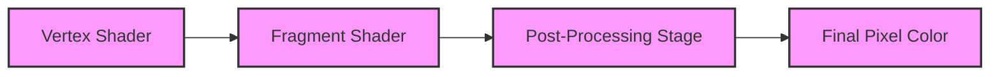

## Technical Triumphs Behind the Darkest Dungeon's Enduring Legacy

As the gaming industry continues to evolve at an unprecedented pace, it's essential to revisit the classics that have stood the test of time. The Darkest Dungeon, developed by Red Hook Studios, is a prime example of a game that has managed to captivate audiences for over a decade. Released in 2016, this gothic RPG has not only maintained its relevance but has also inspired a dedicated community of fans. In this article, we'll delve into the technical triumphs behind the Darkest Dungeon's enduring legacy, exploring the game's rendering engine architecture, how it bypassed physical console constraints, and the code-level development triumphs that made it possible.

## Rendering Engine Architecture: A Key to Bypassing Physical Console Constraints

The Darkest Dungeon's rendering engine is built on top of the Unity game engine, which provided a robust and flexible foundation for the game's development. However, Red Hook Studios chose to implement a custom rendering pipeline to achieve the desired visual aesthetic. By leveraging Unity's Scriptable Render Pipeline (SRP), the developers were able to create a unique rendering system that tailored the game's look and feel to the dark, gothic atmosphere.

The rendering pipeline consisted of multiple stages, each responsible for a specific aspect of the rendering process. The pipeline began with a vertex shader that transformed 3D vertices into screen space, followed by a fragment shader that computed the final pixel color. The pipeline also included a custom post-processing stage, which applied a range of effects to enhance the game's visuals.

One of the key features of the Darkest Dungeon's rendering pipeline was its use of multi-threading. By utilizing multiple threads to process different stages of the pipeline, the developers were able to significantly improve the game's performance on multi-core processors. This allowed the game to run smoothly on a range of hardware configurations, from low-end laptops to high-end gaming PCs.

## Code-Level Development Triumphs: Optimizing Performance and Debugging

The Darkest Dungeon's development process was not without its challenges. The game's complex rendering pipeline and multi-threaded architecture made it difficult to optimize performance and debug issues. However, the development team at Red Hook Studios employed a range of techniques to overcome these challenges.

One of the key strategies employed by the developers was the use of profiling tools. By using tools such as Unity's Profiler and Visual Studio's Performance Analyzer, the team was able to identify performance bottlenecks and optimize the game's code accordingly. This involved tweaking the rendering pipeline, reducing the number of threads used, and implementing caching mechanisms to improve performance.

Another key aspect of the Darkest Dungeon's development process was the use of debugging tools. The team employed a range of debugging tools, including Unity's Debugger and Visual Studio's Debugger, to identify and fix issues with the game's code. This involved setting breakpoints, stepping through code, and using debuggers to analyze the game's behavior.

## Conclusion

The Darkest Dungeon's 10th anniversary serves as a testament to the game's enduring legacy. By analyzing the technical triumphs behind the game's development, we can gain a deeper understanding of the challenges faced by the development team and the strategies employed to overcome them. The game's custom rendering pipeline, multi-threaded architecture, and use of profiling and debugging tools all contributed to its success and have inspired a new generation of game developers.

As the gaming industry continues to evolve, it's essential to remember the classics that have paved the way for modern game development. The Darkest Dungeon serves as a prime example of a game that has managed to captivate audiences for over a decade, and its technical triumphs offer valuable lessons for game developers of all levels.

This Mermaid diagram illustrates the custom rendering pipeline used in the Darkest Dungeon. The pipeline consists of multiple stages, each responsible for a specific aspect of the rendering process. The vertex shader transforms 3D vertices into screen space, followed by the fragment shader, which computes the final pixel color. The post-processing stage applies a range of effects to enhance the game's visuals.
