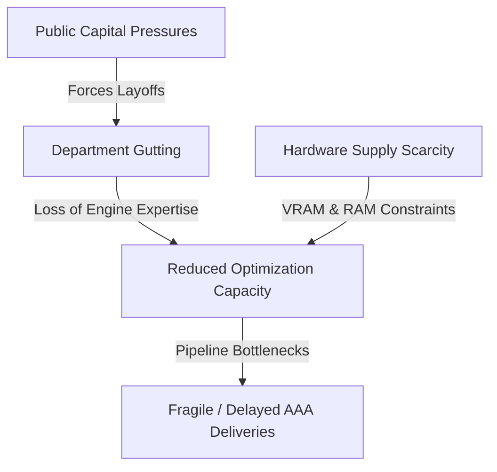

The video game industry in mid-2026 sits at a volatile intersection: hardware memory limits are capping render pipelines, corporate restructuring is eroding core technical teams, and publishing models are actively retreating from public markets. As studios grapple with the soaring overhead of current-gen asset creation, unearthing legacy development artifacts—like FromSoftware’s original vision for *Demon’s Souls*—serves as a poignant reminder of how drastically camera mechanics, engine architecture, and project scope shape interactive media.

---

## The AAA Scale Crisis: Restructuring vs. Engine Pipelines

The industrial strain on high-budget game development reached a flashpoint this week. Following sweeping staff reductions across Microsoft's gaming division, id Software veteran Chris Hays candidly reported that entire departments have been "gutted." According to Hays, maintaining the technological standard set by upcoming titles like *Doom: The Dark Ages* is becoming functionally impossible under current organizational downsizing. 

When specialized teams responsible for custom engine systems—such as id Tech's frametime stabilization, Vulkan pipeline optimization, and multi-threaded job system scheduling—are removed, the downstream effects directly impair frame pacing, streaming bandwidth, and asset delivery.



Simultaneously, publishers are pivoting their corporate strategies to shield themselves from market volatility:
* **Devolver Digital** has initiated plans to exit the public market and return to private ownership after years of equity fluctuations, aiming for operational flexibility.
* **Take-Two Interactive** CEO Strauss Zelnick dismissed concerns regarding an ongoing employment tribunal over alleged union-busting at Rockstar Games, asserting it will "not in the least" impact the launch of *Grand Theft Auto 6*.

This tension highlights an industry split: executive leadership prioritizes massive live-service launches and structural cost-cutting, while technical leads warn that stripping technical teams makes rendering at current fidelity targets unviable.

---

## Hardware Bottlenecks: Memory Allocation and System Bandwidth

Compounding development friction is an acute hardware crisis: memory supply chains have dried up. Industry reports confirm system RAM and VRAM availability have hit severe availability walls. For engine developers working with dynamic geometry rendering (such as Nanite-style micro-polygon rasterization) and hardware-accelerated ray tracing, strict memory budgets are once again a primary engineering bottleneck.

```
+-----------------------------------------------------------------------+
|                 TYPICAL 2026 VRAM ALLOCATION (16GB TARGET)             |
+-----------------------------------------------------------------------+
| [G-Buffer / Render Targets: 2.5GB] [Geometry / Nanite Cache: 4.0GB]   |
| [BVH Data (Ray Tracing): 2.0GB]  [Streamed Textures (BC7): 5.5GB]   |
| [Engine System Overhead / Audio / Heap Buffer: 2.0GB]                 |
+-----------------------------------------------------------------------+
```

Modern rendering loops demand aggressive streaming algorithms to prevent thrashing when system RAM capacity is constrained. Without sufficient system memory to buffer uncompressed assets before staging them to VRAM via DirectStorage or Resizable BAR, frametime variance spikes dramatically, resulting in pervasive hitching during high-velocity camera movement.

---

## Camera Architecture: Lessons from FromSoftware’s First-Person Prototype

Amid these modern structural challenges, recently unearthed prototype footage revealed that FromSoftware originally designed *Demon's Souls* as a first-person action game. While the studio ultimately pivoted to the iconic third-person perspective that defined the "Soulsborne" subgenre, analyzing this early iteration provides technical insight into combat mechanics and frustum management.

Switching from a first-person perspective (FPP) to a third-person perspective (TPP) fundamentally alters spatial awareness and hit-detection mechanics in action RPGs:

| Feature | First-Person Perspective (FPP) | Third-Person Perspective (TPP) |
| :--- | :--- | :--- |
| **Camera Frustum Field of View** | Requires wide FOV (90°–110°) to maintain peripheral awareness; causes edge distortion. | Narrower FOV (60°–75°); character model occupies screen space to anchor spatial perception. |
| **Hitbox & Collision Logic** | Relies on direct forward raycasts or tight forward-facing volume sweeps. | Requires 360° directional bounding volumes and complex animation-driven collision arcs. |
| **Frustum Culling Overhead** | High camera rotation velocity forces rapid culling and asset re-streaming. | Occlusion querying benefits from predictable distance behind player mesh. |

In a first-person spatial model, melee hit detection typically evaluates raycasts directly aligned with the viewport vector, requiring precision spatial bounds. Below is a simplified representation of how camera-centric attack sweeps operate versus third-person actor-centric sweeps:

```cpp
// First-Person vs Third-Person Melee Arc Evaluation
struct AttackSweep {
    Vector3 cameraOrigin;
    Vector3 cameraForward;
    float attackReach;
    float maxArcAngle;

    bool EvaluateFirstPersonHit(const BoundingBox& targetBounds) {
        // Simple frustum-aligned raycast cone
        Vector3 targetDir = (targetBounds.center - cameraOrigin).Normalized();
        float dotProduct = Vector3::Dot(cameraForward, targetDir);
        
        // Target must be within camera cone and reach distance
        return (dotProduct >= std::cos(maxArcAngle * 0.5f)) && 
               (Vector3::Distance(cameraOrigin, targetBounds.center) <= attackReach);
    }
};
```

FromSoftware's decision to pivot away from FPP allowed them to utilize character animation timing (invincibility frames) and visual telegraphing that would be visually disorienting if locked directly to a first-person camera view.

---

## Media Adaptations and Indie Trajectories

Outside of rendering mechanics and corporate restructuring, project updates continue across multimedia adaptations and independent development:

* **Film Adaptations:** Cast announcements for Nintendo's live-action *The Legend of Zelda* feature film confirmed antagonist Ganondorf's casting alongside news that the late Sam Neill will appear in what is expected to be his final on-screen role.
* **Indie Horizons:** Eric Barone's *Haunted Chocolatier* continues steady development, building upon the custom C#/MonoGame framework foundation used in *Stardew Valley* to deliver expanded action-RPG mechanics and dynamic lighting algorithms.
* **Cult Pop Culture:** Robert Pattinson's unsettling performance work in *Primetime* continues to generate buzz, with critics calling his Chris Hansen-inspired performance one of the most unhinged turns in recent cinematic releases.

---

## Conclusion

As hardware shortages squeeze physical RAM allocations and studio downsizing threatens the integrity of custom engine development, the video game industry faces a moment of structural re-evaluation. Whether transitioning a project from public markets to private ownership, or pivoting a camera perspective to invent a brand-new subgenre, technical adaptability remains the key factor separating sustainable game engineering from project failure.
