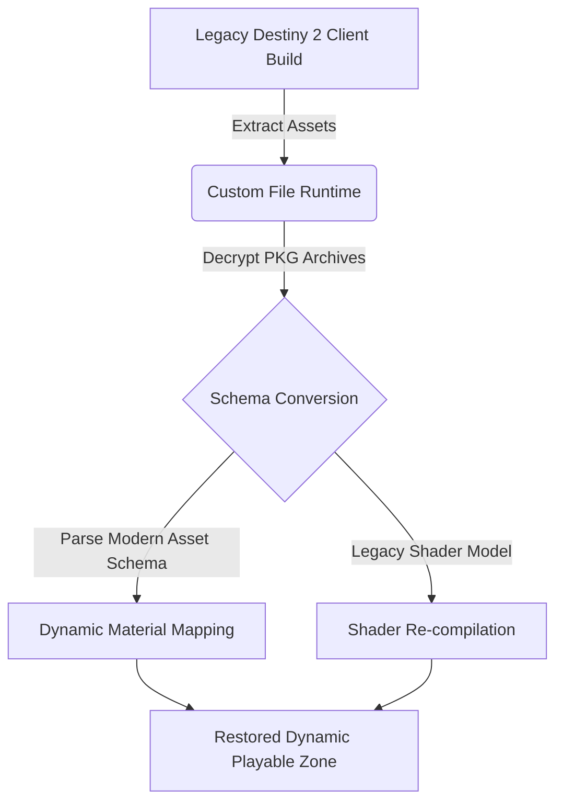

The software architecture of modern gaming operates under a dual mandate: optimizing cutting-edge hardware platforms while preserving, adapting, and analyzing legacy game engines. Today’s mid-cycle console generation, coupled with long-tail telemetry analysis and community-led reverse engineering, highlights how developers manage variable workloads across varied runtimes. From custom OS firmware updates to skeletal rig scaling in fighting engines, here is an engineering breakdown of the major developments shaping the industry in August 2026.

## Platform-Level Optimizations: PS5 Pro Beta Firmware and Legacy Unlocks

Sony’s latest system software beta for the PlayStation 5 Pro introduces low-level changes to the platform’s display controller pipeline and system memory allocation. The update focuses on reducing frame-pacing volatility in titles utilizing variable refresh rate (VRR) windows between 48Hz and 120Hz. By refining how the OS compositor handles asynchronous compute queues alongside PlayStation Spectral Super Resolution (PSSR), the beta minimizes frame-time variance ($\Delta t$) during dynamic resolution scaling drops.

Mathematically, dynamic resolution systems adjust render target scale based on GPU frame execution times relative to target frame thresholds:

$$ S_{\text{next}} = \text{clamp}\left( S_{\text{current}} \times \sqrt{\frac{T_{\text{target}}}{T_{\text{render}}}}, \, S_{\text{min}}, \, 1.0 \right) $$

Where $S$ represents the frame scaling factor, $T_{\text{target}}$ is the target frame timing (e.g., $16.67\,\text{ms}$ for 60 FPS), and $T_{\text{render}}$ is the actual time taken to render the preceding frame buffer. Sony's updated system pipeline ensures these render target adjustments execute with lower frame-time latency.

Simultaneously, legacy backend updates demonstrate the benefits of removing legacy cap bottlenecks. Ubisoft’s frame-rate unlock for *Ghost Recon Wildlands* targets the PS5 and Xbox Series X/S runtimes. By removing the 30 FPS execution lock embedded in the game's original AnvilNext 2.0 loop, the title runs natively at target 4K resolution at 60 FPS. This adjustment shifts the primary bottleneck from CPU draw-call thread synchronization to standard GPU rasterization limits, stabilizing rendering on current-gen hardware.

| Platform / Title | Target Resolution | Target Framerate | Pipeline Optimizations |
| :--- | :--- | :--- | :--- |
| **PS5 Pro (Beta Firmware)** | Dynamic 4K | 60 - 120 FPS | Enhanced PSSR compositing, VRR timing adjustments |
| **Ghost Recon Wildlands** | Native 4K (2160p) | 60 FPS | Unlocked thread timing, removed render-loop caps |

## Telemetry Metrics and Arc System Works Frame Mechanics

Data collection at scale continues to yield surprising operational insights. Marking the three-year anniversary of *Baldur’s Gate 3*, Larian Studios published comprehensive runtime telemetry. The data reveals player behavior metrics across millions of unique campaign saves. Notably, standard custom protagonists recorded higher aggregate civilian NPC kill counts than players running the dedicated "Dark Urge" origin path. 

From an infrastructure perspective, logging non-linear choice permutations at this scale requires distributed event streaming (such as Apache Kafka pipelines) feeding into columnar data stores. Every player interaction fires structured event payloads to map global state variables:

```json
{
  "event_id": "8f3a12b4-20260807",
  "timestamp": 1786089600,
  "player_origin": "Custom_TavernBrawler",
  "act_id": 2,
  "npc_state_changes": [
    { "npc_id": "guard_042", "status": "KILLED", "lethal_damage_type": "Bludgeoning" }
  ],
  "party_approval_delta": { "Shadowheart": -5, "Astarion": 2 }
}
```

Meanwhile, Arc System Works’ release of *Marvel Tokon* demonstrates precision frame engineering within a heavily customized Unreal Engine 5 pipeline. To account for character-specific move lists—specifically Deadpool's extensive visual references—the developers implemented distinct skeletal rig scaling rules and animation cancel windows. ArcSys utilizes custom hitboxes and hurtboxes that adjust on a per-frame basis, allowing complex move interruptions without breaking hit-stop mechanics or visual interpolation.

## Scalable Architectures: Guild Wars 3 Rigging & Destiny 2 Asset Extraction

In engine architecture news, ArenaNet detailed the foundational design choices for *Guild Wars 3*. A major developer post confirmed that the upcoming MMORPG utilizes a modular character pipeline configured to support post-launch species additions. Rather than relying on static character meshes, the engine separates bone hierarchies into dynamic, retargetable structures. This setup prevents memory overhead spikes when adding non-humanoid topologies, decoupling character animation states from base skeleton sizes.



Concurrently, community reverse-engineering efforts around *Destiny 2* demonstrate the viability of local asset restoration. A modder managed to re-integrate content vaulted over six years ago by building custom middleware that emulates missing server-side Remote Procedure Calls (RPCs). By parsing legacy `.pkg` container structures and re-mapping legacy shader attributes to match current graphics API calls (DirectX 12 / Vulkan), the project successfully reconstructs legacy zones locally without modifying active live-service authentication servers.

> "Restoring legacy engine assets requires solving two problems: schema drift in binary data packages, and missing server-authoritative state responses," notes community technical analysis. "Once packet headers are correctly translated, legacy client geometry renders properly within updated engine runtimes."

## Conclusion

Whether via low-level firmware tuning on the PS5 Pro, long-term database telemetry from *Baldur's Gate 3*, or custom character rigging pipelines in *Guild Wars 3*, game developers and engineers continue to push hardware limits while extending software lifespans. As engine architectures mature, bridging the gap between legacy code preservation
