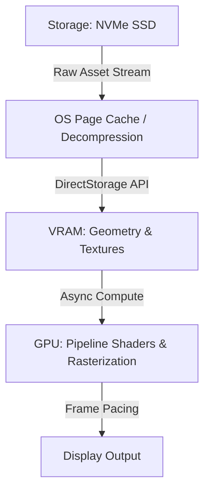

The intersection of real-time rendering architecture, cross-industry digital activations, and massive open-world streaming pipelines is defining the current state of interactive entertainment. As the industry prepares for Gamescom 2026 under the guidance of Geoff Keighley, recent technical leaks from anticipated titles like *Grand Theft Auto VI* alongside novel applications in medicine and luxury brand integrations illustrate how far game engines have transcended traditional entertainment boundaries. 

Analyzing these developments requires a close look at memory management, streaming optimizations, and the widening scope of platform deployment.

## Streaming Open-World Architecture: Lessons from Recent *GTA 6* Footage

Recent gameplay leaks highlighting aerial navigation over Vice City have offered systems architects and engine developers a rare glimpse into modern open-world streaming strategies. Rendering high-detail urban environments at high velocities—such as flying a fixed-wing aircraft across a seamless map—stresses CPU-to-GPU data streaming pipelines to their absolute limits.



To prevent asset pop-in and stuttering during high-speed traversal, modern engines rely heavily on hardware-accelerated decompression pipelines and low-overhead storage APIs (such as Microsoft's DirectStorage or Sony's equivalent custom I/O schedulers). 

When a player pilots an aircraft across density maps, the engine must dynamically adjust Level of Detail (LOD) hierarchies and execute garbage collection on out-of-bounds geometry without stalling the main rendering thread. 

* **Disk Throughput:** Maintaining stable frame pacing at 60 FPS or higher during rapid asset turnover demands sustained read speeds exceeding 5 GB/s.
* **Asset Streaming Budgets:** Developers must carefully partition VRAM allocations between high-resolution texture atlases and dynamic mesh buffers to avoid memory thrashing.

## Gamescom 2026 and the Evolution of Engine Performance

As organizers gear up for Gamescom 2026, the technical discourse centers heavily on how developers are squeezing maximum performance from current-generation hardware using advanced shaders, hardware ray tracing, and machine learning-assisted upscaling techniques. 

With modern titles pushing the limits of the DirectX 12 and Vulkan APIs, pipeline optimization has shifted from brute-force rasterization to intelligent workload distribution. Asynchronous compute queues allow physics calculations and AI pathfinding to execute concurrently with shadow map generation, maximizing GPU utilization across multi-core architectures.

For developers optimizing custom or commercial pipelines (like Unreal Engine 5 or proprietary frameworks), profiling frame times with built-in instrumentation tools is critical:

```bash
# Example: Launching an Unreal Engine 5 build with dedicated GPU profiling flags
./GameName.exe -gpucrashdebugging -d3d12 -force-d3d12-debug -RenderOffScreen
```

Profiling helps isolate whether a bottleneck stems from vertex shader execution, pixel overdraw, or CPU-side draw call overhead. Addressing these bottlenecks ensures that cinematic fidelity aligns with competitive hardware constraints.

## Cross-Industry Expansion: Luxury Brand Activations and Therapeutics

Beyond traditional hardware optimization, the underlying technology of real-time engines is finding traction in unexpected verticals. Estée Lauder’s Jo Malone entering *Fortnite* via a custom gaming activation highlights a broader trend: game engines serving as persistent, interactive marketing and virtual retail spaces. 

These activations rely on optimized asset management to ensure custom-built virtual environments run smoothly across a fragmented hardware ecosystem, ranging from high-end desktop rigs to mobile devices and Nintendo Switch consoles.

Simultaneously, the therapeutic and medical sectors are increasingly adopting procedural and interactive rendering frameworks. From cognitive behavioral therapy simulations to spatial computing applications for surgical training, the low-latency feedback loops native to video game engines are proving invaluable in clinical environments.

```json
{
  "activation_metadata": {
    "platform": "Fortnite_Creative_2.0",
    "engine": "Unreal_Engine_5",
    "target_frame_rate": 60,
    "max_draw_calls_per_frame": 1500,
    "texture_streaming_pool_mb": 2048
  }
}
```

## Conclusion

The boundary between game development and enterprise systems architecture continues to dissolve. Whether analyzing the complex asset streaming challenges of upcoming open-world blockbusters, preparing for technical showcases at Gamescom 2026, or evaluating non-gaming deployments in medicine and digital retail, the core engineering principles remain the same. Mastery of low-level graphics APIs, efficient memory management, and robust pipeline optimization will dictate which platforms and developers succeed in the years ahead.
