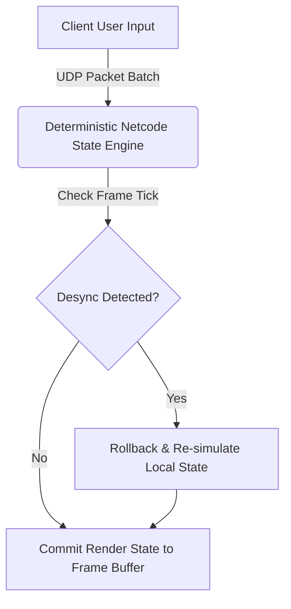

The video game industry is navigating a pivotal moment where legacy technical debt, player engagement ethics, and real-time live-service tuning intersect. From Game Freak’s unprecedented post-launch patch commitment for its newest non-Pokémon IP to Roblox’s multi-billion-dollar algorithmic adjustment, developers and studio executives are confronting the harsh realities of code optimization, player retention, and hardware constraints.

## Game Freak’s New Frontier: 'Beast of Reincarnation' Encounters Real-World Patch Cycles

Game Freak's latest release, *Beast of Reincarnation*, represents a major structural departure for the veteran Japanese studio. While the title retains thematic echoes of creature companionship and environmental symbiosis familiar to *Pokémon* fans, its underlying mechanics lean heavily into real-time action systems and modern loop dynamics. However, the game’s divisive launch highlights the difficulties of stepping outside a decades-old proprietary engine architecture.

In response to mixed technical and gameplay feedback, Game Freak issued a public commitment promising a series of major post-launch updates. The studio's engineering team is targeting key performance bottlenecks, frame-pacing irregularities, and combat responsiveness.

```json
{
  "patch_target": "v1.1.0-performance",
  "pipeline_updates": {
    "frame_pacing_target_ms": 16.67,
    "vram_allocation_budget_mb": 6144,
    "asset_streaming_strategy": "asynchronous_chunk_loading",
    "shader_compilation": "pre_pass_warmup"
  }
}
```

This proactive post-launch strategy reflects a cultural pivot for Game Freak. Historically reliant on static release builds, the studio is adapting to modern live-service maintenance workflows to salvage player sentiment and protect its long-term multi-IP strategy.

## Engine Bottlenecks and Netcode Pivots: Fallout 3 Remaster & Gears of War: E-Day

The technical constraints of 7th-generation consoles heavily dictated game aesthetics. Ex-Bethesda developer Nathan Purkeypile recently revealed that the visual presentation of 2008’s *Fallout 3* was "100 percent not what we intended," citing severe hardware constraints. The Xbox 360 (512 MB unified GDDR3 RAM) and PlayStation 3 (256 MB system / 256 MB video RAM) imposed strict budgets on draw calls, dynamic lights, and texture budgets.

To maintain target framerates on Gamebryo, Bethesda relied on heavy fogging, aggressive LOD (Level of Detail) pop-in, and a dominant monochromatic color grade to mask low-resolution asset degradation.

| Feature Target | 2008 Original (*Gamebryo*) | Modern Remaster Target (*DX12 / Vulkan*) |
| :--- | :--- | :--- |
| **System Memory Budget** | 512 MB Unified | 16 GB+ System / 8 GB+ VRAM |
| **Draw Call Pipeline** | Single-threaded CPU bottleneck | Multi-threaded execute indirect |
| **Global Illumination** | Baked shadowmaps & static ambient | Real-time hardware ray tracing / Lumen |
| **Color Depth & Shading** | 8-bit post-processing green tint | High Dynamic Range (HDR10) native |

Modern remasters resolve these legacy hardware compromises by decoupling render pipelines from monolithic single-threaded architecture, allowing native 4K reconstruction without relying on visual obfuscation.

Meanwhile, network architecture takes center stage in *Gears of War: E-Day*. Initially planned as a pure Horde mode stress-test, The Coalition abruptly announced that the upcoming weekend open beta will include competitive Player-vs-Player (PvP) modes due to overwhelming fan demand. Switching on competitive multiplayer requires real-time network topology validation to prevent client-side desynchronization across varying tick rates.



## Algorithmic Re-weighting: Roblox’s $9B Valuation Hit and Strategic Studio Realignments

Roblox experienced a $9 billion drop in market capitalization in a single trading session following an algorithmic tweak to its recommendation engine. The company deliberately dialed back promotion of viral titles that prioritized aggressive, short-term microtransactions in favor of experiences featuring sustained player engagement and safer interaction models.

Recommendation engines in user-generated content (UGC) platforms balance user satisfaction against monetization velocity using weighted scoring models:

$$\text{Score} = w_1 \cdot \text{Retention}_{\text{d7}} + w_2 \cdot \text{SessionLength} + w_3 \cdot \text{LTV}_{\text{short}} - w_4 \cdot \text{ChurnRisk}$$

By reducing the weight coefficient ($w_3$) assigned to short-term Lifetime Value ($\text{LTV}$), the platform immediately depressed near-term bookings. Wall Street reacted negatively to the short-term revenue dip, despite the architectural necessity of mitigating predatory monetization loops on a platform heavily populated by minors.

Elsewhere in the industry, structural realignments continue. Ubisoft has re-hired the director behind *Assassin’s Creed Valhalla*, *Origins*, and *Black Flag* to lead the future of the franchise, signaling a consolidation of core leadership around proven open-world paradigms. Simultaneously, preservation efforts remain strong: GOG's recent retro shooter promotion features classic titles like *F.E.A.R.*—celebrated for its Goal-Oriented Action Planning (GOAP) AI engine—offering lightweight performance on modern hardware. Creative co-op experimentation also thrives, with House House (*Untitled Goose Game*) pushing proximity voice systems and organic trust mechanics in their upcoming co-op project, *Big Walk*.

## Conclusion

The modern gaming industry continues to navigate complex trade-offs between business mechanics and core engineering. Whether optimizing legacy engine code for modern hardware, re-engineering recommendation algorithms to favor long-term safety over fast monetization, or maintaining live-service stability after launch, technical decisions directly impact financial outcomes. As platforms, engines, and player expectations evolve, clear architectural vision and adaptable post-launch support remain essential to building sustainable gaming ecosystems.
