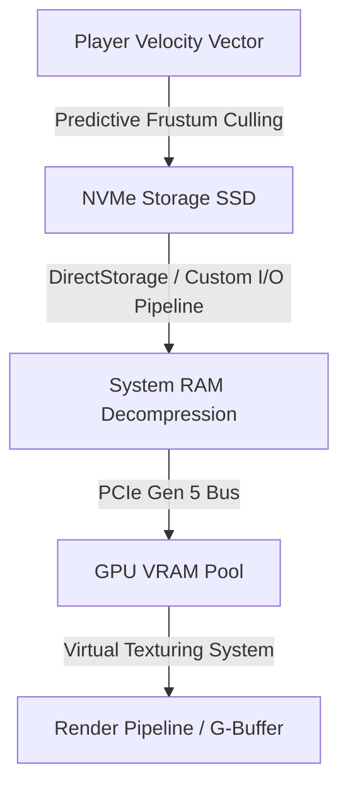
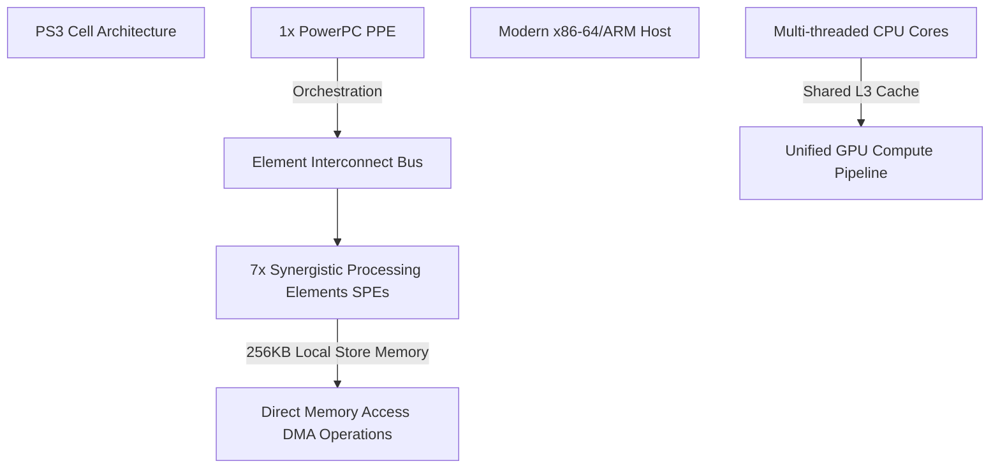

The late-August gaming calendar is dominated by Gamescom 2026, where hardware vendors and engine developers gather in Cologne to showcase the immediate future of interactive media. Yet, the most compelling technical discussions of the week are happening at the intersection of unreleased bleeding-edge tech and notoriously stubborn legacy software. 

From leaks showcasing the asset-streaming budgets of *Grand Theft Auto 6* to the monumental engineering effort required to bring *Metal Gear Solid 4: Guns of the Patriots* to modern architectures, game development is grappling with a singular challenge: how to efficiently manage massive simulation pipelines across heterogeneous hardware.

---

## GTA 6 Leaks: High-Velocity Asset Streaming and LOD Scaling

Recent footage leaking from the development pipelines of *Grand Theft Auto 6*—specifically showing the protagonist, Jason, piloting a fixed-wing aircraft over Vice City—provides a rare window into the evolution of Rockstar’s proprietary RAGE (Rockstar Advanced Game Engine). 

Flying at high altitudes and velocities introduces severe bottlenecks to game engines. The engine must stream gigabytes of geometry, high-resolution texture mipmaps, and physics colliders from modern NVMe storage directly to VRAM without causing frame-pacing spikes or visible level-of-detail (LOD) "pop-in."

To maintain a locked frame rate (targeting 30 or 60 FPS on current-gen consoles), the engine utilizes a predictive asset-streaming budget. We can model the raw I/O throughput required for high-velocity traversal using the following relationship:

$$T_{\text{throughput}} = \frac{S_{\text{sector}} \times (V_{\text{velocity}} / D_{\text{sector}})}{t_{\text{buffer}}}$$

Where:
*   $S_{\text{sector}}$ is the average data size of a high-density world sector (in Megabytes).
*   $V_{\text{velocity}}$ is the player's velocity vector magnitude (in meters per second).
*   $D_{\text{sector}}$ is the linear dimension of a world sector (in meters).
*   $t_{\text{buffer}}$ is the safety window (in seconds) required to decompress and load assets before they enter the player's field of view (frustum).

### Estimated Streaming Budgets at Variable Speeds

| Traversal State | Velocity ($V$) | Sector Size ($S$) | Target I/O Bandwidth (Uncompressed) |
| :--- | :--- | :--- | :--- |
| **On Foot** | $1.5 \text{ m/s}$ | $500 \text{ MB}$ | $\approx 25 \text{ MB/s}$ |
| **Supercar (Max Speed)** | $80 \text{ m/s}$ | $500 \text{ MB}$ | $\approx 400 \text{ MB/s}$ |
| **Aircraft (Cruising)** | $180 \text{ m/s}$ | $750 \text{ MB}$ | $\approx 1.35 \text{ GB/s}$ |

The leaked aircraft footage demonstrates that Rockstar has refined its virtual texturing and asynchronous compute pipelines to prevent VRAM choking. By utilizing hardware-decompression blocks on modern consoles, RAGE dynamically scales down asset density in the player's peripheral frustum while reserving memory bandwidth for high-fidelity volumetric clouds and atmospheric scattering effects.

---

## The Cell Exorcism: Porting Metal Gear Solid 4 to x86-64

While Rockstar pushes the limits of future hardware, Konami is quietly tackling one of the most infamous legacy porting challenges in software engineering: *Metal Gear Solid 4: Guns of the Patriots*. Slated for modern platforms via the *Metal Gear Solid: Master Collection Vol. 2*, MGS4 has spent nearly two decades trapped on the PlayStation 3 due to its deep architectural ties to the Cell Broadband Engine.

The Cell architecture was fundamentally different from modern multi-core x86-64 or ARM processors:

To port MGS4 without resorting to pure, resource-heavy emulation, developers must recompile the original assembly written for the Cell’s Synergistic Processing Elements (SPEs). SPEs lacked direct access to system memory; instead, they relied on manual Direct Memory Access (DMA) transfers to move data into a tiny $256\text{ KB}$ Local Store. 

On modern hardware, this execution model is translated using two primary techniques:
1.  **Asynchronous Compute Shaders:** Offloading heavily parallelized SPE tasks (such as cell-shaded rendering passes, physics calculations, and audio DSP) directly to modern GPU compute pipelines.
2.  **Thread Pool Mapping:** Mapping the individual SPE software threads onto modern, high-throughput CPU worker threads (such as those on AMD's Zen architecture), utilizing lock-free ring buffers to mimic the high-bandwidth Element Interconnect Bus (EIB).

---

## Gamescom 2026: The Convergence of Gaming Tech

The technical achievements discussed at Gamescom 2026 highlight how game engines are outgrowing their original entertainment boundaries. No longer confined to traditional game design, real-time rendering pipelines are finding utility in unexpected verticals:

*   **Gamified Medicine:** As highlighted by recent clinical studies, FDA-cleared therapeutic games are leveraging real-time biofeedback and adaptive difficulty algorithms. These systems utilize low-latency input monitoring to train cognitive pathways, transforming game loops into neuro-rehabilitative tools.
*   **High-Fidelity Brand Activations:** Non-endemic brands like Estée Lauder's Jo Malone are utilizing the Unreal Editor for Fortnite (UEFN) to deploy interactive experiences. By leveraging Nanite (virtualized geometry) and Lumen (global illumination), developers can deliver path-traced visual fidelity inside a massive, multi-platform multiplayer sandbox.
*   **The Pro-Gamer Economy:** The infrastructure supporting professional play has matured. Real-time network telemetry, sub-millisecond input polling, and machine-learning-driven anti-cheat systems have solidified competitive gaming as a highly engineered, viable career path for top-tier talent.

---

## Conclusion

The state of game technology in 2026 is defined by how developers manage complexity. Whether it is Rockstar optimizing its I/O pipelines to stream high-altitude assets in *GTA 6*, engine architects rewriting low-level assembly to free *Metal Gear Solid 4* from its legacy hardware chains, or medical researchers utilizing real-time feedback loops, the core challenge remains the same: maximizing hardware throughput. As Gamescom 2026 continues, the industry's focus is clear—it is no longer just about rendering more pixels, but about engineering smarter, more adaptable systems.
