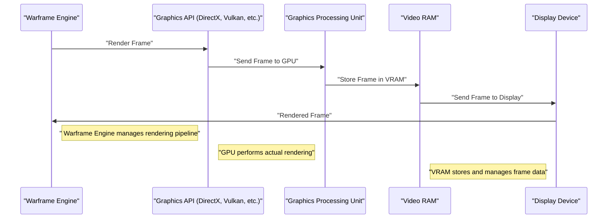

# Game News Roundup: Warframe, Soulframe, AI Slop, and More

## TennoCon 2026: The Warframe and Soulframe Fan Event

TennoCon 2026 has come and gone, leaving fans of Warframe and Soulframe buzzing with excitement. The annual fan event has become a staple of the gaming calendar, offering a glimpse into the future of the Warframe universe. This year's event did not disappoint, with a slew of announcements that will have fans eagerly awaiting the next update.

One of the most significant reveals was the confirmation of Soulframe's release date. The highly anticipated game is set to launch in early 2027, with a closed beta expected to begin later this year. The game's unique blend of action-RPG combat and immersive storytelling has generated significant buzz, and fans are eager to get their hands on the game.

Warframe, the popular cooperative third-person shooter, also received a significant update. The game's developers, Digital Extremes, announced a new expansion that will add a wealth of new content, including a revamped mission system and a range of new playable characters. The expansion is expected to drop later this year, with a beta phase scheduled to begin in the coming months.

## AI Slop and the Future of Gaming

The gaming industry has been abuzz with controversy surrounding AI-generated content. The latest salvo came from none other than director Christopher Nolan, who took to the stage at a recent event to express his disdain for what he called "AI slop." Nolan's comments were aimed squarely at the proliferation of AI-generated art and music in the gaming industry, with the director arguing that younger audiences are increasingly rejecting content that relies too heavily on artificial intelligence.

The issue of AI-generated content is a complex one, with proponents arguing that it offers a level of creative freedom and flexibility that traditional methods simply cannot match. However, opponents argue that AI-generated content lacks the soul and humanity of traditional art, and that it is ultimately a poor substitute for the real thing.

## PlayStation's Disc-less Future

The gaming industry is undergoing a significant shift, with the rise of digital distribution and streaming services threatening the very existence of physical game discs. Sony, in particular, has been at the forefront of this trend, with the company's PlayStation 5 console offering a range of digital-only titles and services.

However, not everyone is happy with this trend. A recent petition has been circulating online, calling on Sony to reverse its decision to drop support for physical game discs. The petition has gained significant traction, with many fans expressing their disappointment at the loss of a beloved aspect of gaming culture.

## Microsoft Responds to Racist Conspiracy Theories

Microsoft has been at the center of a recent controversy, with the company facing accusations of racism and xenophobia following a series of layoffs. The company's communications lead has since responded to the allegations, arguing that the layoffs were not made to replace employees with foreign workers.

The issue of racism and xenophobia in the tech industry is a complex and sensitive one, with many companies struggling to address the issue. Microsoft's response is a welcome step in the right direction, and serves as a reminder that the industry must do more to address these issues and promote diversity and inclusion.

## Conclusion

The gaming industry is a complex and ever-changing beast, with new technologies and trends emerging all the time. From the latest developments in AI-generated content to the rise of digital distribution and streaming services, there is no shortage of exciting news and announcements to get excited about.

As we look to the future, it will be interesting to see how the industry continues to evolve and adapt to the changing landscape. One thing is for sure, however: the gaming industry will continue to be a source of innovation and excitement, and we can't wait to see what the future holds.

---

**Table: TennoCon 2026 Announcements**

| Game | Announcement | Release Date |
| --- | --- | --- |
| Soulframe | Closed Beta | Q4 2026 |
| Soulframe | Full Release | Early 2027 |
| Warframe | New Expansion | Q3 2026 |
| Warframe | Beta Phase | Q2 2026 |

**Code Block: Soulframe System Requirements**

```python
import sys

# System Requirements for Soulframe
soulframe_system_requirements = {
    "OS": "Windows 10 or later",
    "CPU": "Intel Core i5 or AMD equivalent",
    "GPU": "NVIDIA GeForce GTX 1060 or AMD Radeon RX 580",
    "RAM": "16 GB or more",
    "Storage": "1 TB or more"
}

print("Soulframe System Requirements:")
for requirement, value in soulframe_system_requirements.items():
    print(f"{requirement}: {value}")
```

**Mermaid Diagram: Warframe Rendering Pipeline**



Note: The above Mermaid diagram is a simplified representation of the Warframe rendering pipeline. In reality, the pipeline is much more complex and involves many more stages and components.
