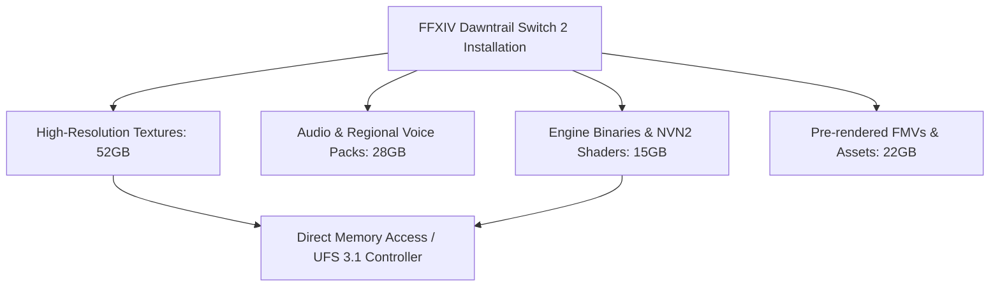

Today marks a turbulent shift in the gaming ecosystem. Between massive MMO platform expansions, historically unprecedented corporate consolidation, and immediate post-launch studio contraction, the industry is balancing aggressive technical adaptation against stark financial realities.

Here is an analytical breakdown of today’s key industry and engineering developments.

---

## FFXIV Debuts on Nintendo Switch 2: A 117GB Engineering Feat

Square Enix has officially launched *Final Fantasy XIV* on Nintendo’s new handheld hardware following a surprisingly tight announcement-to-release window. Porting an MMORPG with over a decade of legacy asset builds, custom shaders, and complex UI paradigms to a handheld architecture presents clear technical challenges—most notably storage throughput and memory management.

The Switch 2 build demands **117 GB** of local storage, making it one of the largest single software packages on the platform to date.



Transitioning from DirectX 11 execution pipelines to Nintendo's updated low-level graphics API (NVN2) requires efficient runtime asset streaming. Because the Switch 2 relies on internal UFS 3.1 flash memory and expandable Express storage cards, texture streaming logic must strictly manage pipeline stalls during dense player-gatherings in hub cities like Tuliyollal.

```json
{
  "target_platform": "Nintendo_Switch_2",
  "graphics_api": "NVN2",
  "render_resolution": "1080p_Dynamic",
  "target_framerate": 60,
  "asset_streaming": {
    "vram_budget_mb": 7168,
    "texture_compression": "ASTC_HDC",
    "async_compute_queues": true
  }
}
```

Square Enix has extended its free trial strategy to the platform, offering content through the *Stormblood* expansion without requiring a subscription. For developers, this release serves as an empirical benchmark for how modern high-occupancy MMO engines translate to mobile SoC architectures without severe asset downscaling.

---

## EA Closes Record $55B Privatization Deal

The public market era for Electronic Arts has officially closed. EA has been acquired by a consortium comprising Saudi Arabia’s Public Investment Fund (PIF), private equity firms including Silver Lake, and Jared Kushner’s Affinity Partners. Standing as the second-largest acquisition in interactive entertainment history behind Microsoft’s buyout of Activision Blizzard, the transaction removes one of the industry's foundational publishers from public stock exchanges.

```
+-------------------------------------------------------------------+
|               EA Privatization Capital Breakdown                  |
+-------------------------------------------------------------------+
| [========================] Saudi PIF (Lead Equity)               |
| [============] Private Equity / Silver Lake (Consortium Partner)  |
| [======] Affinity Partners (Strategic Capital)                    |
+-------------------------------------------------------------------+
```

Privatization alters EA’s operational obligations. Freed from quarterly earnings pressure from public shareholders, the publisher may pivot towards long-term platform services and internal infrastructure overhauls. However, high-debt leveraged buyouts often introduce cost-cutting directives across internal development studios to service capital requirements, leaving multi-studio pipelines under heightened scrutiny.

---

## Post-Launch Volatility: Refractor Games Cuts 85% of Staff

Underscoring the extreme financial risks of modern mid-budget development, Refractor Games has laid off approximately 85% of its workforce. This drastic restructuring arrives under two months after the release of *Fifa World Cup: Launch Edition*.

Short development cycles paired with intense licensing overhead routinely stretch independent teams past operational safety margins. When initial concurrent user (CCU) metrics fail to convert into immediate live-service monetization, capital reserves deplete rapidly.

```
Development Timeline vs. Workforce Retention:
[Project Greenlight] ---> [2-Month Post-Launch Window] ---> [85% Workforce Cut]
       |                                   |
 High Licensing Costs              Low CCU Conversion Rate
```

For technical directors and studio heads, Refractor’s situation highlights a persistent trend: rapid-turnaround seasonal titles built on licensed frameworks carry operational risk profiles that traditional studio budget models can rarely absorb without sustained day-one player conversion.

---

## Telemetry Metrics and Network Tilt-Mitigation Strategies

Beyond macro-level corporate updates, telemetry reports and indie development pipelines reflect interesting shifts in player behavior and netcode design:

* **Baldur's Gate 3 Telemetry:** Larian Studios released updated global player stats revealing an unexpected distribution in class selection and moral pathing. Despite complex multi-class options, knife-focused Bard setups operating on high-aggression morality paths accounted for a disproportionately high percentage of recent playthrough completions.
* **Anti-Rage-Quit Netcode Architecture:** To combat instant disconnections in competitive online titles, an indie developer has showcased an asynchronous match-desync protocol. Instead of immediately terminating a match when a user rage-quits, the server seamlessly hot-swaps the disconnected client with a machine-learning-driven bot trained on the user's localized input latency and positional habits.

```
Client Disconnect Packet ---> Edge Gateway ---> Hot-Swap Controller ---> AI Input Engine Strategy
                                                                   |
                                                      Zero Match-Interruption State
```

This state-mitigation pattern masks network drops entirely from the remaining player, ensuring server state stability while punishing the dropping client via background session-flagging APIs.

---

## Conclusion

The current state of game development demands absolute technical efficiency alongside brutal market positioning. Whether optimizing 117GB footprints for mobile hardware architectures or engineering automated server-side failovers for bad actors, engine adaptability remains paramount. As corporate landscapes consolidate under private equity, technical resilience and intelligent engine architecture will differentiate sustainable studios from those vulnerable to sudden market shifts.
