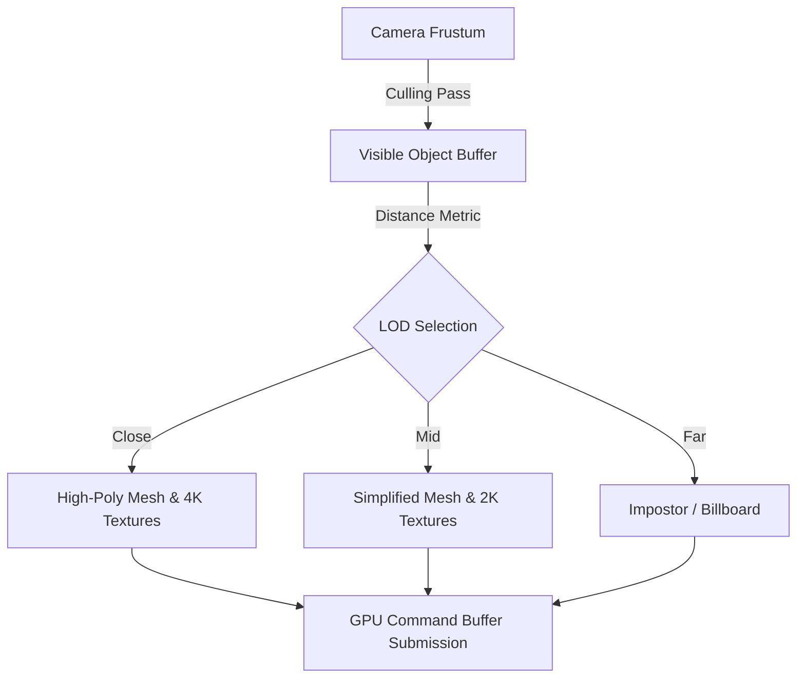

Few titles in recent memory have so fundamentally altered how we analyze open-world game design as FromSoftware's 2022 masterpiece. Yet, two years post-launch, players and engineers alike are still uncovering the deep complexities of how its underlying engine manages vast, seamless landscapes without traditional loading screens. Moving away from linear level design required a complete architectural overhaul of FromSoftware’s proprietary engine, stretching hardware constraints across eighth and ninth-generation consoles to their absolute limits.

## The Evolution of FromSoftware’s Proprietary Engine

FromSoftware has long iterated on its proprietary cross-platform engine, which evolved significantly from the interconnected, vertical design of *Dark Souls* to the sprawling horizontal scope of the Lands Between. Unlike modular engines like Unreal Engine 5, which rely heavily on generalized virtual geometry systems like Nanite, FromSoftware’s pipeline relies on a bespoke asset streaming architecture tailored specifically to synchronous risk-and-reward gameplay loops.

At the core of this system is a strict deterministic frame-pacing requirement. In a combat-driven ARGS, micro-stutters or frame drops directly impact input latency and collision detection frames (i-frames). To maintain a target 60 FPS on capable hardware, the engine implements aggressive occlusion culling and dynamic level-of-detail (LOD) scaling. 



## Memory Management and Asset Streaming in the Lands Between

Streaming a massive open world while keeping RAM and VRAM footprints within console thresholds requires sophisticated memory paging. On base PlayStation 4 and Xbox One hardware, the game had to operate within a meager 8GB of shared GDDR5/DDR3 memory pool, forcing engineers to optimize asset decompression pipelines.

* **Texture Streaming Pools:** VRAM allocation is dynamically adjusted based on immediate camera vectors and player velocity. 
* **Geometry Paging:** Terrain is broken down into a hierarchical grid of discrete tiles. As the player traverses the map via Torrent, the background worker threads asynchronously load adjacent sector files into a ring buffer.
* **Shader Compilation:** Shader pre-compilation minimizes runtime stutter, though CPU bottlenecks during initial pipeline state object (PSO) creation historically led to stutter on specific PC configurations.

> "Managing hardware constraints across a divergent ecosystem of PC, last-gen, and current-gen consoles demands that the engine adapt its streaming budget dynamically per frame, rather than relying on static pre-baked assumptions."

### Asset Streaming Optimization Algorithm

To understand how the engine prevents hitching during rapid movement, consider a conceptual pseudo-code representation of the asynchronous loader loop managing streaming priorities:

```python
def update_streaming_pool(player_position, velocity, streaming_buffer):
    target_lod = calculate_dynamic_lod(velocity)
    sectors_in_frustum = get_frustum_sectors(player_position)
    
    for sector in sectors_in_frustum:
        if not sector.is_loaded and not streaming_buffer.is_full():
            async_load_to_vram(sector, priority=target_lod)
        elif sector.distance_from(player_position) > VIEW_DISTANCE_THRESHOLD:
            offload_from_vram(sector)
```

## Lighting, Shadows, and Dynamic Time-of-Day

The transition to an open world also forced a rethinking of the rendering pipeline's lighting model. Previous titles relied heavily on static lightmaps mixed with localized dynamic shadow casters. For the Lands Between, the engine integrated a unified dynamic time-of-day system coupled with screen-space ambient occlusion (SSAO) and dynamic volumetric fog.

The shadow mapping pipeline utilizes Cascaded Shadow Maps (CSMs) for directional sunlight, partitioning the view frustum into multiple slices to balance shadow resolution and performance cost. The mathematical formulation for split distances typically follows a logarithmic distribution:

$$C_i = d_{near} \left( \frac{d_{far}}{d_{near}} \right)^{\frac{i}{N}}$$

Where $N$ is the total number of cascades, and $i$ represents the current cascade index. This ensures that objects close to the camera receive high-resolution shadow maps, while distant terrain utilizes coarser maps, optimizing pixel shader fill rates.

## Conclusion

Analyzing the engineering triumphs behind older masterpieces offers vital context for modern software design. FromSoftware’s ability to scale a proprietary engine across wildly different hardware targets highlights that clever memory management, efficient asset streaming, and disciplined rendering pipelines often outweigh brute-force hardware power. As developers look toward future hardware iterations, the foundational lessons learned from streaming the Lands Between will continue to influence open-world engine architecture for years to come.
