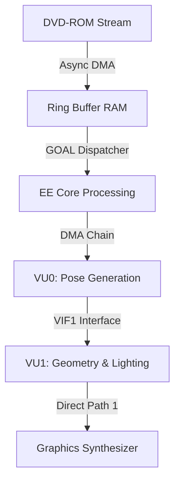

When *Jak and Daxter: The Precursor Legacy* launched on the PlayStation 2, it accomplished a feat that contemporary engine architects declared technically impossible: a fully open, high-fidelity 3D world rendered at a locked 60 frames per second with zero loading screens. 

At a time when competitors relied on claustrophobic corridor transitions, heavy fogting techniques, or explicit loading pauses, Naughty Dog achieved seamless streaming by throwing out Sony's standard C/C++ toolchains. Instead, they engineered a custom compiled language, squeezed bare-metal performance out of the PS2's raw Vector Units, and established a blueprint for streaming architectures that still underpins modern engine design.

## The Hardware Dilemma: The Emotion Engine Paradigm

To understand the magnitude of this triumph, one must analyze the unique architectural bottlenecks of the PlayStation 2. The core of the machine was the Emotion Engine (EE)—a custom MIPS R5900-based CPU running at 294.912 MHz, paired with a meager 32 MB of main Direct RDRAM and 4 MB of embedded VRAM (eDRAM) on the Graphics Synthesizer (GS).

```
                      +-------------------+
                      |   EE Core CPU     |
                      |   (MIPS R5900)    |
                      +---------+---------+
                                |
               +----------------+----------------+
               |                                 |
        +------+------+                   +------+------+
        | Vector Unit |                   | Vector Unit |
        |     VU0     |                   |     VU1     |
        +------+------+                   +------+------+
               |                                 |
               +----------------+----------------+
                                |
                      +---------+---------+
                      |   Graphics      |
                      |   Synthesizer   |
                      |   (4 MB eDRAM)  |
                      +-----------------+
```

The system lacked hardware texture caching and hardware Transform and Lighting (T&L) pipelines. Geometry transformation and lighting calculations had to be executed directly in code across two custom SIMD micro-processors:

1. **VU0:** Positioned inline with the CPU, primarily serving as a programmable coprocessor for physics, character pose generation, and skeletal animation.
2. **VU1:** An autonomous geometry processor linked directly to the Graphics Synthesizer via the VIF1 interface, dedicated to rasterizing transformed vertex buffers.

The challenge was throughput. With only 32 MB of system RAM, storing an entire world in memory simultaneously was out of the question. Main memory had to act as a dynamic, volatile staging area.

## GOAL: High-Level Lisp on Bare-Metal Hardware

Rather than battling C's memory alignment constraints and static linking paradigms, Andy Gavin and the Naughty Dog core team developed **GOAL** (*Game Orientated Assembly Lisp*). 

GOAL was a dialect of Lisp that compiled directly to native MIPS machine code. It combined the dynamic control of a high-level functional language—such as dynamic re-compilation over a live socket connection during active playtests—with low-level memory layout control and custom vector assembly inline operations.

```lisp
;; Example of inline vector math abstraction in GOAL
(defun transform-vertex-buffer ((v-in vector) (m matrix) (v-out vector))
  (.lv.vf vf1 v-in)             ;; Load input vector to Vector Register 1
  (.qmfc2.i vf2 m)              ;; Load transformation matrix block
  (.mul.vf vf3 vf1 vf2)         ;; Execute parallel SIMD vector multiplication
  (.sv.vf v-out vf3)            ;; Store back to DMA output buffer
  none)
```

Because GOAL supported dynamic memory allocation and precise object placement in memory, memory fragmentation could be rigorously mitigated. Structures were designed down to exact 16-byte alignment boundaries to maximize the EE's 128-bit Direct Memory Access (DMA) controller efficiency.

## Dynamic Streaming Mechanics & DVD Math

The PlayStation 2’s DVD-ROM drive presented a massive physical bottleneck, operating at a maximum transfer rate of 4X, yielding roughly 5.28 MB/s of sequential throughput. Random seek operations dropped throughput to a fraction of that figure.

To prevent drive-head thrashing, Naughty Dog partitioned the game world into a spatial grid composed of 64 KB memory pages. Two master streaming ring buffers were allocated in RAM: while Buffer A streamed active geometry and textures for the current sector, Buffer B asynchronously fetched adjacent world blocks off the optical disc.

The physical streaming throughput equation operated under tight temporal boundaries:

$$T_{\text{budget}} = T_{\text{seek}} + \frac{S_{\text{block}}}{B_{\text{max}}}$$

Where $T_{\text{budget}}$ represents the frame window before a player reaches a sector boundary, $S_{\text{block}}$ is the memory chunk payload (64 KB), and $B_{\text{max}}$ is the optical read bandwidth.

To handle variable rendering demands without dropping frames, Naughty Dog built specialized microcode renderers tailored to specific geometric topologies:

| Engine Name | Target Geometry | Primary Execution Unit | Optimization Focus |
| :--- | :--- | :--- | :--- |
| **TIE** (Terrain Instancing Engine) | Static background terrain | VU1 Microcode | Heavy mesh compression & fast culling |
| **MERC** (Model Renderer) | Dynamic characters & enemies | VU0 + VU1 pipeline | Fast skeletal skinning & blend shapes |
| **FGA** (Foreground Architecture) | Intermediate world detail | VU1 Microcode | Instanced geometry duplication |
| **SHR** (Shadow Engine) | Dynamic shadow volumes | CPU Core + GS | Direct stencil buffer injection |

The data transfer pipeline decoupled the CPU entirely from geometry execution during rasterization phases:



## Legacy of an Engineering Triumph

Naughty Dog’s engineering choices on *Jak and Daxter* bypassed hardware constraints by blending software compilation paradigms with raw hardware control. By building a custom Lisp compiler, running custom microcode across dual Vector Units, and enforcing strict 64 KB alignment budgets for optical streaming, they eliminated the concept of world loading screens a full hardware generation before solid-state storage made such feats commonplace. 

The
