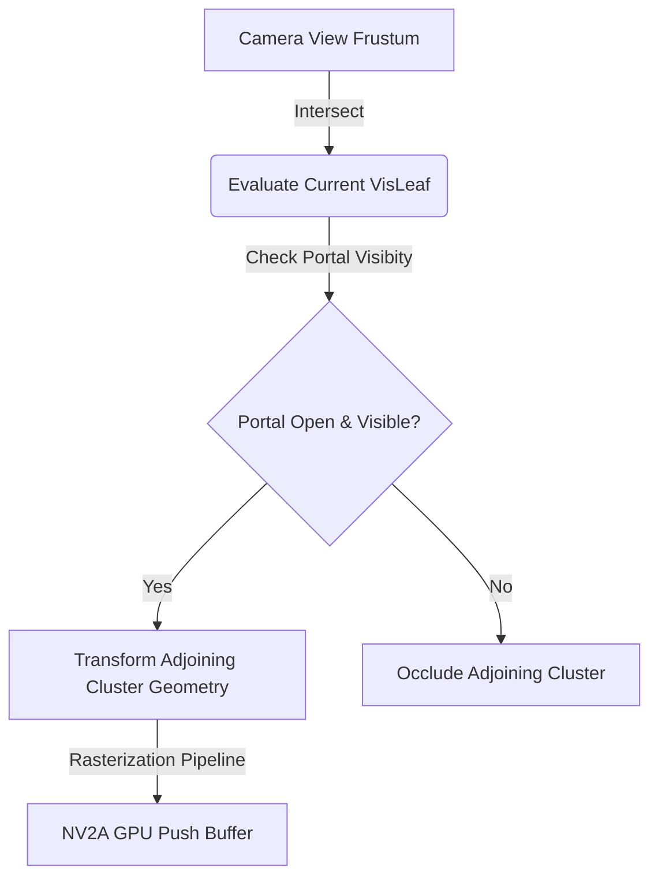

When examining modern multiplatform deployment challenges—whether it is optimization pipelines on new console hardware or tuning netcode latency for extraction shooters—the core technical friction points almost always trace back to early engine paradigms. Long before modern engines abstracted memory allocation and draw-call batching behind engine plugins, legacy codebases had to construct custom pipelines from first principles.

Bungie’s **Blam! Engine**, which debuted in 2001 with *Halo: Combat Evolved*, represents one of the most significant engineering milestones in 3D real-time rendering. Designed to run on custom fixed-function and early programmable shader hardware, Blam! bypassed severe system bottlenecks through clever spatial partitioning, fixed-rate deterministic physics loops, and strict unified memory management.

## Spatial Partitioning: Portals, BSPs, and Occlusion Culling

To achieve expansive outdoor environments alongside tightly constrained indoor corridors on hardware with severe bandwidth limitations, the Blam! Engine utilized a hybrid spatial partitioning system combining Binary Space Partitioning (BSP) trees with portal-based occlusion culling.

Standard BSP implementations, such as those in early id Tech builds, suffered high draw-call costs in wide-open spaces. Blam! resolved this by segmenting geometry into discrete interior clusters and exterior terrain meshes. Interior geometry was partitioned into static leaves connected by 2D convex polygons called **portals**.



During execution, the visibility pipeline performed the following sequence:

1. **Leaf Identification:** Locate the active camera vector within the static BSP structure.
2. **Portal Projection:** Project adjacent cluster portals into screen space using the view-projection matrix.
3. **Frustum Clipping:** Dynamically clip the view frustum to the bounding rectangle of the visible portal.
4. **Draw-Call Batching:** Send only geometry contained within the clipped sub-frustum down the push buffer.

By rejecting off-screen geometry prior to rasterization, the engine kept vertex count submissions well within the hardware limits of the early 2000s GPU architecture.

## Deterministic Tick Loops and Physics Interpolation

A critical architectural triumph of the Blam! Engine was its total decoupling of the simulation tick rate from the frame rendering loop. The game world simulated state updates at a hard-coded $30\text{ Hz}$ ($33.33\text{ ms}$ tick delta), whereas the rendering engine was targeting variable refresh rates (typically $60\text{ Hz}$ NTSC output).

To prevent visual stutter caused by the disparity between physics updates and frame presentation, the presentation layer performed linear and spherical interpolation ($\text{LERP}$/$\text{SLERP}$) across visual transforms based on a fractional frame time metric $\alpha$.

$$\mathbf{P}_{render}(\alpha) = (1 - \alpha)\mathbf{P}_{tick\_k} + \alpha\mathbf{P}_{tick\_k+1} \quad \text{where} \quad \alpha = \frac{t_{current} - t_k}{\Delta t_{tick}}$$

Below is an annotated C++ abstraction demonstrating how the rendering engine interpolated entity positions between discrete physics steps:

```cpp
#include <iostream>

struct Vector3 {
    float x, y, z;
    Vector3 operator*(float scalar) const { return {x * scalar, y * scalar, z * scalar}; }
    Vector3 operator+(const Vector3& other) const { return {x + other.x, y + other.y, z + other.z}; }
};

struct Transform {
    Vector3 position;
};

// Interpolates between previous tick state (k) and current tick state (k+1)
Transform ComputeRenderTransform(const Transform& statePrev, const Transform& stateCurr, float alpha) {
    Transform interpolated;
    // P_render = (1 - alpha) * P_prev + alpha * P_curr
    interpolated.position = (statePrev.position * (1.0f - alpha)) + (stateCurr.position * alpha);
    return interpolated;
}

int main() {
    Transform tick_K    = { { 10.0f, 0.0f, 0.0f } };
    Transform tick_K1   = { { 20.0f, 0.0f, 0.0f } };
    float frameAlpha    = 0.45f; // Render timing falls 45% between tick K and K+1

    Transform renderState = ComputeRenderTransform(tick_K, tick_K1, frameAlpha);
    std::cout << "Render X Pos: " << renderState.position.x << " units" << std::endl;
    return 0;
}
```

This deterministic tick architecture provided two primary advantages:
* **Network Predictability:** Multiplayer state synchronization only needed to transmit $30\text{ Hz}$ snapshot deltas over low-bandwidth broadband/LAN connections.
* **Physics Stability:** Rigid-body dynamics and collision detection run within a fixed time step ($\Delta t$), preventing numerical integration drift across varying framerates.

## Hardware Constraints: The 64MB Unified Memory Bottleneck

The target platform hardware operated on a unified memory architecture (UMA) where CPU, GPU, and audio hardware shared a single bank of 64MB DDR SDRAM operating on a 128-bit bus at 200 MHz ($6.4\text{ GB/s}$ peak bandwidth). 

Because VRAM was not physically segregated from system memory, audio buffers, animation tracks, texture maps, and geometry mesh buffers competed directly for allocation space.

| Subsystem Memory Allocation | Budget Cap | Primary Data Structures |
| :--- | :--- | :--- |
| **System Kernel & Engine Static Executable** | $\sim 12\text{ MB}$ | Code segment, static heap, call stack |
| **Geometry & Index Buffers** | $\sim 14\text{ MB}$ | Level BSPs, instanced mesh objects, vertex lists |
| **Texture Streaming & Framebuffers** | $\sim 24\text{ MB}$ | DXT1/DXT5 compressed textures, front/back buffers, Z-buffer |
| **Audio Heap** | $\sim 8\text{ MB}$ | ADPCM compressed audio streams, dynamic sound banks |
| **Dynamic Simulation Memory** | $\sim 6\text{ MB}$ | Object pool allocations, active particle systems, game state |

To maximize this limited hardware footprint, Bungie engineered a dynamic tag-based resource system (the `.map` file format). Sound files used ADPCM compression, while textures were heavily constrained to lower-bit DXT texture formats (DXT1 for opaque surfaces yielding a 6:1 compression ratio, and DXT5 for alpha channels). Asset streaming dynamically paged map data directly into fixed-size memory pools, eliminating runtime dynamic memory allocation (`malloc`) and preventing heap fragmentation during gameplay.

## Conclusion

The structural survival of legacy game architectures depends on how clean their underlying math and spatial partitioning logic remains when stripped of hardware-specific crutches. By enforcing fixed-rate simulation loops, aggressive portal-based occlusion culling, and strict unified memory layouts, the Blam! Engine achieved visual scale and computational stability far beyond what its target hardware specifications promised
