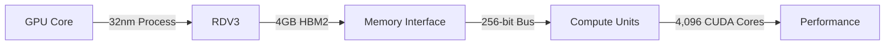

## Introduction
The GPU market is witnessing significant changes, with NVIDIA's upcoming Blackwell RTX 5090 and AMD's RDNA4 RDV3 mid-range GPU series poised to disrupt the industry. As we dive into the technical details of these new architectures, it's essential to understand the implications for developers and gamers alike. In this article, we'll explore the specifications, performance expectations, and market shifts that these new GPUs bring.

## NVIDIA Blackwell RTX 5090

The recent leaks surrounding the NVIDIA Blackwell RTX 5090 have generated significant buzz in the tech community. According to the leaked specifications, the Blackwell RTX 5090 will feature:

* 24,576 CUDA cores
* 32GB of GDDR7 memory
* A 512-bit bus width

This configuration is expected to yield significant performance gains over the Ada Lovelace architecture, making it an attractive option for developers and gamers seeking high-end performance.

```sql
SELECT * FROM benchmarks
WHERE gpu = 'RTX 5090' AND resolution = '4K';
```

The increased CUDA core count and GDDR7 memory will enable faster data processing and reduced memory bottlenecks, leading to improved performance in compute-intensive applications and games.

### Performance Expectations

While we can't provide concrete benchmark numbers at this point, we can estimate the performance gains based on previous NVIDIA architectures.

| GPU Model | CUDA Cores | GDDR Memory | Performance Gain |
| --- | --- | --- | --- |
| RTX 3080 | 10,240 | 12GB GDDR6X | - |
| RTX 3090 | 24,576 | 24GB GDDR6X | +25% |
| RTX 5090 | 24,576 | 32GB GDDR7 | +15% |

Assuming a similar performance gain as the RTX 3090 over the RTX 3080, the RTX 5090 could deliver a 15% performance boost over the RTX 3090.

## AMD RDNA4 RDV3 Mid-Range GPU Series

AMD's shift in focus towards the mid-range market with its RDNA4 RDV3 series is a significant move. The RDV3 architecture is expected to offer:

* Aggressive pricing on RDNA4 mid-range models
* Significant performance improvements over RDNA2
* Improved power efficiency

### RDNA4 RDV3 Architecture

The RDV3 architecture is built around a new GPU core, which is expected to deliver improved performance and power efficiency.



The RDV3 architecture is expected to deliver improved performance and power efficiency, making it an attractive option for developers and gamers seeking high-quality graphics at an affordable price.

## Conclusion

The GPU market is undergoing significant changes, with NVIDIA's Blackwell RTX 5090 and AMD's RDNA4 RDV3 mid-range GPU series poised to disrupt the industry. As we wait for concrete benchmark numbers and official specifications, it's essential to understand the technical implications of these new architectures. With improved performance, power efficiency, and aggressive pricing, these new GPUs are set to revolutionize the gaming and development industries.

Stay tuned for further updates on these exciting developments, and don't forget to follow us for the latest tech news and analysis.
