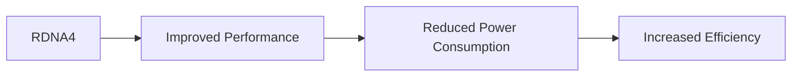

## The Blackwell Effect: NVIDIA's Performance Powerhouse

Recent leaks have shed light on the upcoming NVIDIA Blackwell RTX 5090, hinting at a significant performance leap over the Ada Lovelace architecture. The Blackwell RTX 5090 is expected to feature 24,576 CUDA cores, 32GB of GDDR7 memory, and a 512-bit bus width. These specifications promise to deliver unparalleled performance in the most demanding games and applications.

### Architecture and Performance

The Blackwell RTX 5090's architecture is built upon a 5nm process node, allowing for a substantial increase in transistor density. This, combined with the improved CUDA core design, enables faster and more efficient processing of complex graphics workloads.

The 32GB of GDDR7 memory will provide ample storage for textures, vertex buffers, and other graphics-related data. The 512-bit bus width will enable faster memory access and transfer rates, further enhancing the GPU's overall performance.

### Comparison with Ada Lovelace

To put the Blackwell RTX 5090's performance into perspective, let's consider a comparison with the Ada Lovelace architecture. The Ada Lovelace RTX 5000 features 21,504 CUDA cores, 24GB of GDDR6X memory, and a 384-bit bus width.

| GPU | CUDA Cores | Memory (GB) | Bus Width |
| --- | --- | --- | --- |
| Blackwell RTX 5090 | 24,576 | 32 | 512-bit |
| Ada Lovelace RTX 5000 | 21,504 | 24 | 384-bit |

As we can see, the Blackwell RTX 5090 boasts a 14% increase in CUDA cores, a 33% increase in memory, and a 33% increase in bus width. These improvements will likely result in significant performance gains in games and applications that heavily utilize the GPU.

## AMD's Mid-Range Ambition: Targeting the Mass Market

While NVIDIA focuses on the high-end market with the Blackwell RTX 5090, AMD is shifting its attention to the mid-range segment. The upcoming Radeon RX 8000 series is expected to target the mid-range GPU market with aggressive pricing and competitive performance.

### RDNA4 and Mid-Range Performance

The Radeon RX 8000 series will be built upon AMD's RDNA4 architecture, which promises to deliver improved performance and power efficiency. The RDNA4 architecture features a new, more efficient design that reduces power consumption while maintaining or improving performance.

AMD's mid-range strategy is aimed at capturing the bulk of the market by offering competitive performance at lower price points. This approach will allow AMD to establish a strong presence in the mid-range market and challenge NVIDIA's dominance in the high-end segment.

### Comparison with NVIDIA's High-End

To put AMD's mid-range strategy into perspective, let's consider a comparison with NVIDIA's high-end offerings. The GeForce RTX 4090 features 10496 CUDA cores, 24GB of GDDR6X memory, and a 384-bit bus width.

| GPU | CUDA Cores | Memory (GB) | Bus Width |
| --- | --- | --- | --- |
| Radeon RX 8000 | 4096 | 8 | 128-bit |
| GeForce RTX 4090 | 10496 | 24 | 384-bit |

As we can see, the Radeon RX 8000 features a significantly lower number of CUDA cores, less memory, and a narrower bus width compared to the GeForce RTX 4090. However, AMD's mid-range strategy is focused on delivering competitive performance at lower price points, making it an attractive option for gamers and content creators on a budget.

## Conclusion

The GPU market is shifting, with NVIDIA's Blackwell RTX 5090 and AMD's mid-range Radeon RX 8000 series vying for dominance. While the Blackwell RTX 5090 promises to deliver unparalleled performance in the high-end market, AMD's mid-range strategy targets the mass market with competitive performance and aggressive pricing. As the GPU market continues to evolve, it will be interesting to see how these two approaches shape the future of graphics processing.
