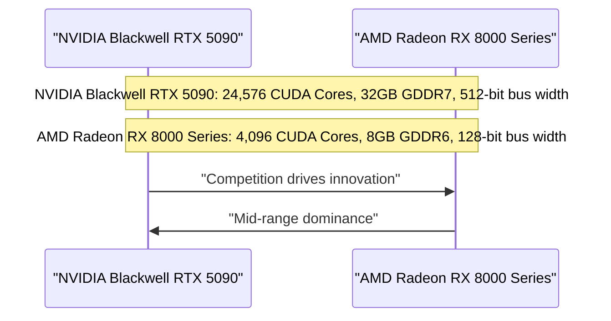

## The Blackwell Effect: NVIDIA's RTX 5090 Leaks and the Future of High-End GPUs

Recent leaks have shed light on NVIDIA's upcoming Blackwell RTX 5090, a behemoth of a GPU that promises significant performance gains over its predecessor, the Ada Lovelace. With 24,576 CUDA cores, 32GB of GDDR7 memory, and a 512-bit bus width, the Blackwell RTX 5090 is poised to dominate the high-end GPU market. But what does this mean for the future of gaming and graphics processing?

### Table 1: NVIDIA Blackwell RTX 5090 Specifications

| Feature | Value |
| --- | --- |
| CUDA Cores | 24,576 |
| Memory | 32GB GDDR7 |
| Memory Bus Width | 512-bit |
| Memory Bandwidth | 1.1 TB/s |

### The Rise of Mid-Range GPUs: AMD's Shift in Strategy

While NVIDIA is focusing on high-end performance, AMD is taking a different approach. Reports suggest that AMD is shifting its focus away from extreme high-end graphics cards and towards the mid-range market. By targeting the bulk of the market with aggressive pricing on RDNA4 mid-range models, AMD aims to capture the largest share of the market. This strategy is a response to the changing landscape of the GPU market, where mid-range GPUs are becoming increasingly popular among gamers and content creators.

## Mid-Range Dominance: AMD Radeon RX 8000 Series

AMD's RDNA4 mid-range GPUs are designed to offer exceptional performance and value for money. With a focus on power efficiency and reduced costs, AMD aims to make its mid-range GPUs more appealing to gamers and content creators. The Radeon RX 8000 series is expected to offer improved performance, lower power consumption, and a more competitive pricing strategy.

### Table 2: AMD Radeon RX 8000 Series Specifications (Estimated)

| Feature | Value |
| --- | --- |
| CUDA Cores | 4,096 |
| Memory | 8GB GDDR6 |
| Memory Bus Width | 128-bit |
| Memory Bandwidth | 224 GB/s |

## The Future of the GPU Market

The GPU market is undergoing a significant shift, driven by the increasing popularity of mid-range GPUs and the emergence of new technologies. NVIDIA's Blackwell RTX 5090 is a testament to the company's commitment to high-end performance, while AMD's focus on mid-range GPUs is a response to the changing landscape of the market. As the market continues to evolve, one thing is certain: the future of gaming and graphics processing will be shaped by the ongoing competition between NVIDIA and AMD.

## Conclusion

The GPU market is on the cusp of a revolution, driven by the emergence of new technologies and the changing landscape of the market. NVIDIA's Blackwell RTX 5090 and AMD's Radeon RX 8000 series are just the beginning of a new era in gaming and graphics processing. As we look to the future, one thing is certain: the GPU market will continue to evolve, driven by the ongoing competition between NVIDIA and AMD.

[Diagram: A Mermaid sequence diagram illustrating the NVIDIA Blackwell RTX 5090 and AMD Radeon RX 8000 series]

