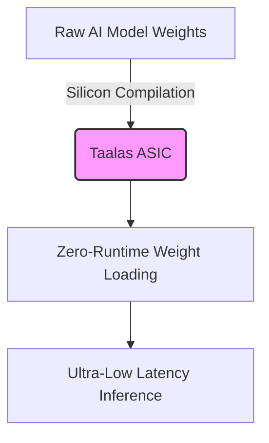

The modern semiconductor landscape moves at a blistering pace, dominated by multi-billion-dollar infrastructure plays and custom inference pipelines. Yet, parallel to these enterprise shifts, hardware enthusiasts continue to push the boundaries of brute-force engineering to rescue digital artifacts from oblivion. Today, we examine two divergent poles of processor engineering: AMD's aggressive infrastructural consolidation via silicon-level AI compilation, and a monumental preservation effort that weaponized a 90-GPU cluster to reverse-engineer a lost relic of the *Final Fantasy 7* universe.

## Hardcoding Intelligence: AMD’s Taalas and Cerebras Strategy

AMD's recent financial disclosures reveal an aggressive expansion strategy. Alongside accounts payable climbing by $2.36 billion—hinting at massive capital outlays to sustain soaring data center demand—the company has made aggressive structural plays in the AI silicon market. Hot on the heels of its partnership with Cerebras to accelerate the Helios rack-scale system's inference capabilities, AMD has signed an agreement to acquire Taalas.

Taalas represents a radical departure from traditional von Neumann architecture and flexible GPU design. Rather than executing large language models via dynamic runtime interpretation in memory, Taalas designs Application-Specific Integrated Circuits (ASICs) that **bake AI models directly into silicon**. 



By hardcoding network weights straight onto the die, these chips eliminate memory bottlenecking entirely. The performance implications for high-throughput enterprise environments are profound:

* **Elimination of HBM/DRAM Bandwidth Walls:** Weights reside in physical gates, bypassing the energy and latency costs of fetching terabytes of parameters from external memory stacks.
* **Maximized Thermal Efficiency:** Stripping out general-purpose instruction decode logic drops idle and active power envelopes significantly per token generated.
* **Deterministic Execution Latency:** With execution pathways frozen in silicon, jitter and variance in inference times drop to near zero.

However, this architecture trades away dynamic adaptability. Updating a model compiled onto a Taalas ASIC requires a full tape-out cycle, positioning these processors strictly for stable, high-volume inference tiers where models remain static for extended durations.

## Brute-Force Preservation: Resurrecting *Dirge of Cerberus: Lost Episode*

While AMD rewrites the paradigm of silicon-level execution, software preservationists operate on the opposite end of the engineering spectrum. A dedicated hardware archivist recently spent approximately $900 to construct a parallel processing rig comprising **90 discrete graphics processing units** to decrypt and reconstruct *Dirge of Cerberus: Lost Episode*—a fully voiced mobile spin-off title that originally vanished when its servers shut down in 2018.

Mobile gaming history is littered with lost media due to proprietary binary formats, closed-source middleware, and obscure carrier-specific execution environments. Recovering these titles requires reverse-engineering legacy ARM binaries, unzipping custom asset containers, and brute-forcing cryptographic wrappers or obfuscated asset indexes.

```bash
# Example snippet illustrating the parsing of legacy compressed asset containers
python3 -c '
import zlib, sys

def extract_asset(filepath):
    with open(filepath, "rb") as f:
        header = f.read(16)
        compressed_data = f.read()
    try:
        decompressed = zlib.decompress(compressed_data)
        print(f"Successfully unpacked {len(decompressed)} bytes from {filepath}")
    except zlib.error as e:
        print(f"Decompression failed: {e}", file=sys.stderr)

if __name__ == "__main__":
    extract_asset(sys.argv[1])
'
```

Running massive parallel brute-force routines across a 90-GPU array allows preservationists to crack weak encryption keys or run distributed emulation environments to capture missing game state logic. This project highlights a critical reality for digital preservation: as games transition entirely to cloud-native rendering and server-authoritative architectures, keeping legacy code alive will demand increasingly complex, high-performance hardware rigs just to emulate the missing infrastructure.

## Financial Balancing Acts and Hardware Realities

Back in the enterprise sector, AMD’s financial footing reflects the immense capital intensity of modern hardware development. While data center revenue surged by an astonishing 107% year-over-year—bolstered by commanding nearly half of the data center CPU market share—the company’s cash flow dynamics reveal the hidden costs of scaling up. 

A $2.36 billion increase in accounts payable signals heavy procurement pipelines, component staging, and foundry commitments with partners like TSMC. Balancing record earnings against free cash flow squeezes demonstrates the sheer capital barrier to entry in contemporary semiconductor manufacturing, where building competitive racks requires pre-funding immense manufacturing capacity quarters in advance.

## Conclusion

Whether examining multi-billion-dollar corporate maneuvers to hardcode AI models directly onto silicon dies or an enthusiast building a 90-GPU array to rescue a forgotten mobile spin-off, hardware is the ultimate medium through which digital capability is bounded. As chip architectures pivot toward static, application-specific ASICs and preservationists race against bit rot and server deprecation, the engineering challenges of tomorrow will continue to demand ingenuity at both ends of the technological scale.
