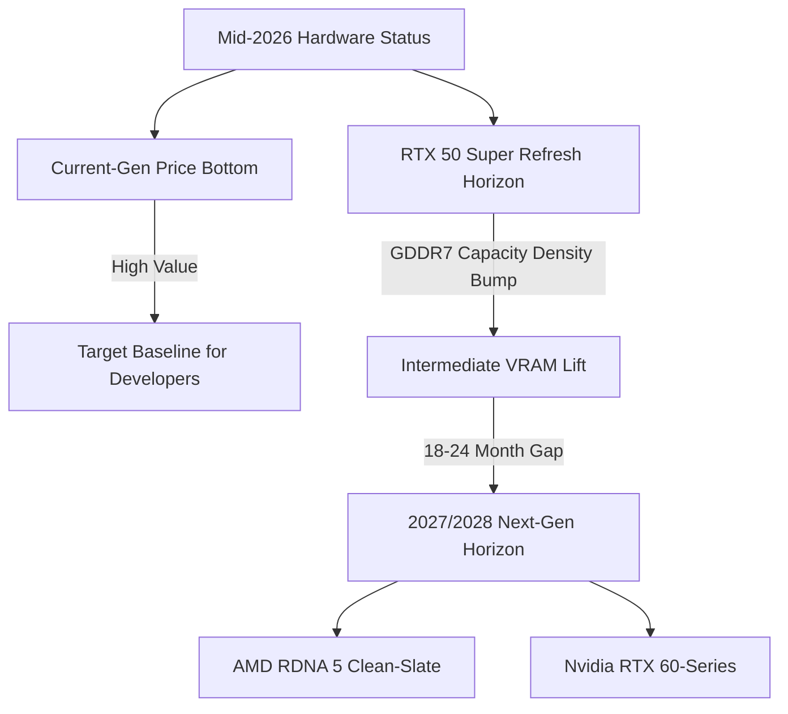

As mid-2026 arrives, the graphics card market is entering an unprecedented structural plateau. Recent industry price tracking across current-generation Nvidia, AMD, and Intel offerings shows that retail pricing has finally normalized, with existing lineups reaching their lowest cost-per-frame metrics since launch. However, gamers and engine developers anticipating a swift transition to next-generation silicon will need to recalibrate their timelines.

Hardware leaks and supply chain reports from Digital Foundry and OC3D confirm that both AMD's ground-up RDNA 5 architecture and Nvidia's RTX 60-series (Rubin consumer variants) have been pushed out to mid-2027 or early 2028. To bridge this 18-to-24-month gap, Nvidia is readying an RTX 50 Super mid-generation refresh, leaving developers with a stable, predictable target hardware baseline for the immediate future.



## Why Next-Gen Silicon is Pushed to 2027/2028

The delayed cadence of next-gen consumer GPUs stems from a combination of wafer allocation dynamics and fundamental microarchitectural shifts. Advanced node capacity at TSMC—specifically the leading-edge N2 (2nm-class) and high-density N3 variants—remains heavily prioritized for enterprise AI accelerators and ultra-high-margin datacenter dies. 

Beyond fabrication bottlenecks, both major vendors are undertaking significant architectural rewrites:

*   **AMD RDNA 5:** Leaked internal roadmaps indicate that AMD is treating RDNA 5 as a "Zen moment" for graphics. Moving completely away from the structural compromises of RDNA 3 and the mid-range positioning of RDNA 4, RDNA 5 is targeted as a clean-slate design featuring overhauled ray tracing pipelines, redesigned matrix math arrays, and a unified execution complex.
*   **Nvidia RTX 60-Series:** Nvidia is focusing its primary architectural modifications on deep neural rendering and advanced asynchronous dispatch. Integrating structural upgrades to Shader Execution Reordering (SER) alongside next-gen Tensor cores requires extended validation cycles on sub-3nm nodes.

Consequently, silicon designers are opting to stretch current die production lifecycles rather than rush underdeveloped tape-outs to market.

## The RTX 50 Super Bridge and Current Market Realities

With the standard Blackwell (RTX 50-series) and RDNA 4 cards sitting at competitive price points across major retailers, the upcoming RTX 50 Super refresh serves a specific functional purpose: optimizing VRAM configurations and filling mid-stack bandwidth gaps.

The main bottleneck for modern rendering pipelines running on Unreal Engine 5.5+ is memory footprint rather than raw compute shading. High-resolution virtualized geometry systems like Nanite and complex volumetric illumination passes (Lumen) heavily tax framebuffers and cache hierarchies. Current market tracking shows cards with 16GB+ VRAM retaining value much better than 12GB equivalents, a factor Nvidia aims to address via higher-density GDDR7 modules on the Super lineup.

| Feature / Architecture | Current Generation (2025-2026) | RTX 50 Super Refresh (Late 2026/2027) | Next-Gen (RDNA 5 / RTX 60) |
| :--- | :--- | :--- | :--- |
| **Node Process** | TSMC N4P / Custom N4 | TSMC N4P Refined | TSMC N2 / Advanced 3nm |
| **Memory Standard** | GDDR6X / GDDR7 (28 Gbps) | GDDR7 (32 Gbps High-Density) | Next-Gen GDDR7 / High-Bandwidth Interfaces |
| **Target Launch Window** | Active Market Lull | Q4 2026 – Q1 2027 | Mid-2027 – Mid-2028 |
| **Architectural Focus** | Frame Generation & RT Refinement | VRAM Density & Clock Efficiency | Clean-Slate Compute & Neural Rendering |

For system builders, this hardware delay creates a rare period of stability. The current pricing bottom means purchasing hardware today does not carry the immediate threat of rapid obsolescence that typically accompanies hardware cycles.

## Engineering Impact: Engine Optimization and Frame Pacing

From a graphics engineering perspective, an extended hardware cycle is a double-edged sword. While it delays hardware-driven brute-force performance jumps, it gives engine programmers a fixed hardware envelope to optimize against. 

```python
# Conceptual example of dynamic workload scaling based on VRAM capacity detection
def allocate_render_targets(vram_budget_mb: int):
    if vram_budget_mb >= 16384:
        return {
            "virtual_textures": "Ultra (8K Physical Pool)",
            "ray_tracing_bvh": "Full Scene Geometry",
            "frame_gen_history": "3-Frame Vector Buffer"
        }
    elif vram_budget_mb >= 12288:
        return {
            "virtual_textures": "High (4K Physical Pool)",
            "ray_tracing_bvh": "Culled Instance Geometry",
            "frame_gen_history": "1-Frame Vector Buffer"
        }
    else:
        return {
            "virtual_textures": "Medium (2K Physical Pool)",
            "ray_tracing_bvh": "Software Distance Fields Fallback",
            "frame_gen_history": "Disabled"
        }
```

With hardware targets locked for the next 18 months, optimization effort shifts toward:

1.  **Frame Generation Pacing:** Eliminating latency spikes caused by asynchronous compute contention during DLSS or FSR interpolation passes.
2.  **BVH Structure Compaction:** Reducing bounding volume hierarchy footprint in system RAM to minimize PCIe bus saturation during dynamic mesh streaming.
3.  **Memory Compression:** Utilizing advanced ASTC and BC7 compression passes directly on high-speed GDDR7 buses to maintain native 4K framebuffers without memory thrashing.

## Conclusion

The hardware timeline leaks mark a clear shift in GPU strategy. Rather than forcing annual architectural node jumps, chipmakers are leaning into mid-generation memory refinements while taking the necessary time to architect substantial architectural leaps for 2027 and beyond. For developers and gamers alike, the current market pricing lulls offer a stable window to build or optimize without fear of immediate platform shift.
