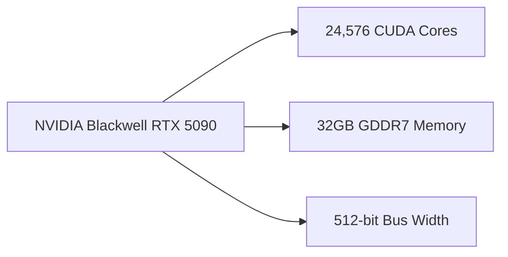

## Introduction

The GPU landscape is evolving rapidly, with new architectures and strategies emerging from top players. Recent leaks have shed light on NVIDIA's Blackwell RTX 5090, a GPU that promises to deliver significant performance gains over the Ada Lovelace architecture. Meanwhile, AMD is shifting its focus towards the mid-range market with its RDNA4 series, aiming to capture a larger share of the market with aggressive pricing. In this article, we'll delve into the technical details of these developments and explore their implications for developers and gamers alike.

## NVIDIA Blackwell RTX 5090: A Leap Forward in Performance

According to leaked specifications, the Blackwell RTX 5090 will boast an impressive 24,576 CUDA cores, a 32GB GDDR7 memory configuration, and a 512-bit bus width. These numbers suggest a substantial increase in performance over the Ada Lovelace architecture, which will be a welcome boost for developers and gamers.

| **Feature** | **Value** |
| --- | --- |
| CUDA Cores | 24,576 |
| GDDR7 Memory | 32GB |
| Bus Width | 512-bit |

The Blackwell RTX 5090's increased CUDA core count will enable developers to take advantage of more parallel processing, leading to improved performance in applications such as ray tracing, AI-enhanced rendering, and physics-based simulations. Additionally, the 32GB GDDR7 memory configuration will provide ample memory for demanding workloads, reducing the likelihood of memory bottlenecks.

## AMD RDNA4: A Shift in Focus

In contrast, AMD is taking a different approach with its RDNA4 series, targeting the mid-range market with aggressive pricing. By focusing on this segment, AMD aims to capture a larger share of the market, potentially at the expense of its high-end offerings.

| **Feature** | **Value** |
| --- | --- |
| RDNA4 Cores | 2048 |
| GDDR6 Memory | 16GB |
| Bus Width | 256-bit |

The RDNA4 architecture will provide improved performance and power efficiency, making it an attractive option for developers and gamers who don't require the absolute highest level of performance. However, the reduced CUDA core count and GDDR6 memory configuration may limit the GPU's capabilities in demanding workloads.

## Conclusion

The recent developments in the GPU market are a testament to the ongoing innovation and competition in the industry. The NVIDIA Blackwell RTX 5090 promises to deliver significant performance gains, while AMD's RDNA4 series targets the mid-range market with aggressive pricing. As the industry continues to evolve, it's essential for developers and gamers to stay informed about the latest developments and their implications for performance, power efficiency, and overall user experience.

---

### Further Reading

* NVIDIA's Blackwell RTX 5090: Official Press Release (TBA)
* AMD's RDNA4 Series: Official Press Release (TBA)
* "GPU Architecture Comparison: NVIDIA Blackwell RTX 5090 vs. AMD RDNA4" (TBA)

### Tags

* GPU
* NVIDIA
* AMD
* RDNA4
* Blackwell RTX 5090
