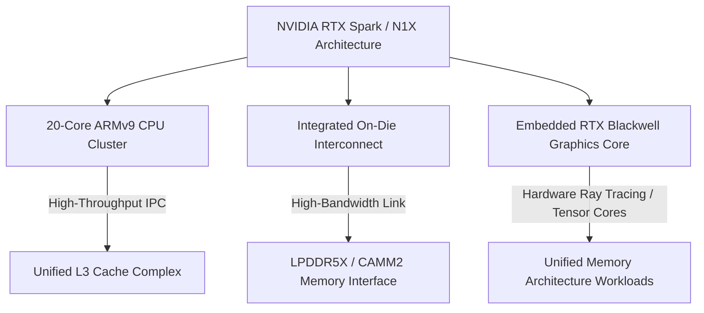

NVIDIA’s aggressive expansion into custom client hardware is accelerating on two parallel tracks: refining proprietary ARM-based system-on-chips (SoCs) to challenge Apple Silicon, and navigating the operational realities of supporting high-TGP desktop flagships. 

Fresh leakage surrounding NVIDIA’s upcoming "RTX Spark" ARM SoC (codenamed N1X) indicates substantial architectural tuning ahead of launch, while a notable customer support event at ZOTAC highlights the thermal and board-level realities of maintaining top-tier desktop GPUs across generational transitions.

## RTX Spark "N1X" Benchmark Leaks: Closing the ARM Multi-Core Gap

Early Geekbench 6 leaks for NVIDIA’s N1X silicon presented a lukewarm picture, showing multi-core and single-core metrics trailing Apple’s previous-generation M3 Max. However, newly surfaced data from two pre-production RTX Spark laptop systems demonstrates a significant performance recovery. 

The updated 20-core ARM processor configuration now trails Apple's 14-core M4 Max by just 11% in Geekbench 6 multi-core testing. This represents a meaningful architectural jump over early stepping revisions, pointing toward aggressive microcode optimization, power delivery fixes, or higher sustained clock targets on the ARMv9-based core cluster.

```
Geekbench 6 Multi-Core Performance Trajectory (Normalized)
───────────────────────────────────────────────────────────
Apple M4 Max (14-Core)   │ ▓▓▓▓▓▓▓▓▓▓▓▓▓▓▓▓▓▓▓▓ 100%
NVIDIA N1X (20-Core) *   │ ▓▓▓▓▓▓▓▓▓▓▓▓▓▓▓▓▓▓█░  89%  (Latest Leak)
Apple M3 Max (16-Core)   │ ▓▓▓▓▓▓▓▓▓▓▓▓▓▓▓▓▓░░░  85%
NVIDIA N1X Early Leak    │ ▓▓▓▓▓▓▓▓▓▓▓▓▓█░░░░░░  72%  (Early Stepping)
───────────────────────────────────────────────────────────
* Pre-production silicon running high-TDP laptop chassis profile
```

While Apple relies on a heavily wide-decoder architecture paired with massive unified memory bandwidth, NVIDIA's 20-core strategy relies on higher core density and tight interconnect integration with on-die or co-packaged RTX graphics hardware. 

For software engineers and game developers, the target architecture shift is profound: standard x86_64 target pipelines will need native compilation passes for ARM64 platforms equipped with discrete-class GPU pipelines running under Windows on ARM and Linux environments.



## Desktop Realities: Board Reliability and the RTX 4090 to 5090 Upgrade

While custom ARM chips represent NVIDIA's long-term mobility focus, the desktop space continues to demand massive power budgets and complex thermal management. A recent incident involving ZOTAC’s U.S. RMA division underscores the technical friction inherent to high-draw graphics cards.

A customer who submitted an RTX 4090 for warranty replacement four consecutive times—likely due to recurring board-level faults such as transient power cycling, memory thermal throttling, or PCB flexing near the 12V-2x6 connector—received an upgraded RTX 5090 at no additional charge. 

### PCB Failure Vectors on Ultra-High-TDP Flagships
1. **Thermal Fatigue on VRAM Modules:** High density GDDR6X/GDDR7 layouts subject soldered BGA joints to severe micro-expansion cycles.
2. **Transient Voltage Spikes:** High-draw GPUs (450W+) place extreme stress on power delivery phases (VRMs and MOSFETs), requiring precise PWM controller behavior.
3. **Connector Interface Stress:** Thermal cycling near high-current connectors can lead to localized resistance spikes if pin contact force degrades over time.

For an Add-In Board (AIB) partner, replacing a persistent legacy RMA with current-generation Blackwell architecture (RTX 5090) often represents a rational engineering decision: the labor cost of repeated diagnostic testing and refurbishing legacy PCBs eventually exceeds the BOM cost of deploying a newer, revised power delivery platform.

## Cross-Compiling for ARM64 + CUDA Heterogeneous Systems

As SoCs like the RTX Spark enter developer labs, toolchains must bridge the gap between ARM64 CPU hosts and NVIDIA's native CUDA acceleration layers. Developers targeting Linux-on-ARM or Windows-on-ARM environments can configure CMake to cross-compile binary targets using standard toolchains.

Below is an example snippet showing how a C++/CUDA project configures standard toolchain paths for a target ARM64 architecture with integrated CUDA runtime support:

```cmake
# CMakeLists.txt - Cross-compilation configuration for ARM64 + CUDA Target
cmake_minimum_required(VERSION 3.22)
project(RTXSparkWorkload LANGUAGES CXX CUDA)

# Set target system parameters for ARM64
set(CMAKE_SYSTEM_NAME Linux)
set(CMAKE_SYSTEM_PROCESSOR aarch64)

# Define CUDA architecture for target silicon (e.g., Blackwell/Ada compute capability)
if(NOT DEFINED CMAKE_CUDA_ARCHITECTURES)
  set(CMAKE_CUDA_ARCHITECTURES 90) # Adjust based on target architecture target
endif()

# Compiler flags for native ARMv9 optimization
set(CMAKE_CXX_FLAGS "${CMAKE_CXX_FLAGS} -march=armv8.5-a+sve+crypto -O3")
set(CMAKE_CUDA_FLAGS "${CMAKE_CUDA_FLAGS} --use_fast_math -Xptxas -v")

add_executable(rtx_spark_demo main.cpp pipeline.cu)

set_target_properties(rtx_spark_demo PROPERTIES
    CUDA_SEPARABLE_COMPILATION ON
    POSITION_INDEPENDENT_CODE ON
)
```

By establishing clean build configurations for `aarch64` native targets, teams can evaluate execution times and memory throughput across unified memory pools long before final consumer silicon reaches retail shelves.

## Conclusion

NVIDIA's dual-track approach highlights the realities of current hardware engineering. The rapid iterative performance gains shown in the 20-core RTX Spark (N1X) leak prove that ARM-based mobile silicon is rapidly approaching performance parity with established mobile market leaders. Simultaneously, the support lifecycle of 450W+ desktop flagships like the RTX 4090 and RTX 5090 serves as a reminder that raw power density demands uncompromised board design and proactive customer service.
