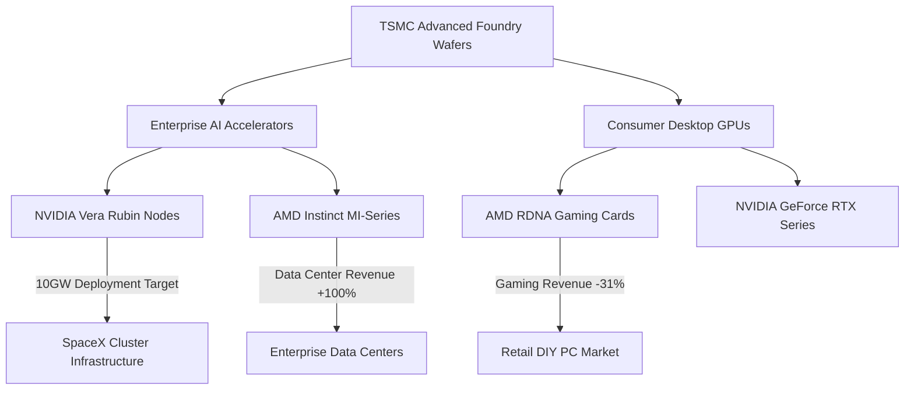

The divergence within the high-performance silicon market has reached an unprecedented tipping point. On one end of the spectrum, aerospace and frontier AI firms are writing blank checks for hyper-scale compute clusters. On the other, retail hardware sales are stalling as consumer price sensitivity hits a wall.

Two major developments summarize this market split: Elon Musk has officially committed SpaceX exclusively to NVIDIA GPUs—citing a massive planned buildout targeting 10 Gigawatts of compute powered by NVIDIA’s next-generation Vera Rubin architecture. Meanwhile, AMD’s latest financial disclosures reveal a striking internal dynamic: while their data center division doubled its revenue year-over-year, their gaming division experienced a brutal 31% revenue crash.

---

## SpaceX’s 10GW Bet: NVIDIA’s Vera Rubin Ecosystem Lock-In

SpaceX's decision to standardize entirely on NVIDIA hardware highlights the massive technical moat built around CUDA and NVIDIA’s tightly integrated rack-scale architectures. Citing that NVIDIA’s accelerators remain "the best" on the market, Musk’s commitment to deploy up to 10 Gigawatts (10GW) of compute capacity by 2027 represents an infrastructure footprint rarely seen outside of dedicated utility-scale power grids.

At this scale, hardware selection isn't just about raw peak TFLOPS; it comes down to interconnect density, thermal dissipation efficiency, and communication fabric latency across hundreds of thousands of discrete nodes. 

```
                                  10GW Power Budget
                                         │
                 ┌───────────────────────┴───────────────────────┐
                 ▼                                               ▼
   NVLink Switch Tray Network                      Vera Rubin Rack Infrastructure
   • NVLink 6 Fabric Interface                     • Vera Arm CPUs + Rubin GPUs
   • Multi-Tb/s Bisection Bandwidth                • Unified Memory / HBM4 Protocol
```

NVIDIA’s upcoming Vera Rubin platform combines high-throughput custom Vera Arm-based CPUs with Rubin GPUs, backed by HBM4 memory architectures and next-generation NVLink networks. For SpaceX, which relies heavily on real-time physics simulations, Starlink orbital mesh routing, and orbital trajectory telemetry, maintaining low inter-node communication latency is paramount. The lock-in is as much software driven (via TensorRT and custom CUDA-X libraries) as it is architectural.

---

## AMD’s Dual Reality: Data Center Soars, Gaming Sinks

While NVIDIA secures exclusive hyper-scale commitments, AMD is navigating a stark operational split. In their latest financial reporting, AMD’s Data Center segment doubled its revenue YoY, driven primarily by strong enterprise adoption of its EPYC server processors and Instinct AI accelerators (such as the MI300 and MI350 series).

However, AMD’s Gaming segment suffered a sharp 31% YoY plunge. CEO Lisa Su attributed this decline directly to elevated consumer GPU pricing weighing heavily on client demand.

| Segment | YoY Revenue Growth | Key Operational Drivers |
| :--- | :--- | :--- |
| **AMD Data Center** | **+100% (Doubled)** | Enterprise EPYC deployments, Instinct MI-series adoption |
| **AMD Gaming** | **-31%** | Consumer price fatigue, console cycle tail-off, high mid-range GPU prices |

With TSMC’s advanced node wafer capacity heavily prioritized for high-margin enterprise silicon, desktop graphics cards have seen sticky pricing structures that deter the typical mid-range desktop builder. As a result, PC gamers are extending their hardware upgrade cycles, delaying purchases of RDNA-based GPUs.

---

## Silicon Economics: The Enterprise R&D Feedback Loop

The flow of silicon from advanced lithography nodes (such as TSMC's 3nm and 2nm variants) shows a fundamental structural shift. High-margin AI compute nodes are displacing lower-margin consumer desktop graphics dies.



Because enterprise hardware yields order-of-magnitude higher profit per mm² of silicon compared to desktop GPUs, both NVIDIA and AMD are incentivized to optimize architectural R&D around matrix math execution, high-bandwidth memory (HBM) controllers, and scale-out networking topologies rather than pure rasterization or consumer ray tracing engines.

---

## Technical Implications for Developers and Graphics Engineers

For game engineers, graphics programmers, and software architects, this market realignment forces a shift in runtime optimization strategies:

1. **Targeting Extended Legacy Baselines:** With consumer GPU upgrades slowing down, game engines must optimize for older installed bases. Memory budgets (VRAM) must be managed tightly using runtime texture streaming and mesh shaders rather than relying on brute-force hardware upgrades.
2. **Cross-API Portability:** As enterprise infrastructure centralizes on CUDA, alternative frameworks like AMD's ROCm and open standards like Vulkan/SPIR-V are becoming critical for developers aiming to maintain vendor-neutral pipelines.

Systems developers profiling hardware performance across heterogeneous nodes can monitor hardware-level power target constraints using vendor-level APIs. Below is a Python script utilizing `pynvml` to dynamically assess node-level power caps and compute utilization across deployed enterprise nodes:

```python
import pynvml
import sys

def audit_node_compute():
    try:
        pynvml.nvmlInit()
        device_count = pynvml.nvmlDeviceGetCount()
        print(f"[+] Active GPU Compute Nodes Detected: {device_count}")
        
        for i in range(device_count):
            handle = pynvml.nvmlDeviceGetHandleByIndex(i)
            name = pynvml.nvmlDeviceGetName(handle)
            power_usage = pynvml.nvmlDeviceGetPowerUsage(handle) / 1000.0  # Watts
            power_limit = pynvml.nvmlDeviceGetEnforcedPowerLimit(handle) / 1000.0
            utilization = pynvml.nvmlDeviceGetUtilizationRates(handle)
            
            print(f"  Node {i}: {name}")
            print(f"    ├─ Power Draw: {power_usage:.2f}W / {power_limit:.2f}W")
            print(f"    ├─ GPU Core Utilization: {utilization.gpu}%")
            print(f"    └─ Memory Utilization:   {utilization.memory}%")
            
        pynvml.nvmlShutdown()
    except pynvml.NVMLError as err:
        print(f"[-] NVML Query Error: {err}", file=sys.stderr)

if __name__ == "__main__":
    audit_node_compute()
```

---

## Conclusion

The hardware industry in mid-2026 is defined by a clear structural realignment. NVIDIA's massive deployment agreement with SpaceX demonstrates the relentless scale of enterprise AI compute infrastructure, where projects are calculated in gigawatts rather than gigabytes. Conversely, AMD’s financial results serve as a direct measurement of the market: enterprise data center infrastructure is thriving, while the consumer gaming market struggles under high component costs and delayed upgrade cycles. As enterprise demands swallow advanced node availability, game developers and software engineers must focus on optimization and resource efficiency over raw hardware brute force.
