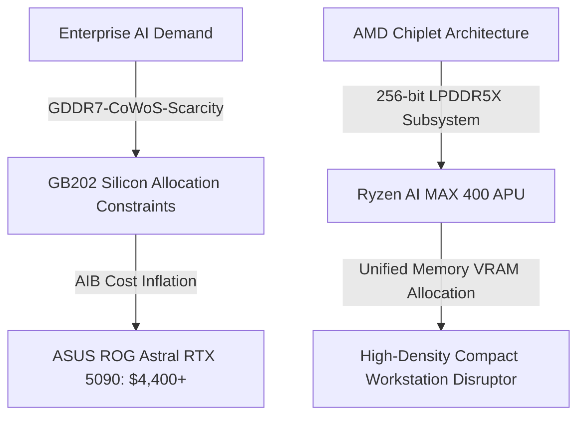

The high-performance hardware landscape in August 2026 is defined by two extreme, opposing forces: runaway price escalation on top-tier discrete enthusiast GPUs, and aggressive architectural consolidation via high-bandwidth monolithic/chiplet APUs. 

As Nvidia's add-in card (AIB) partners struggle with production costs and severe memory allocation constraints on flagship SKUs, market prices for top-tier custom boards have detached from initial MSRPs. Simultaneously, AMD is preparing to present the opening keynote at IFA 2026 in Berlin, where Senior VP Jack Huynh is scheduled to officially launch the long-anticipated **Ryzen AI MAX 400** series (codenamed *Strix Halo*).

These combined developments signal a dramatic pivot in how hardware developers and enthusiast gamers evaluate client-side compute density.

---

## The $4,400 Benchmark: What Is Driving Flagship GPU Chaos?

Reports surfaced this week detailing canceled orders for the high-end **ASUS ROG Astral RTX 5090**, where buyers who secured orders at $4,429 had their purchases voided due to rapid mid-stream price adjustments. The GPU's retail tag subsequently spiked by an immediate $500, pushing custom flagship pricing nearly **2.5x higher** than Nvidia’s base reference MSRP.

```
+--------------------------------------------------------------------+
|  Flagship Discrete GPU Inflation Factors                          |
+--------------------------------------------------------------------+
|  1. GDDR7 Memory Allocation Constraints (32 Gbps Module Cost)       |
|  2. Enterprise AI Siphon (GB202 Die Yields Prioritized for B200)   |
|  3. Extreme VRM Power Delivery Components (28+ Phase Design)       |
|  4. Board Partner Margin Compression on Reference Board Designs    |
+--------------------------------------------------------------------+
```

Several structural factors are driving this pricing volatility:

1. **High-Density GDDR7 Yields:** The 512-bit bus interface on GB202 silicon requires sixteen high-speed GDDR7 ICs operating at or above 28–32 Gbps. Sourcing dense, high-signal-integrity DRAM modules remains a major bottleneck.
2. **Die Prioritization & Wafer Allocation:** TSMC's 4N/N3 nodes remain intensely contested. Enterprise AI accelerators (such as the Blackwell B200 and custom enterprise variants) yield significantly higher margins per square millimeter of silicon than consumer GB202 dies.
3. **Overbuilt Power Delivery Subsystems:** Custom AIB cards like the ROG Astral utilize heavy-duty vapor chambers and multi-phase VRMs designed to handle 600W+ transient spikes cleanly over dual 12V-2x6 power connectors.

> "AIB manufacturers are operating on razor-thin margins at baseline reference pricing. When high-speed GDDR7 component costs shift by even 8%, board partners must either absorb a loss or pass extreme premiums onto the high-end consumer market."

---

## AMD’s Counter-Play: Ryzen AI MAX 400 at IFA 2026

While discrete desktop GPUs hit historic price ceilings, AMD is positioning integrated silicon as a direct challenge to mid-tier discrete setups. Returning to the keynote stage at IFA 2026 on September 4, AMD’s Jack Huynh will officially reveal the consumer rollout of the **Ryzen AI MAX 400** series.



Built around the *Strix Halo* footprint, the Ryzen AI MAX 400 family pairs up to 16 **Zen 5** CPU cores with a massive 40 Compute Unit (CU) **RDNA 3.5** integrated graphics engine, backed by an XDNA 2 Neural Processing Unit delivering up to 60+ TOPS of local inference capability.

### Unified Memory Architecture: Challenging Discrete VRAM Limits

The crucial architectural advantage of the Ryzen AI MAX series lies in its wide **256-bit LPDDR5X-8533** memory bus. Rather than relying on standard 64-bit or 128-bit mobile interfaces, this 256-bit implementation bridges the performance gap between conventional system RAM and discrete VRAM.

To calculate the theoretical maximum memory bandwidth of this unified memory system:

$$\text{Theoretical Bandwidth} = \frac{\text{Data Rate (MT/s)} \times \text{Bus Width (bits)}}{8 \text{ bits/byte}}$$

$$\text{Bandwidth} = \frac{8533 \times 256}{8} = 273,056 \text{ MB/s} \approx 273.06 \text{ GB/s}$$

While 273 GB/s falls short of the 1.5+ TB/s available on high-end discrete GDDR7 buses, it allows the APU to dynamically allocate up to **96GB of unified system memory as VRAM**. This enables developer workstations and compact mini-PCs to load medium-sized LLMs (such as Llama-3-70B FP8) and dense rendering scenes into unified memory without requiring a $2,000+ discrete GPU.

---

## Technical Comparison: Flagship Discrete vs. Top-Tier APU (2026)

| Parameter | Nvidia GeForce RTX 5090 (Custom AIB) | AMD Ryzen AI MAX+ 395 / 400 Series |
| :--- | :--- | :--- |
| **Target Form Factor** | Full-Tower Desktop (3.5 to 4-Slot) | Mobile Workstations, SFF, Mini-PCs |
| **Compute Architecture** | Blackwell GB202 (192 SMs) | Zen 5 (16 Cores) + RDNA 3.5 (40 CUs) |
| **Memory Configuration** | 32 GB GDDR7 (512-bit) | Up to 128 GB LPDDR5X-8533 (256-bit) |
| **Peak Bandwidth** | $\approx 1,792 \text{ GB/s}$ | $\approx 273 \text{ GB/s}$ |
| **Total Board Power (TBP)** | 550W – 600W+ | 55W – 120W Configurable TDP |
| **Street Price Context** | $3,500 – $4,500+ (Market Inflated) | ~$1,200 – $1,800 (Entire Barebone System) |

---

## Inspecting Unified Memory Allocation via ROCm

For developers deploying local PyTorch models or graphics pipelines on AMD's unified architecture, inspecting topology and dynamic VRAM assignment requires checking system hardware via `rocm-smi` or HIP runtime interfaces.

```bash
# Query unified architecture topology and heap allocation on Linux/ROCm
rocm-smi --showmeminfo vram vis_vram gtt

# Example output on unified 256-bit Strix Halo platforms:
# ======================== ROCm System Management Interface ========================
# GPU[0] : VRAM Total Memory (MB): 65536
# GPU[0] : VRAM Total Used   (MB): 12480
# GPU[0] : GTT Total Memory  (MB): 65536
# GPU
