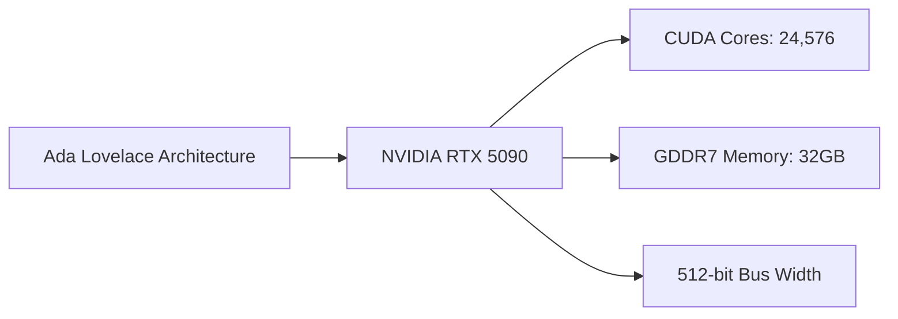

## The Shift in GPU Market Dynamics

The GPU landscape is witnessing a significant shift, with NVIDIA's upcoming RTX 5090 and AMD's Radeon RX 8000 series at the forefront. Leaked specifications for the NVIDIA RTX 5090 reveal a massive 24,576 CUDA cores, 32GB of GDDR7 memory, and a 512-bit bus width. Meanwhile, AMD is reportedly targeting the mid-range GPU market with aggressive pricing on RDNA4 models. In this article, we'll delve into the implications of these developments and explore what they mean for gamers and developers alike.

## NVIDIA's RTX 5090: A Leap Forward in Performance

The NVIDIA RTX 5090, codenamed Blackwell, promises to deliver unprecedented performance gains over its predecessor, the Ada Lovelace architecture. With a massive 24,576 CUDA cores, this GPU is poised to tackle even the most demanding workloads with ease. The 32GB of GDDR7 memory ensures that the RTX 5090 has ample resources to handle complex graphics and compute tasks.



This architecture is expected to yield significant performance gains, particularly in applications that rely heavily on parallel processing. However, it's essential to note that the actual performance will depend on various factors, including the specific use case, system configuration, and driver optimization.

## AMD's Mid-Range Strategy: A Game-Changer for the Mass Market

AMD's decision to target the mid-range GPU market with aggressive pricing on RDNA4 models could be a game-changer for the industry. By focusing on the mid-range segment, AMD aims to capture the bulk of the market, potentially disrupting NVIDIA's dominance in the high-end space.

```table
| Model | CUDA Cores | Memory | Bus Width |
| --- | --- | --- | --- |
| NVIDIA RTX 5090 | 24,576 | 32GB | 512-bit |
| AMD Radeon RX 8000 | 3,840 | 16GB | 256-bit |
```

While the specifications for the AMD Radeon RX 8000 series are not yet confirmed, it's clear that AMD is aiming to offer a more affordable and accessible option for gamers and developers. This could lead to increased competition in the market, driving innovation and pushing the boundaries of what's possible in GPU design.

## Conclusion

The GPU landscape is evolving rapidly, with NVIDIA's RTX 5090 and AMD's Radeon RX 8000 series at the forefront. As we move forward, it's essential to keep an eye on these developments and understand their implications for the industry. Whether you're a gamer, developer, or simply a tech enthusiast, the future of GPU technology holds much excitement and promise.
