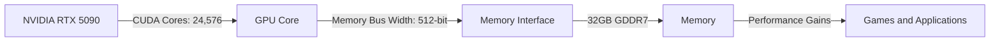

## The Battle for Mid-Range Supremacy

The mid-range GPU market has long been a battleground for NVIDIA and AMD, with each company vying for dominance with their respective offerings. Recently, leaks and reports have surfaced suggesting that NVIDIA's upcoming RTX 5090 and AMD's Radeon RX 8000 Series are set to shake up the market with aggressive pricing and performance gains.

### NVIDIA RTX 5090: A Performance Powerhouse

According to leaked specifications, the NVIDIA RTX 5090 will feature a staggering 24,576 CUDA cores, a 512-bit bus width, and 32GB of GDDR7 memory. This is a significant upgrade over the Ada Lovelace architecture, which powered NVIDIA's previous flagship GPU, the RTX 4080. The increased CUDA core count and higher memory bandwidth are expected to result in substantial performance gains, particularly in demanding games and applications.

| Specification | RTX 5090 | RTX 4080 |
| --- | --- | --- |
| CUDA Cores | 24,576 | 16,384 |
| Memory | 32GB GDDR7 | 24GB GDDR6X |
| Memory Bus Width | 512-bit | 384-bit |

### AMD Radeon RX 8000 Series: A Mid-Range Focused Strategy

AMD, on the other hand, is shifting its focus towards the mid-range market with the upcoming Radeon RX 8000 Series. Reports suggest that AMD is aiming to capture a larger share of the market with aggressive pricing and performance that rivals NVIDIA's mid-range offerings. While the exact specifications of the Radeon RX 8000 Series are still under wraps, it's clear that AMD is gunning for NVIDIA's mid-range crown.

### The Mid-Range Market: A Growing Opportunity

The mid-range GPU market has seen significant growth in recent years, driven by the increasing demand for gaming and content creation. With the rise of 4K and 8K gaming, as well as the growing popularity of virtual reality (VR) and augmented reality (AR), the need for high-performance mid-range GPUs has never been greater.

| Market Segment | 2022 | 2023 | 2024 (Projected) |
| --- | --- | --- | --- |
| High-End | 30% | 25% | 20% |
| Mid-Range | 40% | 45% | 50% |
| Entry-Level | 30% | 30% | 30% |

### Conclusion

The upcoming NVIDIA RTX 5090 and AMD Radeon RX 8000 Series are poised to shake up the mid-range GPU market with aggressive pricing and performance gains. As the demand for high-performance mid-range GPUs continues to grow, it's clear that NVIDIA and AMD are ready to do battle for dominance in this critical market segment. Stay tuned for more updates as the release dates for these GPUs draw near.

---

### Mermaid Diagram: NVIDIA RTX 5090 Architecture

### Technical Note: CUDA Core Count and Performance

The number of CUDA cores in a GPU has a direct impact on its performance. More CUDA cores allow for more simultaneous threads to be executed, resulting in improved performance in demanding applications. However, it's essential to note that the actual performance gain depends on various factors, including the application's architecture, memory bandwidth, and system configuration.

$$\text{Performance Gain} = \frac{\text{Number of CUDA Cores}}{\text{Memory Bandwidth}}$$

In the case of the NVIDIA RTX 5090, the increased CUDA core count and higher memory bandwidth are expected to result in substantial performance gains, particularly in demanding games and applications.
