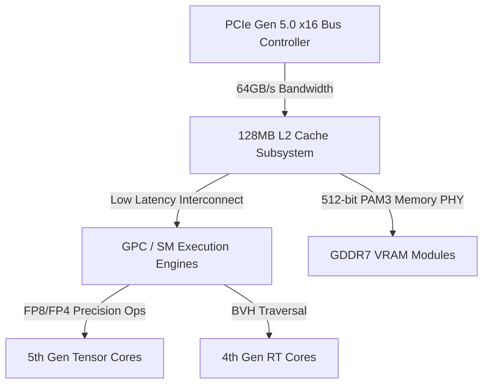

When board partners opt to fulfill warranty RMAs by swapping failing flagship Ada Lovelace hardware with incoming Blackwell units—or when prebuilt system integrators aggressively rebalance system margins against standalone GPU costs—the driving factor is rarely mere customer service goodwill. It is fundamentally an indicator of manufacturing yield stabilization and silicon generational displacement. 

Transitioning from the GeForce RTX 4090 (AD102) to the GeForce RTX 5090 (GB202) is not an incremental frequency bump. It represents a fundamental refactoring of the memory controller PHY, streaming multiprocessor (SM) execution pipelines, and electrical transient response management. Analyzing these structural changes reveals why the Blackwell consumer flagship fundamentally alters compute and rendering bounds.

---

## Memory Subsystem Engineering: The Shift to GDDR7 and PAM3

The primary operational bottleneck for high-throughput compute and uncompressed 4K framebuffers has shifted from raw FLOPS to memory bandwidth. The AD102 architecture reached its dynamic limit using a 384-bit bus paired with GDDR6X memory running at 21 Gbps, yielding roughly $1,008\text{ GB/s}$ of peak bandwidth.

To break past the $1.5\text{ TB/s}$ threshold without scaling bus widths to unwieldy trace routing sizes, the GB202 architecture introduces a 512-bit memory interface paired with GDDR7 SDRAM. GDDR7 moves away from the NRZ (Non-Return-to-Zero) and PAM4 (Pulse Amplitude Modulation 4-level) signaling schemes used in prior generations, adopting **PAM3 (3-level Pulse Amplitude Modulation)**.

```
PAM4 (2 bits / cycle):   [ 11 ] [ 10 ] [ 01 ] [ 00 ]  -> Higher SNR vulnerability
PAM3 (1.5 bits / cycle): [ +1 ] [  0 ] [ -1 ]          -> Optimal eye diagram opening
```

PAM3 transmits 3 bits over 2 cycles (yielding $1.5\text{ bits per cycle per pin}$), operating with three voltage states ($-1$, $0$, $+1$). This reduced state count compared to PAM4 vastly improves signal integrity by opening the electrical "eye diagram" wider at the receiver, lowering bit-error rates (BER) while consuming less physical PHY area per trace.

$$BW_{\text{peak}} = \frac{\text{Bus Width (bits)} \times \text{Data Rate (Gbps)}}{8}$$

For a 512-bit interface operating at an initial specification of 28 Gbps:

$$BW_{\text{peak}} = \frac{512 \times 28}{8} = 1,792 \text{ GB/s}$$

This represents a **77.8% increase in theoretical VRAM bandwidth** over the RTX 4090, directly relaxing stall cycles in bandwidth-bound Ray Tracing pipelines and Large Language Model (LLM) token generation passes.

| Specification | RTX 4090 (AD102) | RTX 5090 (GB202) | Architectural Impact |
| :--- | :--- | :--- | :--- |
| **Process Node** | TSMC 4N | TSMC 4NP / Custom | Higher transistor density & gate efficiency |
| **Memory Type** | GDDR6X (PAM4) | GDDR7 (PAM3) | Lower PHY power, higher signal fidelity |
| **Bus Width** | 384-bit | 512-bit | Expanded parallel channel routing |
| **Bandwidth** | 1,008 GB/s | 1,792 GB/s | Reduced memory-stall cycles in path tracing |
| **L2 Cache** | 72 MB | 128 MB | Reduced off-chip VRAM request frequency |
| **PCIe Interface** | PCIe Gen 4.0 x16 | PCIe Gen 5.0 x16 | 64 GB/s bidirectional system throughput |

---

## Streaming Multiprocessor Topology & L2 Cache Hierarchy

Beyond memory access lanes, the inner execution pipeline of the GB202 Streaming Multiprocessor features overhauled register file allocations and expanded L2 cache topologies. 



By expanding the on-die L2 cache from 72 MB on AD102 to 128 MB on GB202, the hit rate for ray-tracing acceleration structures (Bounding Volume Hierarchy / BVH nodes) improves significantly. When a ray-triangle intersection test fails its L1 cache lookup, hitting an expanded 128 MB L2 cache incurs a latency penalty of only ~40-50 cycles, compared to a ~250+ cycle round-trip penalty to main GDDR7 VRAM.

Developers querying device capabilities via low-level telemetry scripts can observe these bus configurations and thermal clock-state thresholds directly:

```bash
# Query current PCIe generation, link width, active clocks, and thermal status
nvidia-smi --query-gpu=name,pci.link.gen.current,pci.link.width.current,clocks.current.memory,temperature.gpu --format=csv -l 1
```

---

## Transient Load Management and Power Topology

The architectural scale of GB202 imposes strict requirements on the Printed Circuit Board (PCB) Power Delivery Network (PDN). The dynamic current draw ($\frac{di}{dt}$) during instant switching from an idle power state to maximum matrix-math execution can induce significant voltage droop.

To mitigate transient voltage spikes that plagued earlier power delivery designs, the platform relies on refined implementation standards for the **12V-2x6 connector standard (IEC 62196-3 derivative)**. 

$$\Delta V_{\text{droop}} = L_{\text{parasitic}} \cdot \frac{di}{dt}$$

By shortening the sense pins (`SNT_AMPS` / `SNT_PWR`) relative to the power conductors, the GPU power management controller (PMIC) ensures that full current allocation occurs only when physical contact resistance drops below critical thresholds. Furthermore, multi-phase VRMs utilize smart power stages (SPS) capable of reporting real-time per-phase current telemetry at microsecond intervals.

```
Sense Pin Contact Timeline:
[Power Pins Engage] ====> [Sense Pins Engage] ====> [PMIC Negotiates Power Budget]
0ms                      +2ms                        +5ms -> Safe High-Current Output
```

---

## Conclusion

The engineering progression embodied by the RTX 5090 is rooted in systemic bandwidth and power optimization. By combining PAM3-encoded GDDR7 memory across a wider 512-bit bus, scaling
