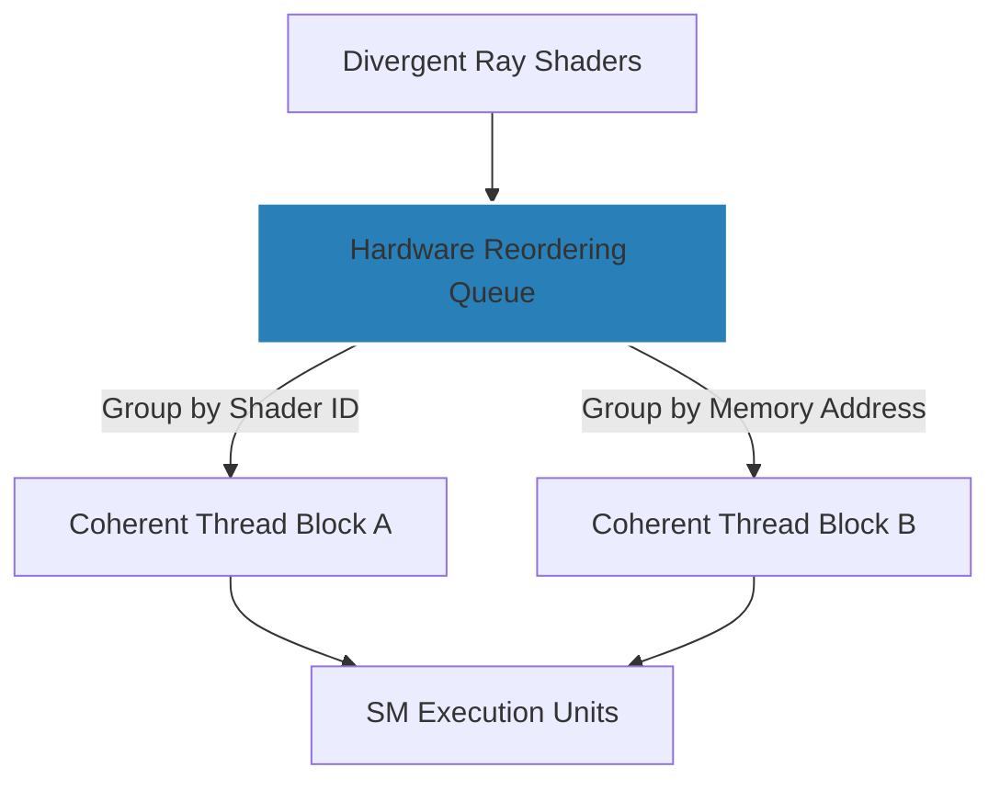

In modern real-time rendering, the transition from rasterization to path tracing and dynamic global illumination has fundamentally broken the traditional graphics pipeline. When Unreal Engine 5 projects like *S.T.A.L.K.E.R. 2: Heart of Chornobyl* launch, they push hardware to its absolute limit. The game's massive 2.0 update highlights how critical low-level engine optimization is to rescuing a "flawed gem" from performance degradation. 

But what is happening at the silicon level when a game engine transitions from stuttering mess to a polished, high-frame-rate experience? The answer lies in how modern GPU architectures—spanning Nvidia’s Ada Lovelace/Blackwell, AMD’s RDNA 3/4, and Intel’s Battlemage—manage **thread divergence** and memory subsystem latency.

---

## The Physics of Thread Divergence and SIMT Inefficiency

Desktop GPUs operate on a Single Instruction, Multiple Threads (SIMT) execution model. Work is grouped into execution units called warps (Nvidia, 32 threads) or wavefronts (AMD, 32 or 64 threads). In a traditional rasterized workload, SIMT is highly efficient: adjacent pixels on a triangle share the same material, execute the same shader code, and access contiguous memory.

Ray tracing completely destroys this spatial and execution coherency. When a primary ray hits a surface and casts secondary reflection or shadow rays, those rays bounce in wildly different directions. 

```mermaid
graph TD
    A["Primary Ray Hit"] -->|Ray Bounce 1| B["Hits Mirror: Run Reflection Shader"]
    A -->|Ray Bounce 2| C["Hits Foliage: Run Alpha-Test Shader"]
    A -->|Ray Bounce 3| D["Hits Concrete: Run Diffuse Shader"]
    B --> E["Divergent Execution Path 1"]
    C --> F["Divergent Execution Path 2"]
    D --> G["Divergent Execution Path 3"]
    style A fill:#111,stroke:#f39c12,stroke-width:2px
```

Because different threads within the same warp are now executing different shader programs (shader divergence) or fetching data from disparate memory addresses (memory divergence), the GPU suffers from severe execution stalls. 

We can mathematically represent the efficiency of a SIMD/SIMT unit ($\eta_{\text{SIMD}}$) undergoing divergence as:

$$\eta_{\text{SIMD}} = \frac{\sum_{i=1}^{N} T_{\text{active}, i}}{W \cdot T_{\text{total}}}$$

Where $W$ is the warp/wavefront width, $T_{\text{active}, i}$ is the number of active threads executing useful work in step $i$, and $T_{\text{total}}$ is the total clock cycles required to execute all divergent paths sequentially. When only one thread in a warp of 32 is active, the execution efficiency drops to a dismal 3.125%.

---

## Shader Execution Reordering (SER) to the Rescue

To mitigate this massive loss of compute efficiency, modern GPU architectures implement hardware-assisted thread sorting. Nvidia calls this **Shader Execution Reordering (SER)**, while Intel and AMD have implemented similar execution-sorting pipelines in their latest architectures.

SER acts as an on-the-fly scheduler between the ray tracing cores (which calculate intersections) and the execution units (which run the shading code). 

By dynamically grouping divergent threads into new, coherent warps before they hit the Streaming Multiprocessors (SMs), the hardware ensures that all 32 threads in a warp execute the same instruction block simultaneously. This reduces execution divergence and maximizes execution unit occupancy.

---

## Case Study: *S.T.A.L.K.E.R. 2* Update 2.0 and Memory Subsystem Strain

The 2.0 update for *S.T.A.L.K.E.R. 2* serves as an excellent case study in how software-level pipeline restructuring can yield massive performance gains on existing hardware. Prior to the update, the game suffered from severe frame-pacing issues and VRAM bottlenecks. 

By restructuring their Pipeline State Objects (PSOs) and optimizing their Bounding Volume Hierarchy (BVH) traversal, the developers reduced the frequency of cold cache misses. When a GPU traverses a BVH to find ray-triangle intersections, it must constantly fetch node data from memory. If the BVH is unoptimized, these fetches miss the L1 and L2 caches, forcing a high-latency round-trip to VRAM.

| Performance Metric | Pre-Update (v1.0) | Post-Update (v2.0) | Architectural Impact |
| :--- | :--- | :--- | :--- |
| **Average L2 Cache Hit Rate** | ~58% | ~74% | Reduced VRAM bus saturation; lower latency |
| **VRAM Footprint (Ultra, 4K)** | 15.4 GB | 13.1 GB | Better texture streaming & garbage collection |
| **Stutter Rate (0.1% Lows)** | 14 FPS | 41 FPS | Elimination of synchronous PSO compilation stalls |
| **Compute Unit Occupancy** | ~62% | ~81% | Better thread sorting and reduced execution stalls |

By implementing asynchronous compute queues, the engine can now interleave shadow map rendering and physics calculations with the main ray tracing passes, filling the execution bubbles left by memory-stalled threads.

---

## The Power Efficiency Equation: Desktops vs. Mobile Silicon

This focus on maximizing execution efficiency isn't just about raw frame rates; it is also the defining battleground for power efficiency. In the desktop space, where thermal design power (TDP) can exceed 450W on top-tier GPUs, hardware schedulers can run aggressively. 

In contrast, mobile and ultra-portable architectures must prioritize static compiler scheduling over dynamic, power-hungry hardware sorting. This design divergence was highlighted recently when Qualcomm retracted select Snapdragon C power efficiency benchmarks after removing idle application and web browsing states from their public slides. 

While desktop architectures like Nvidia's Ada/Blackwell or AMD's RDNA use complex, dedicated silicon real estate for dynamic runtime scheduling, mobile SoC architectures must rely on aggressive clock-gating, Dynamic Voltage and Frequency Scaling (DVFS), and compiler-level optimization to keep power envelopes under 15W.

---

## Conclusion

As game engines transition fully to path-traced pipelines, raw compute power is no longer the sole arbiter of performance. The battle is now won or lost in the memory controllers, the L2 cache hierarchies, and the thread-sorting schedulers. The dramatic performance recovery of *S.T.A.L.K.E.R. 2* in its 2.0 update demonstrates that the future of real-time graphics relies on software architectures that actively cooperate with the underlying silicon to keep execution pipelines coherent, fed, and optimized.
