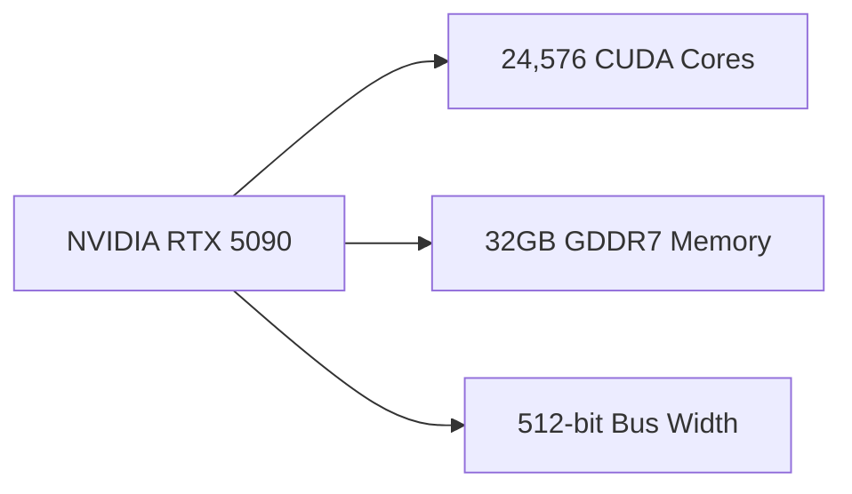

## The Evolution of GPU Architecture

The GPU landscape has undergone significant changes in recent years, with major players like NVIDIA and AMD continuously pushing the boundaries of performance, power efficiency, and affordability. The latest developments in GPU technology, particularly the NVIDIA RTX 5090 and AMD Radeon RX 8000 Series, offer a fascinating glimpse into the future of mid-range GPU architecture.

## NVIDIA RTX 5090: Unpacking the Blackwell Architecture

Recent leaks have revealed the specifications of the upcoming NVIDIA RTX 5090, codenamed Blackwell. This next-generation GPU promises significant performance gains over its predecessor, the Ada Lovelace architecture. At the heart of the Blackwell architecture lies a massive 24,576 CUDA core count, a substantial increase from the previous 21,504 cores. This boost in CUDA cores enables the RTX 5090 to tackle complex workloads, such as ray tracing and AI-enhanced rendering, with greater efficiency.

The Blackwell architecture also features 32GB of GDDR7 memory, a significant upgrade from the GDDR6 memory used in the RTX 4080. The increased memory bandwidth and capacity will enable the RTX 5090 to handle larger, more complex 3D models and textures, further enhancing the gaming experience.

## AMD Radeon RX 8000 Series: Targeting the Mid-Range Market

In a surprising move, AMD has shifted its focus away from extreme high-end graphics cards, instead targeting the mid-range market with its Radeon RX 8000 Series. This strategic decision aims to capture the bulk of the market with aggressive pricing on RDNA4 mid-range models. By doing so, AMD hopes to increase its market share and challenge NVIDIA's dominance in the mid-range segment.

The Radeon RX 8000 Series is expected to feature a range of models, each with varying levels of performance and pricing. While the exact specifications remain under wraps, rumors suggest that the mid-range models will offer a balance of performance and power efficiency, making them an attractive option for gamers on a budget.

## Mid-Range GPU Architecture: What to Expect

The mid-range GPU market is poised to undergo significant changes with the introduction of the NVIDIA RTX 5090 and AMD Radeon RX 8000 Series. As these GPUs aim to offer a balance of performance, power efficiency, and affordability, developers and gamers can expect a range of benefits.

For developers, the mid-range GPU market offers a more accessible entry point for exploring advanced features like ray tracing and AI-enhanced rendering. The increased performance and power efficiency of mid-range GPUs will enable developers to create more complex, immersive gaming experiences without breaking the bank.

For gamers, the mid-range GPU market provides a more affordable option for upgrading to the latest technology. With the NVIDIA RTX 5090 and AMD Radeon RX 8000 Series, gamers can expect improved performance, faster frame rates, and enhanced visual fidelity without sacrificing power efficiency.

## Conclusion

The NVIDIA RTX 5090 and AMD Radeon RX 8000 Series mark a significant shift in the GPU landscape, with a focus on mid-range architecture and performance. As these GPUs aim to capture the bulk of the market, developers and gamers can expect a range of benefits, from improved performance to increased accessibility. As the technology continues to evolve, one thing is certain: the future of GPU architecture is bright, and the possibilities are endless.
