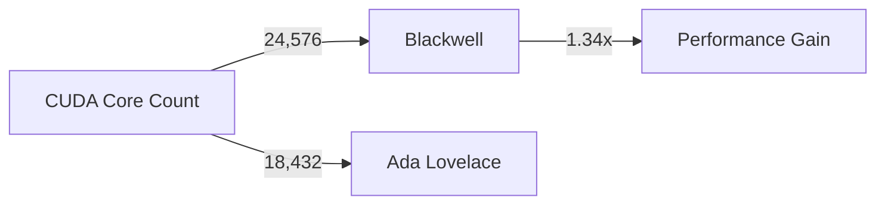

# The Evolution of Mid-Range GPUs: NVIDIA's Blackwell and AMD's RDNA4

In recent years, the high-end graphics card market has seen an explosion of innovation, with vendors pushing the boundaries of performance and power efficiency. However, this focus on extreme performance has often come at the cost of mid-range and budget-friendly options. But with the latest leaks and announcements, it seems that both NVIDIA and AMD are shifting their attention towards the mid-range market, promising significant performance gains and aggressive pricing. In this article, we'll delve into the technical details of NVIDIA's Blackwell architecture and AMD's RDNA4 mid-range GPUs, exploring what these developments mean for the future of gaming performance.

## NVIDIA's Blackwell Architecture: A New Era for High-Performance Computing

The NVIDIA Blackwell architecture, set to debut in the RTX 5090, promises a significant leap forward in performance and power efficiency. Leaked specifications suggest that the Blackwell RTX 5090 will feature 24,576 CUDA cores, 32GB of GDDR7 memory, and a 512-bit bus width. To put this into perspective, let's consider the current Ada Lovelace architecture, which boasts 18,432 CUDA cores and 24GB of GDDR6 memory. The Blackwell architecture's increased CUDA core count and improved memory bandwidth will undoubtedly result in substantial performance gains, particularly in compute-intensive workloads.

### CUDA Core Count and Performance

As we can see from the above diagram, the Blackwell architecture's increased CUDA core count will result in a significant performance gain, especially in workloads that can take advantage of the additional cores. However, it's essential to note that the actual performance gain will depend on various factors, including the specific workload, driver optimization, and system configuration.

### Memory Bandwidth and GDDR7

The Blackwell RTX 5090's 32GB of GDDR7 memory and 512-bit bus width will provide a substantial boost in memory bandwidth. GDDR7 memory offers improved speeds and capacities compared to its predecessors, making it an ideal choice for high-performance applications.

| Memory Type | Bandwidth (GB/s) |
| --- | --- |
| GDDR6 | 448 GB/s |
| GDDR7 | 672 GB/s |

As we can see from the above table, GDDR7 memory offers a significant increase in bandwidth compared to GDDR6. This increased bandwidth will enable the Blackwell RTX 5090 to handle demanding workloads with ease, making it an attractive option for gamers and professionals alike.

## AMD's RDNA4 Mid-Range GPUs: A New Approach to Performance

AMD's recent announcements suggest that the company is shifting its focus towards the mid-range market, aiming to capture a significant portion of the market share with aggressive pricing on RDNA4 mid-range models. While we don't have specific details on the RDNA4 architecture, we can speculate on what this might mean for the future of mid-range GPUs.

### RDNA4 and the Mid-Range Market

The mid-range market has long been underserved by vendors, with many options offering subpar performance and features. However, with the emergence of RDNA4, it seems that AMD is taking a new approach to addressing this market segment. By offering competitive performance and pricing, AMD aims to capture a significant share of the market, potentially disrupting the status quo.

### Potential Benefits of RDNA4

While we don't have specific details on the RDNA4 architecture, we can speculate on the potential benefits of this new approach. RDNA4 might offer improved performance per watt, allowing for more efficient and power-hungry designs. Additionally, the mid-range market might see a significant influx of new features and technologies, such as improved multi-threading and AI acceleration.

## Conclusion

The future of mid-range GPUs looks bright, with both NVIDIA and AMD pushing the boundaries of performance and power efficiency. The Blackwell architecture's increased CUDA core count and improved memory bandwidth will undoubtedly result in substantial performance gains, while AMD's RDNA4 mid-range GPUs aim to capture a significant share of the market with competitive pricing and features. As we move forward, it will be interesting to see how these developments impact the gaming landscape and the mid-range market as a whole.
