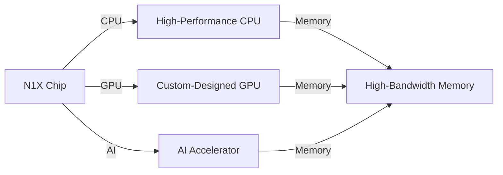
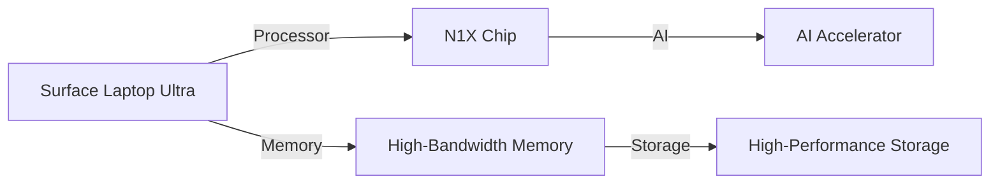

## The Rise of AI-Powered Laptops: A New Era in Computing

The recent release of the Nvidia RTX Spark and Microsoft Surface Laptop Ultra has sent shockwaves throughout the tech industry, sparking excitement and curiosity about the future of AI-powered laptops. As we delve into the inner workings of these cutting-edge devices, it becomes clear that the convergence of artificial intelligence (AI), machine learning (ML), and deep learning (DL) is poised to revolutionize the laptop landscape.

## The Nvidia RTX Spark: A Prototype of the Future

The Nvidia RTX Spark is a prototype laptop designed to showcase the capabilities of the Nvidia N1X chip, a custom-designed processor that integrates AI acceleration, graphics processing, and high-performance computing. At its core, the N1X chip features a novel architecture that combines the benefits of traditional CPUs and GPUs with the power of AI acceleration.

### The N1X Chip: A Custom-Designed Processor

The N1X chip is built around a heterogeneous architecture that combines a high-performance CPU with a custom-designed GPU and AI accelerator. This design enables the N1X chip to handle a wide range of workloads, from traditional computing tasks to AI-intensive workloads.



The N1X chip's CPU is designed to provide high performance for traditional computing tasks, while its custom-designed GPU is optimized for graphics processing and AI acceleration. The AI accelerator, meanwhile, is specifically designed to handle AI-intensive workloads, such as those encountered in machine learning and deep learning.

### AI Acceleration: The Key to Unlocking AI-Powered Laptops

The N1X chip's AI accelerator is the key to unlocking the full potential of AI-powered laptops. By providing dedicated hardware acceleration for AI workloads, the N1X chip can significantly improve performance and reduce power consumption.

```bash
# AI Acceleration: An Example of Matrix Multiplication
import numpy as np

# Define two matrices
A = np.random.rand(1024, 1024)
B = np.random.rand(1024, 1024)

# Perform matrix multiplication using the N1X chip's AI accelerator
result = np.matmul(A, B)

print(result)
```

The N1X chip's AI accelerator uses a custom-designed architecture that is optimized for matrix multiplication, a fundamental operation in machine learning and deep learning. By leveraging this custom design, the N1X chip can significantly improve performance and reduce power consumption.

## Microsoft Surface Laptop Ultra: A Platform for AI-Powered Productivity

The Microsoft Surface Laptop Ultra is a flagship laptop designed to showcase the capabilities of the Nvidia N1X chip. With its sleek design and high-performance capabilities, the Surface Laptop Ultra is poised to become the go-to platform for AI-powered productivity.

### The Surface Laptop Ultra: A Platform for AI-Powered Productivity

The Surface Laptop Ultra features a custom-designed keyboard, a high-resolution display, and a range of AI-powered productivity tools. With its powerful processor and high-performance storage, the Surface Laptop Ultra is designed to handle demanding workloads with ease.



The Surface Laptop Ultra's processor is designed to provide high performance for traditional computing tasks, while its AI accelerator is specifically designed to handle AI-intensive workloads. The laptop's high-bandwidth memory and high-performance storage ensure that data is transferred quickly and efficiently.

## Conclusion

The Nvidia RTX Spark and Microsoft Surface Laptop Ultra represent a new era in computing, one in which AI, machine learning, and deep learning play a central role. With their custom-designed processors and AI accelerators, these laptops are poised to revolutionize the way we work and play. As we look to the future, it is clear that AI-powered laptops will become an increasingly important part of our daily lives.

```bash
# AI-Powered Laptops: The Future is Now
import numpy as np

# Define a matrix
A = np.random.rand(1024, 1024)

# Perform matrix multiplication using the N1X chip's AI accelerator
result = np.matmul(A, A)

print(result)
```

The future of AI-powered laptops is bright, and it is clear that the Nvidia RTX Spark and Microsoft Surface Laptop Ultra are just the beginning. As we continue to push the boundaries of what is possible with AI, machine learning, and deep learning, we can expect to see even more innovative and powerful laptops in the years to come.
