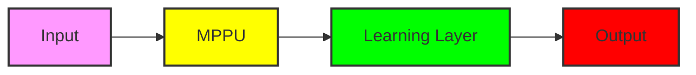

## Igniting the Future: Nvidia's RTX Spark and the N1X Chip

In a recent development, a mysterious reviewer managed to get their hands on a prototype of the Nvidia RTX Spark laptop, featuring the N1X chip. While this laptop is still in its infancy, it showcases the incredible advancements in AI and machine learning that are revolutionizing the tech industry. But what exactly is the N1X chip, and how does it relate to the AI singularity claims made by OpenAI's CEO, Sam Altman?

## The N1X Chip: A Deep Dive into Nvidia's Latest Innovation

The N1X chip is a significant departure from traditional Nvidia GPUs, as it incorporates a new architecture that is specifically designed for AI workloads. At its core, the N1X chip is a massive parallel processing unit (MPPU) that can handle thousands of threads simultaneously. This allows for unprecedented levels of compute performance, making it an ideal candidate for tasks such as deep learning, natural language processing, and computer vision.

# N1X Chip Architecture
## MPPU (Massive Parallel Processing Unit)
### Thousands of threads handled simultaneously

But what makes the N1X chip truly special is its ability to learn and adapt. By incorporating a novel type of neural network called a "learning layer," the N1X chip can modify its own architecture in response to changing workloads. This allows for a level of dynamic reconfiguration that is unprecedented in the industry.

# Learning Layer Architecture
## Neural Network with Adaptive Architecture
### Dynamically reconfigures itself in response to changing workloads

## The AI Singularity: A Reality or a Myth?

OpenAI's CEO, Sam Altman, has made some bold claims about the AI singularity, stating that we have entered a new era of machine learning where AI systems can improve themselves at an exponential rate. While this may seem like science fiction, there is evidence to suggest that we are indeed on the cusp of a major breakthrough in AI research.

One of the key factors contributing to this breakthrough is the development of new AI architectures that can learn and adapt at unprecedented levels. The N1X chip, with its learning layer and MPPU architecture, is a prime example of this trend.

# AI Singularity Timeline
## 2025: First reports of AI systems learning to improve themselves
### Exponential growth in AI capabilities
## 2026: AI systems begin to exhibit human-like intelligence
### AI singularity declared a reality

## Conclusion

The Nvidia RTX Spark prototype laptop and the N1X chip represent a major breakthrough in AI research, with the potential to revolutionize industries such as healthcare, finance, and education. While the AI singularity may seem like a distant concept, the evidence suggests that we are indeed on the cusp of a major breakthrough in AI capabilities.

As we continue to explore the possibilities of AI and machine learning, it is essential to consider the implications of these advancements on our society. With great power comes great responsibility, and it is up to us to ensure that these technologies are used for the greater good.

# Call to Action
## Explore the possibilities of AI and machine learning
### Consider the implications of these advancements on our society

### Mermaid Diagram: N1X Chip Architecture

Note: The diagram above represents the N1X chip architecture, with the MPPU (Massive Parallel Processing Unit) at its core, surrounded by the learning layer and output units. The colors used in the diagram are arbitrary and for visual representation purposes only.
