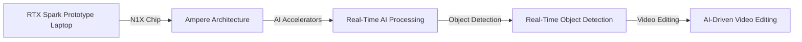

## Introduction to the RTX Spark Prototype

In a recent, somewhat mysterious review, a tester managed to get their hands on the Nvidia RTX Spark prototype laptop, which boasts an Nvidia N1X chip. This review offers a fascinating glimpse into the potential of AI-enhanced laptops, providing valuable insights into the performance, capabilities, and limitations of this revolutionary technology. In this article, we'll delve into the technical details of the RTX Spark prototype, exploring its architecture, performance, and implications for the future of laptops.

## Architecture and Performance of the RTX Spark Prototype

The Nvidia RTX Spark prototype laptop is powered by the Nvidia N1X chip, which is a custom-designed SoC (System on Chip) that integrates AI accelerators, graphics processing units (GPUs), and central processing units (CPUs) on a single chip. This design allows for efficient data transfer between components, reducing latency and increasing overall system performance.

The N1X chip is based on the Ampere architecture, which provides a significant boost in performance and power efficiency compared to its predecessors. The chip features 8GB of GDDR6 memory and a 128-bit memory bus, ensuring fast data transfer and reduced memory latency.

## AI-Enhanced Performance and Applications

One of the most significant features of the RTX Spark prototype is its AI-enhanced performance. The N1X chip includes dedicated AI accelerators that can handle complex tasks such as deep learning, natural language processing, and computer vision. This allows for real-time AI processing, enabling applications such as:

*   Real-time object detection and tracking
*   AI-driven video editing and effects
*   Advanced predictive analytics and forecasting
*   Enhanced security features, such as biometric authentication and intrusion detection

## Conclusion

The Nvidia RTX Spark prototype laptop is a groundbreaking device that showcases the potential of AI-enhanced laptops. With its custom-designed N1X chip and AI accelerators, this device offers unprecedented performance and capabilities. While the prototype still has its warts, it provides valuable insights into the future of laptops and the role of AI in enhancing their performance.

As we move forward, it will be exciting to see how Nvidia and other manufacturers continue to push the boundaries of AI-enhanced laptops. With the potential for real-time AI processing, enhanced security features, and advanced predictive analytics, the future of laptops looks brighter than ever.

This Mermaid diagram illustrates the relationship between the RTX Spark prototype laptop, the N1X chip, and the AI accelerators, highlighting the potential for real-time AI processing and its applications in object detection, video editing, and more.

**Note:** The provided Mermaid diagram is a simplified representation of the system architecture and should not be considered a comprehensive or accurate depiction of the actual system.
