The divergence of consumer PC hardware in 2026 has reached a critical bottleneck, driven not by raw compute metrics, but by the physical limits of memory subsystems. On one hand, reports of ultra-enthusiast discrete graphics cards like the ROG Astral RTX 5090 seeing late-stage price adjustments—pushing retail pricing to astronomical levels near $4,400—highlight the extreme costs of building ultra-wide, high-speed discrete PCBs. On the other hand, AMD’s upcoming IFA 2026 keynote, spearheaded by Jack Huynh, is set to officially unveil the "Ryzen AI MAX 400" series (codenamed Strix Halo), an APU architecture designed to bypass discrete GPU costs entirely by integrating an unprecedented 256-bit memory controller directly onto an organic package substrate.

To understand why discrete graphics cards are pricing themselves out of the mainstream market, and why high-width APUs represent the future of mainstream gaming, we must analyze the underlying physics of memory routing, signal attenuation, and silicon packaging.

---

## The Physics of the Memory Wall: APU vs. Discrete GPU

For over a decade, monolithic Accelerated Processing Units (APUs) have been choked by the "memory wall." A typical modern processor relies on a 128-bit dual-channel memory interface. When sharing this narrow pipe between CPU cores and a large integrated graphics cluster, memory bandwidth quickly becomes the primary system bottleneck.

To calculate the theoretical maximum bandwidth ($B$) of a memory subsystem, we use the following equation:

$$B = \frac{W \times f_{\text{eff}}}{8}$$

Where:
*   $W$ is the bus width in bits.
*   $f_{\text{eff}}$ is the effective transfer rate in Giga-transfers per second (GT/s) or Gbps per pin.
*   $B$ is the bandwidth in Gigabytes per second (GB/s).

Let's compare a standard 128-bit LPDDR5X-7500 system against the newly engineered Ryzen AI MAX (256-bit LPDDR5X-8000) and the rumored ultra-enthusiast RTX 5090 (512-bit GDDR7 at 28 Gbps):

| Platform | Memory Type | Bus Width ($W$) | Pin Speed ($f_{\text{eff}}$) | Peak Bandwidth ($B$) |
| :--- | :--- | :--- | :--- | :--- |
| **Standard APU** | LPDDR5X | 128-bit | 7500 MT/s | 120.0 GB/s |
| **Ryzen AI MAX 400** | LPDDR5X | 256-bit | 8000 MT/s | 256.0 GB/s |
| **RTX 5090 (Discrete)** | GDDR7 | 512-bit | 28000 MT/s | 1,792.0 GB/s |

While the RTX 5090 commands massive bandwidth, routing a 512-bit memory interface on a discrete graphics card requires an incredibly complex, multi-layer PCB (often 14 layers or more) with rigorous impedance matching to prevent electromagnetic interference (EMI). This physical complexity is a primary driver behind the skyrocketing manufacturing costs of top-tier discrete GPUs.

---

## Inside the Ryzen AI MAX Chiplet Architecture

To bypass the physical space constraints of traditional socketed motherboards, AMD's Ryzen AI MAX 400 bypasses standard DIMM slots entirely. It utilizes an on-package, high-density organic substrate that connects the CPU Compute Core Dies (CCDs) and the Graphics Compute Die (GCD) directly to LPDDR5X memory modules soldered adjacent to the silicon.

```mermaid
graph TD
    subgraph Ryzen_AI_MAX_Package [Ryzen AI MAX 400 Package]
        CCD1["Zen 5 CCD - 8 Cores"] -->|Infinity Fabric| IOD["System I/O Die"]
        CCD2["Zen 5 CCD - 8 Cores"] -->|Infinity Fabric| IOD
        GCD["RDNA 3.5 Graphics Die - 40 CUs"] -->|High-Speed Interconnect| IOD
        IOD -->|256-bit Physical Layer PHY| LPDDR5X["On-Package LPDDR5X Memory"]
    end
    style Ryzen_AI_MAX_Package fill:#151515,stroke:#333,stroke-width:2px;
    style LPDDR5X fill:#113311,stroke:#22aa22;
```



By consolidating the memory controller and the physical layer (PHY) onto a single package, AMD slashes trace lengths from several inches (typical of motherboard DIMM slots) to mere millimeters. This drastic reduction in physical distance minimizes parasitic capacitance and signal degradation, allowing the 256-bit bus to operate reliably at 8000 MT/s without requiring exotic PCB materials. 

For developers, this architecture provides a unified memory pool. Instead of copying game assets from system RAM to discrete VRAM over a high-latency PCIe bus, the graphics pipeline can access the same physical memory space as the CPU, eliminating redundant serialization/deserialization overhead.

---

## The Physical Reality of GDDR7 and PAM3 Signaling

To understand why the ROG Astral RTX 5090 faces extreme manufacturing and retail pricing pressure, we must look at the transition from GDDR6 to GDDR7. 

Unlike previous generations that used Non-Return-to-Zero (NRZ) or PAM4 signaling, GDDR7 introduces **PAM3 (Pulse Amplitude Modulation 3-Level)** signaling. PAM3 transmits three voltage levels ($-1$, $0$, $+1$), allowing it to pack 1.5 bits of data per cycle. 

```
NRZ (2 Levels):   [ High ]  --> 1 bit/cycle
                  [ Low  ]

PAM3 (3 Levels):  [ +1 ]
                  [  0 ]    --> 1.5 bits/cycle
                  [ -1 ]
```

While PAM3 reduces the high-frequency attenuation issues associated with PAM4, it demands incredibly tight voltage tolerances. At 28 Gbps, the "eye diagram" (the visual representation of signal integrity on an oscilloscope) becomes incredibly narrow. 

Any minor variation in PCB trace length, copper purity, or thermal expansion can cause signal skew, resulting in bit errors. To stabilize a 512-bit bus operating under these conditions, board partners must implement:
1.  **Ultra-low-loss PCB materials** (such as Megtron 6 or equivalent).
2.  **Highly advanced power delivery networks (PDN)** to suppress transient voltage spikes.
3.  **Complex active cooling systems** specifically designed to keep the GDDR7 memory controllers and physical chips below their thermal throttling limits (typically $95^\circ\text{C}$ to $105^\circ\text{C}$).

These requirements explain why premium custom designs like the ROG Astral series are seeing sudden, late-stage price spikes. The yield rates for PCBs capable of cleanly routing 512-bit PAM3 signals are significantly lower than those of standard hardware, forcing manufacturers to pass the cost of failed boards onto the consumer.

---

## Conclusion

The hardware landscape of 2026 is defined by a stark divide in engineering philosophy. NVIDIA’s discrete GPU strategy pushes the absolute limits of traditional PCB design, leveraging cutting-edge PAM3 signaling over massive 512-bit buses—a brute-force approach to bandwidth that comes with extreme financial and thermal costs. Conversely, AMD’s strategy with the Ryzen AI MAX 400 leverages high-density, on-package packaging to deliver discrete-class memory bandwidth within a highly efficient, consolidated silicon footprint. For the vast majority of developers and gamers, this shift toward advanced packaging and wide-bus APUs offers a scalable, cost-effective escape from the volatile economics of the ultra-enthusiast discrete GPU market.
