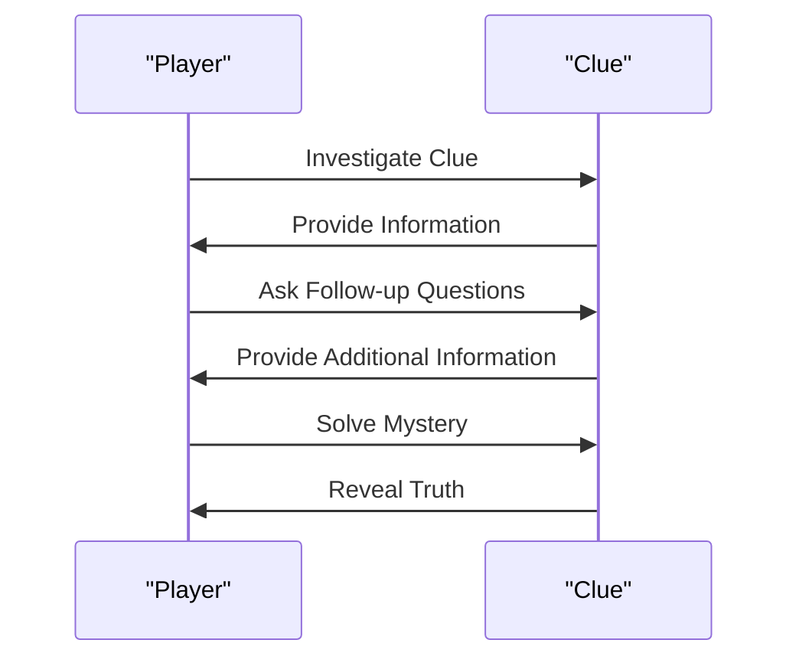

## Merger Mayhem: A Temporary Reprieve for Paramount-Warner Bros.

The entertainment industry is no stranger to controversy, and the latest development is a perfect example of this. A judge has ordered a temporary pause to the Paramount-Warner Bros. merger, citing concerns from multiple states. This move has sent shockwaves throughout the industry, leaving many to wonder what this means for the future of entertainment.

The merger, which was announced earlier this year, would have seen two of the largest media conglomerates in the world combine forces. However, California and 11 other states have successfully blocked the deal from moving forward for at least 14 days. This temporary reprieve has given the parties involved time to reassess the deal and address the concerns raised by the states.

### What's Next for Paramount-Warner Bros.?

While the merger is on hold, it's unclear what the future holds for Paramount-Warner Bros. The company has released a statement indicating that they will continue to work with the states to address their concerns. However, it's unlikely that the deal will move forward in its current form.

### Gaming Deals and New Hardware Releases

While the merger drama unfolds, gaming enthusiasts are enjoying new deals and hardware releases. Best Buy's 2026 Black Friday in July Sale is now live, offering discounts on a range of gaming peripherals and hardware. LEGO Star Wars fans can also score a new set at its lowest price ever.

For those looking to upgrade their gaming setup, the Samsung Odyssey OLED G5 27" QHD 180Hz OLED Gaming Monitor is now available for $299.99 on Amazon. This monitor offers stunning visuals and fast refresh rates, making it a great option for gamers looking to upgrade their setup.

### Rehaunted: A New First-Person Psychological Horror Detective Game

Gaming enthusiasts are also excited about the announcement of Rehaunted, a new first-person psychological horror detective game. The game promises to deliver a unique and unsettling experience, with players investigating a strange house filled with clues and mysteries.

### Conclusion

The entertainment industry is known for its unpredictability, and the temporary pause of the Paramount-Warner Bros. merger is just the latest example. While the future of the merger remains uncertain, gaming enthusiasts can enjoy new deals and hardware releases. With the release of Rehaunted and other new games on the horizon, it's an exciting time for gamers and entertainment enthusiasts alike.

---

### Table: Black Friday in July Sale Highlights

| Product | Discount | Price |
| --- | --- | --- |
| Samsung Odyssey OLED G5 27" QHD 180Hz OLED Gaming Monitor | 20% off | $299.99 |
| LEGO Star Wars Set | 30% off | $49.99 |
| Gaming Keyboard | 25% off | $49.99 |

### Mermaid Diagram: Rehaunted's Investigation Process



### Code Block: Rehaunted's Investigation Script

```javascript
// Rehaunted Investigation Script
function investigateClue(clue) {
    // Ask follow-up questions
    console.log("Asking follow-up questions...");
    
    // Provide additional information
    console.log("Providing additional information...");
    
    // Solve mystery
    console.log("Solving mystery...");
    
    // Reveal truth
    console.log("Revealing truth...");
}

// Call the investigation function
investigateClue(clue);
```

### Callout: Rehaunted's Investigation Process

Rehaunted's investigation process is a unique and engaging aspect of the game. Players must investigate clues, ask follow-up questions, and provide additional information to solve the mystery. This process is designed to be unsettling and thought-provoking, making it a standout feature of the game.
