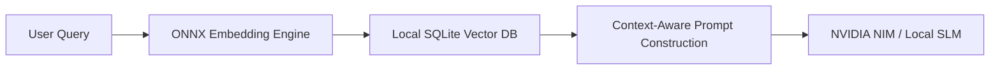

# Offline RAG: Bringing Intelligence to Local Hardware

In competitive gaming, accessing online search APIs or querying distant LLM endpoints is too slow. A 500ms API roundtrip could mean losing a match. To solve this, **Mission Control** incorporates a local RAG (Retrieval-Augmented Generation) engine that operates entirely offline.

---

## Architecture of Local Knowledge Retrieval

Instead of relying on cloud vector endpoints, Mission Control runs a dual-mode semantic search. When offline or running under strict bandwidth controls, it compiles models to the ONNX runtime:



The database indices are stored under your local installation folder:
- **Index Store**: `backend/ai_brain/rag_index/`
- **Game Document Cache**: `backend/ai_brain/rag_data/`

---

## Embedding and Query Pipeline

The embedding process utilizes a lightweight sentence-transformer model converted to ONNX format. This allows us to run embeddings directly on the GPU shader cores or CPU threads in under 10ms.

Here is the setup for the semantic search matching logic:

```python
import numpy as np

def cosine_similarity(a, b):
    # Calculate vector similarity locally
    return np.dot(a, b) / (np.linalg.norm(a) * np.linalg.norm(b))
```

> [!NOTE]
> All vectorized game wikis, boss mechanics, and custom configuration sheets are stored locally in the vector directory. The system automatically performs a difference check (diff) on launch to re-index any updated files.

---

## Privacy and Bandwidth Optimization

Because RAG runs entirely locally on your hardware, no prompts are sent to external databases or cloud miners. 

If internet connectivity is detected and an `NVIDIA_API_KEY` is provided, the overlay can securely interface with cloud NIM endpoints, but the document chunking and search matching phases remain 100% sandboxed inside your local motherboard UUID security boundary.
