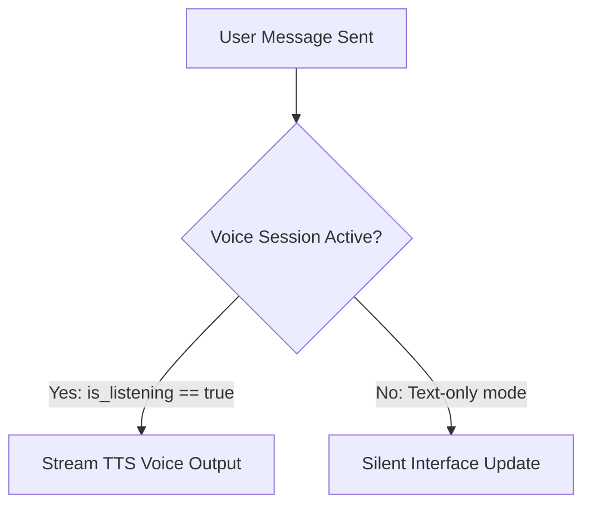

# Mission Control v1.4.9: Production Release

We are excited to deploy **Mission Control v1.4.9** to production. This build focuses heavily on stabilizing the local voice companion overlay, hardening hardware-level security sandboxing, and transitioning our local vision components to modern tensor quantization interfaces.

---

## Technical Highlights

### 1. Anti-Ghosting Speech Control
To prevent the Text-To-Speech (TTS) engine from outputting spontaneous spoken text while you are actively typing or focus-shifting, we introduced a strict state-gate. The sound-generation thread now queries the global audio manager state:



### 2. Hotkey Conflict Resolution
The global microphone toggle has been re-bound to avoid keyboard conflict layout crashes.

| Command Function | Old Shortcut | New Production Shortcut |
| :--- | :--- | :--- |
| Microphone Session Toggle | `Ctrl` + `V` | `Ctrl` + `Alt` + `M` |
| HUD Overlay Viewport | `Ctrl` + `\`` | `Ctrl` + `Alt` + `` ` `` |
| Standby RAM Flush | — | `Ctrl` + `Alt` + `F` |

---

## Code Optimizations

We updated the EasyOCR dependency stack to leverage the modern `torchao` eager-mode API. This replaces legacy quantization wrappers and silences deprecation warnings during startup:

```python
import torch
import torchao

def apply_eager_quantization(model):
    # Quantize the float32 model to 8-bit integers eagerly
    quantized_model = torchao.quantization.change_linear_weights_to_int8_dqt(model)
    return quantized_model
```

> [!IMPORTANT]
> Ensure your system is running CUDA Toolkit 12.1+ to support the compiled `torchao` execution kernels.

---

## Hardware-Locked Security Boundaries
To protect user prompts and private game telemetry, credentials are now locked using a dynamic verification signature generated directly from your local hardware properties. 

By combining the motherboard UUID and system MAC addresses into a salted SHA-256 fingerprint, we ensure configuration files cannot be ported or read on external devices.
