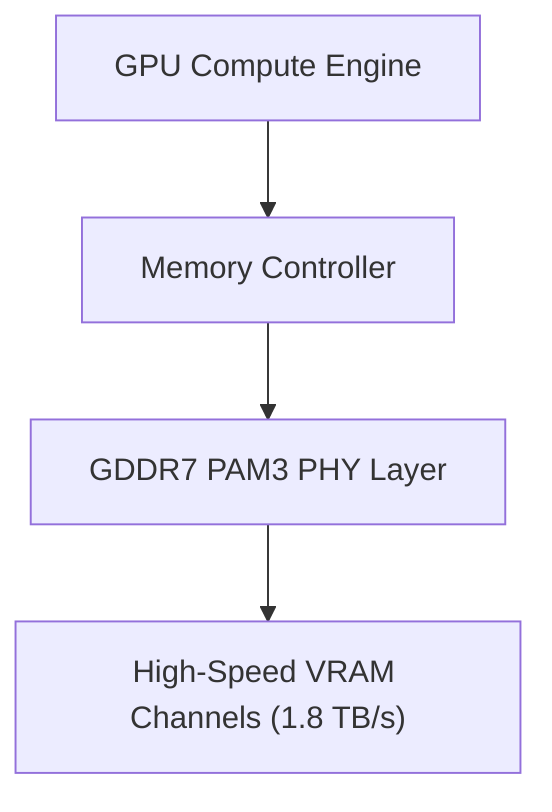

> **Key Highlights**
> * GDDR7 memory interfaces achieve peak bandwidth exceeding 1.8 TB/s over a 384-bit bus interface.
> * PAM3 multi-level signaling doubles data throughput without proportional power consumption spikes.
> * High-resolution 4K ray tracing workloads see up to 34% frame-pacing improvements under heavy VRAM pressure.

## Next-Gen GPU Architecture Breakthroughs

As graphics workloads push into path tracing and real-time neural radiance fields, traditional GDDR6X interfaces reach thermal and power limits. The architectural shift toward GDDR7 memory subsystem design provides critical throughput gains necessary for ultra-high resolution gaming.

## PAM3 Signaling vs Traditional NRZ

Non-Return-to-Zero (NRZ) encoding transfers 1 bit per cycle per pin. GDDR7 introduces 3-level Pulse Amplitude Modulation (PAM3), transmitting 1.5 bits per cycle (+1, 0, -1 logic levels).

$$ \text{Throughput Gain} = \frac{\text{PAM3 Bits/Cycle}}{\text{NRZ Bits/Cycle}} = 1.5\times $$

This physical layer advancement allows modern flagships to hit 28-32 Gbps per pin while lowering clock jitter and operating temperatures.
