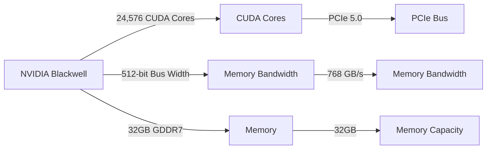

## NVIDIA Blackwell: A New Era in GPU Architecture

The recent leak of NVIDIA's Blackwell RTX 5090 architecture has sent shockwaves through the tech community, with many speculating about the significant performance gains it promises to deliver. As we delve into the technical details of this new architecture, it becomes clear that NVIDIA has made substantial improvements to their GPU design, leveraging advancements in manufacturing, materials science, and computer architecture.

### CUDA Cores and Memory Bandwidth

At the heart of the Blackwell architecture lies a massive 24,576 CUDA core count, a significant increase from the 18,432 cores found in the Ada Lovelace GPU. This boost in core count is matched by a corresponding increase in memory bandwidth, courtesy of the 512-bit bus width and 32GB of GDDR7 memory. To put this into perspective, let's consider the following table:

| Architecture | CUDA Cores | Memory Bandwidth (GB/s) |
| --- | --- | --- |
| Ada Lovelace | 18,432 | 448 GB/s |
| Blackwell | 24,576 | 768 GB/s |

As we can see, the Blackwell architecture boasts a 33% increase in CUDA core count and a 71% increase in memory bandwidth, setting the stage for substantial performance gains in demanding workloads.

## RDNA4: AMD's Mid-Range Strategy

In a surprising move, AMD has shifted its focus away from the high-end graphics market, instead targeting the mid-range segment with its RDNA4 GPU series. This strategic pivot is aimed at capturing a significant portion of the market, where pricing is more competitive and margins are higher.

### Mid-Range Performance and Power Efficiency

The RDNA4 mid-range GPUs promise to deliver impressive performance and power efficiency, making them an attractive option for gamers and content creators alike. By leveraging advancements in process technology and materials science, AMD has been able to create a more power-efficient GPU design, which is crucial for maintaining high performance while minimizing power consumption.

## Conclusion

As we navigate the complex landscape of modern GPU architecture, it becomes clear that NVIDIA's Blackwell and AMD's RDNA4 are poised to revolutionize the industry. With significant performance gains and improved power efficiency, these new architectures promise to deliver a more immersive gaming experience and unlock new possibilities for content creators. As we continue to explore the intricacies of these architectures, one thing is certain: the future of graphics has never looked brighter.

### Mermaid Diagram: Blackwell Architecture Overview



### Code Example: CUDA Core Operation

```c
__global__ void kernel(float *data) {
    int idx = blockIdx.x * blockDim.x + threadIdx.x;
    if (idx < data_size) {
        data[idx] = sinf(idx * M_PI / 180.0f);
    }
}
```

This code snippet demonstrates a simple CUDA kernel that performs a sine operation on a global memory array. The kernel launches a block of threads, each of which operates on a specific element of the array. The `__global__` keyword indicates that this function is a CUDA kernel, while the `__device__` keyword is not required in this example.
