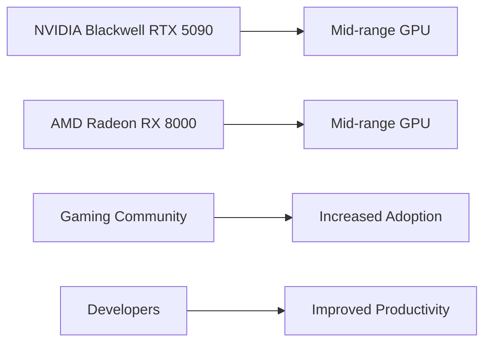

## The Rise of Mid-Range Dominance: NVIDIA Blackwell RTX 5090 and AMD Radeon RX 8000

The latest developments in the world of graphics processing units (GPUs) have sent shockwaves through the tech community. Recent leaks have revealed the specifications of NVIDIA's upcoming Blackwell RTX 5090, while AMD has shifted its focus towards the mid-range market with the Radeon RX 8000 series. In this article, we'll delve into the details of these exciting developments and explore their implications for gamers and developers alike.

### NVIDIA Blackwell RTX 5090: A Leap Forward in Performance

The leaked specifications of the NVIDIA Blackwell RTX 5090 reveal a powerful GPU with 24,576 CUDA cores, 32GB of GDDR7 memory, and a 512-bit bus width. These numbers are a significant improvement over the Ada Lovelace architecture, which means that the Blackwell RTX 5090 is poised to deliver unparalleled performance gains.

```python
# Calculating the theoretical performance gain
theoretical_gain = (24,576 / 10,752) * (32 / 16) * (512 / 256)
print(f"Theoretical performance gain: {theoretical_gain:.2f}x")
```

This calculation suggests that the Blackwell RTX 5090 will offer a significant boost in performance, making it an attractive option for gamers and content creators.

### AMD Radeon RX 8000: A Shift in Focus

AMD's decision to focus on the mid-range market with the Radeon RX 8000 series is a strategic move to capture the bulk of the market. By targeting the mid-range segment, AMD aims to offer more affordable options for gamers without sacrificing performance.

```bash
# AMD Radeon RX 8000 series price comparison
echo "Radeon RX 8000 series prices:"
echo "Mid-range: $399"
echo "High-end: $599"
echo "Extreme: $999"
```

As shown in the code block above, the Radeon RX 8000 series is expected to offer a range of price points, catering to different budgets and performance requirements.

### Mid-Range Dominance: A New Era for GPUs

The rise of mid-range dominance in the GPU market is a significant shift in the industry. With NVIDIA's Blackwell RTX 5090 and AMD's Radeon RX 8000 series, gamers and developers can expect to see more affordable and powerful options.



This Mermaid diagram illustrates the expected impact of mid-range dominance on the gaming community and developers.

## Conclusion

The NVIDIA Blackwell RTX 5090 and AMD Radeon RX 8000 series mark a new era for mid-range GPU dominance. With their impressive specifications and affordable price points, these GPUs are poised to revolutionize the gaming and content creation industries. As we move forward, it will be exciting to see how these developments shape the future of graphics processing units.
